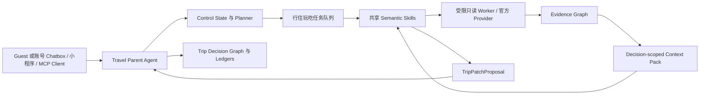

# Agent、上下文与决策架构

## 2026-09-22 当前开发依据：持续规划（待实现）

业务状态与模型不能分别维护一份规划理解。[14](./14-continuous-planning-business-model.md)明确持久计划、决定/问题、依赖与局部变更；[15](./15-model-context-and-handoff.md)明确同一过程的 Parent/Jev/Child 上下文、结果消费和恢复。保留原生 Pi、唯一 TravelService / Runtime 提交权与现有 PostgreSQL 执行记录。

以下 9 月 21 日内容描述前序实现和约定；其中把计划依附 Mobility/预览、依赖进程内规划状态等方式将按 14/15 替换。最新 QA 已证明先前保留/恢复保证不覆盖全部用户路径，不能作为本次完成证据。代码尚待主线程迭代，见[交接与验收](../research/2026-09-22-continuous-planning-redesign-handoff.md)。

## 责任边界

2026-09-21：在原生 Pi Parent、TravelService、唯一 TripState、PostgreSQL 与 Worker 内增加三个严格 TypeScript 模块：`travel-decision-policy.ts` 决定五类允许行动；`travel-judgment.ts` 构建不可变事实快照与批量问题；`jev-client.ts` 负责固定模型的受限 HTTP 调用。`execution-scheduling.ts` 负责公平调度；不新增队列服务或业务状态库。

Parent 负责开放规划、工具选择、问题与最终解释。Jev 只交接逐候选的证据支持情况、偏好分数、置信度、未知项及建议行动；`automatic=false` 仍需 Parent 处理。三个原生 Child 保留独立会话与受限读工具，已完成的 Child 结果可通过续执行缓存复用。共享的是版本化事实及校验后的交接结果，不是共同写一个对话窗口。权威状态和提交校验继续在 TravelService / Runtime。

决策快照按用户、Trip、revision、相关要求、候选、证据、模板、模型与校准版本隔离；原始凭据和图片不进入它。未知事实不被推断成否定或满足。恢复时重新读取权威事实与时效；陈旧回答或分析结果不能覆盖新决定。完整协议、实现边界见 [12](./12-agent-runtime-and-parallelism-architecture.md)。

2026-09-21 用户验收修复：`src/core/trip-feasibility.ts` 将 TripState 的硬要求、预算和路线检查合并，试排与采用共用；写入前重新检查实际提交结果。Provider 无须重复声明用户硬要求，缺少字段不能让约束消失。`src/core/itinerary-proposal.ts` 将完整行程选中的多个候选组合为同一提案，携带所选节点对应的 claim、entity 与 source，保留未采用的替代项；不绕过唯一提交入口。

Parent 当前事实摘要包含已采用节点与锁定状态；续执行保存原目标、必要问题、预算与确认回执。仅保存回答不能结束尚未完成的完整规划。未知无障碍证据优先于可修复的站序问题，不能通过改时间、重复提问或移除硬要求假装补齐证据。PostgreSQL JSONB 的键顺序变化不属于同行人条件变化。

业务返工后的责任链：研究 → Parent 组合 → Checker 返回完整问题 → Parent 比较替代或定向补查 → 同一规划运行的一次修复 → Parent 阅读核验结果并交付。`trial_ready`、来源不可用及一次部分研究结果都不是强制结束 Pi 的理由；用户提问、持久延后、取消和预算限制仍可暂停执行。阶段上下文只保留相关候选事实和 `plan-trip`，不提高模型预算。补查只能更新候选／证据，修复不能借此重置截止时间、修复次数或已保存要求。

9 月 21 日实现把试排（含不可采用草案）放在现有提案和预览仓库；9 月 22 日核查发现预览过期及范围更新仍可导致草案不可见，长期保存职责将按 14 独立到持久计划。采用前复验版本、候选指纹、证据、完整性和业务约束继续保留；路线按具体到访 stopId 对应。前序证据见[业务闭环返工](../research/2026-09-21-traveler-business-rework.md)。

现有 ItineraryPlan.scope 区分完整规划和所选到访优化，整体采用保留多餐厅、多景点及锁定校验。下一轮按 14 增加稳定到访的局部变更语义：首次可提交完整草案，后续不要求模型每次重写未变站点；未出现不能隐式表示删除，最终仍验证合并后的整份计划。

核验问题的 `resolution` 区分 `provider_evidence`、`plan_change` 与 `user_fact`。设施／路线证据缺失由 Parent 补查或交付具体缺口，不发起让用户证明设施或同意放弃硬要求的问题；用户事实和确实无解的约束取舍才进入一个必要问题。此判断由严格类型的业务策略执行，提示词负责解释，不能自行绕过策略。

事实交接显式提供 `travelerCount` 和查询结果的 `route.modes`。到访的 `preferredModes` 只是规划偏好，车辆载客上限不是同行人数；旧路线失效后模式集合为空，不能从保留站序猜测旧路线采用了什么方式。自然解释仍需真实模型逐句核对，数据合同测试不能证明每次措辞准确。

重要预算问题的金额来自核验后的完整账本，包含已知市内交通；Parent 选择何时需要取舍，业务策略生成金额、范围和选项影响，不能让模型把候选小计当作“全部满足”的预算承诺。未知费用明确保留未知，显示问题不会更改预算。回答继续走稳定问题 ID、依赖版本与原提交入口。

现有代码仅在部分同行人变化条件下保留旧站序；同行人和抵达信息同时变化等路径已复现丢失。下一轮所有事实变化均须保留原计划，独立标记证明失效。Parent 的当前计划与实际保存回执按 15 统一交接，不能把“保留”说成“仍可执行”，也不能凭旧工具回复声称某版草案仍可见。

新用户请求开始前，较大的历史工具上下文通过 Pi 原生 compaction 交接目标、约束、未完成事项与来源引用；原运行检查点保留供追溯，当前 Trip 事实逐次重读。正在执行／等待恢复的工具不按“新请求”重新摘要或重放。摘要本身也使用同一账号和运行预算，摘要前的配额等待不得消费用户新输入。

| 层级 | 负责什么 | 不负责什么 |
| --- | --- | --- |
| Parent Agent | 意图、追问、旅行状态、取舍解释、局部重排和最终提交 | 直接抓取、直接修改状态之外的第三方系统。 |
| Semantic Skill | 可复用的研究、归一、核验、评估、排程、解释与恢复语义 | 直接写入 `TripState` 或直接购买。 |
| Tool / Adapter | 单一平台的受限读能力或官方 Provider 调用 | 旅行决策和跨域编排。 |
| Bounded workflow | 一次有界的并行研究、汇合和失败处理 | 持有长期旅行真相或替代 Parent Agent。 |
| MCP | 对外暴露稳定旅行业务合同 | 另建第二份业务逻辑。 |

这几层是协作关系，不是替代关系。吃、住、行、玩是共享状态上的四条任务链，因此一个住宿变更能够只影响邻近的交通和餐食，而不是触发四个独立流程重做。:codex-annotation{index="1"}

## 对话入口与会话状态

Web/PWA 默认进入「旅行编辑」对话。`travel-conversation-v1` 只保存用户和 Agent 可见的短文本、会话归属、可选的 `tripId` 与 storage version；它不是第六份旅行事实状态，也不保存 Prompt trace、Token、证件、支付、Cookie 或 Provider 原始响应。Parent Agent 通过 `save_trip_understanding` 结合完整历史理解短句：首次目的地明确时创建旅行，后续调用 `update_trip_scope` 增量合并，未提及字段保持原值。

每轮对话的边界如下：

1. 先持久化用户输入，并在进入模型前阻断显然的密钥、卡号和证件号码。
2. 模型 Provider 可用时，Pi `Agent` 只获得受限业务工具；没有 Provider 时返回 `agent_unavailable` 状态，不能伪造一条 Agent 研究回复。
3. Parent Agent 保存或更新理解、读取控制视图并发起研究；不得用关键词或正则判断语义是否“足够”。所有外部研究仍需通过 Capability Registry，研究结果才可进入 Evidence Graph 与网页方案画布。
4. 方案画布显示的是待确认状态。Skill 仍不可直写 `TripState`，用户接受 `TripPatchProposal` 前不得改变行程。

Capability Registry 只校验父 Agent 已选择的显式能力 ID，Planner 只编排显式 `focusOrder`；二者都不能通过字符串包含关系猜测用户意图。结构化状态与校验结果也不得原样出现在用户回复中。

## 六个相互引用的状态平面

1. `Trip Control Plane`：开放决策、任务队列、dirty set、分支、锁定项和当前 revision。
2. `Traveler Plane`：每位同行人的硬约束、软偏好、语言、证件与操作限制。
3. `Environment Plane`：与目的地、旅行日期和核验时间绑定的天气观察，以及连接已选地点的城市移动观察；包含覆盖范围、风险、新鲜度、步行/换乘负担与跨域影响，但不复制进四域节点。
4. `Trip Decision Graph`：候选/已选决定、依赖、时间、空间、预算和影响边。
5. `Evidence Graph`：`ContentItem → Claim → Entity → Decision`，含来源、独立性、商业倾向、时间和定位。
6. `Fulfillment Plane`：Offer、BookingIntent、跳转、确认、异常和售后状态。

六者只通过 ID 和 artifact pointer 引用，避免把同一信息复制进多个 Prompt 或状态对象。天气发生实质变化时，Runtime 增加 revision、使旧待确认提案失效，并只把当前存在且受影响的四域节点加入 dirty set；同一预报在三小时内可复用，不重复请求。已选地点、顺序、日期或同行人移动约束变化时，旧城市路线立即失效；没有重新核验前不得称为可执行日程。

`Traveler Plane` 中每个人都有稳定 `travelerId`、用户可理解的称呼/关系和有界 `careNeeds`。`careNeeds` 只存行动结果，按 mobility、stamina、schedule、facilities、sensory、food 分组；它是路线、住宿、活动、餐饮与日程共同读取的约束事实，不复制进四域节点，也不新增“关怀 Workflow”。同行人移动要求变化只使 Mobility Observation 失效，不使同目的地/日期的天气失效。

## Environment Gate：天气不靠模型召回

天气能力分成三个责任，不以 Skill 数量堆叠：

1. **Tool / Adapter** 查询高德或具名天气 Provider，并归一为 `WeatherEnvelope`。
2. **Runtime Environment Gate** 是强制所有者。目的地或日期变化时立刻清空旧天气；`research_trip_options` 每次在提案成立前解析日期覆盖、新鲜度和来源状态，并把结果放入 Context Pack。天气不可用时，地点候选只能形成标记为 partial 的暂定提案。
3. **`assess-trip-weather` Semantic Skill** 只把已核验天气翻译成四域取舍、受影响邻域或重排建议；它不抓天气，也不决定是否需要天气。

把天气做成普通 Extension 只能让模型“有一个可调用工具”，不能保证它一定调用、不会复用错日期的旧预报，或在失败时降低提案可信度，因此 Extension 不是状态与新鲜度所有者。这里吸收 DeepSeek Harness 的 reactive dependency、capability seam、append-only change journal 和统一受限工具入口原则，但不迁移其整套插件/会话体系：旅行日期和目的地是天气的显式依赖，变化会失效旧环境事实；Provider 可替换，父 Agent 的提交协议仍是唯一控制面。

## Mobility Gate：城市移动不等于“行”候选

城市移动同样由 Runtime 强制持有，而不是增加一个可被模型漏掉的 Workflow：

1. **Tool / Adapter** 使用高德路径规划 2.0 查询步行、公交/地铁和驾车，归一为 `trip-mobility-v1`；查询有界，不能接受任意 URL，也不把 Key 放入前端。
2. **Runtime Mobility Gate** 在用户确认地点后自动运行，把住宿、活动、餐饮和必要抵达点连接成路线段；地点或范围变化立即使旧路线失效。结果为 unavailable 或 needs_context 时，QA 不允许把地点列表称为完整行程。
3. **Semantic Skills** 只解释路线取舍，或在步行、换乘、天气和行李约束冲突时提出局部换序、换方式或换住宿提案；Skill 不拥有路线新鲜度，也不能直接提交变更。

交通设施 POI、飞猪/途牛的城际班次和城市路线段分别使用 `transport_facility_poi`、`intercity_inventory` 和 Mobility Observation 表达。高德路线中的计划耗时、换乘和估算车费不是实时公交到站、即时叫车供给、最终车费或站内设施状态。

## `travel-context-pack-v2`

每次 Skill 调用只获得当前决策邻域：任务契约和成功条件、相关同行人切片、Environment Plane 中与目的地/日期匹配的天气和已选地点移动段、Decision Graph 邻域、已归一化 Evidence Bundle、入境可操作性、预算/路线/新鲜度/风险、`readSet`、`writeContract`、版本和 artifact pointer。信息不足时，Skill 必须返回结构化 `needs_context`。

## 提案与提交协议

Skill 返回 `TripPatchProposal`；父 Agent 以相同 `baseRevision` 检查：目标 trip、read set、write set、write contract、锁定项、Offer 新鲜度、操作白名单和跨域约束。通过后才原子提交，增加 revision，计算 dirty set，并只将受影响域加入 replan 队列。旧 revision、超出 write set、修改锁定项与过期 Offer 均被拒绝。

`destination-memory-curator` 是一个 fresh、只读的候选公共记忆审稿角色，不能直接写入长期记忆或旅行状态。

## 前端迭代不可破坏边界

地图工作台、候选池、路线骨架、Day Timeline、Trip Kit 和跨端壳都只是现有业务状态的视图与交互，不改变以下所有权：

- Parent Agent 继续负责意图、一次关键追问、跨域取舍、局部重排和最终提交；
- 附图轮仍是同一个 Parent Agent，只是切到声明 `text + image` 的模型路线；它可以看图后调用现有旅行工具，但原图不持久化，图片文字不获得指令权，视觉观察不获得提交权；
- Skill 继续只返回 Evidence、`needs_context` 或 `TripPatchProposal`；
- Provider 继续只提供受限真实资料，不因视觉需要生成地点、路线、设施、库存或价格；
- `TripState`、Decision Graph、Evidence Graph、Fulfillment Plane 和 revision 继续是唯一旅行真相；
- 候选池读取 pending proposal，路线骨架读取已选节点与 Mobility，Day Timeline 只有合同成立后才能出现；
- 点击、拖动、换序或快捷筛选不能直接写 TripState，只能形成用户可读的 Change Preview 和 Proposal；
- HTTP、MCP、序列化格式、用户确认和购买边界不因前端重构改变。
