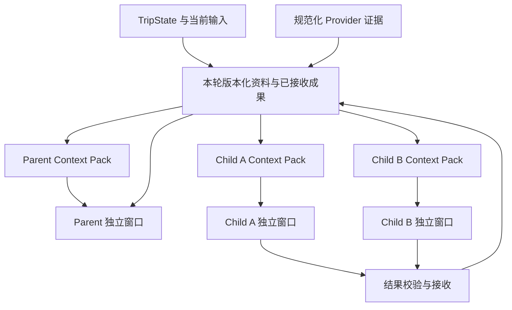

# Travel Agent 执行设计：上下文、工具、多 Agent 共享与工作交接

2026-09-22 追溯说明：本文保留早期设计依据；本轮上下文、工具与业务接续以 [current/15](../current/15-model-context-and-handoff.md)及配套 [current/14](../current/14-continuous-planning-business-model.md)为准。新增方向尚待实现，见[开发交接](./2026-09-22-continuous-planning-redesign-handoff.md)。

日期：2026-09-15。状态：**商用升级方案的执行设计，尚未实现**。

本文补齐[商用升级方案](./2026-09-15-commercial-multi-client-multi-agent-upgrade-plan.md)的执行核心。继续采用现有 Pi、TravelService、PostgreSQL 和有界 fan-out；以下合同与接线属于本次升级必需部分，不以减少服务数量为由省略。

用户随后确认同时满足 500 人提交与 500 个多 Agent 规划执行。[500 并发最终核查](./2026-09-15-commercial-500-concurrency-final-review.md)规定部署、跨实例持有权、全局预算、恢复和容量验收。本文的每轮工作区由同一有效 Worker 管理，持久状态与不可变材料分开保存，以下上下文与交接合同继续适用。

## 1. 设计结论与责任

**多个 Agent 共享有版本的旅行事实、证据和已验收成果；每个 Agent 保留独立上下文窗口。通过结构化任务与接收回执交接工作。**

共享窗口不能把几个模型的上下文长度相加。对一个 Agent 生效的内容，必须实际进入它本次请求，或由它调用获授权的读取工具取得。只给一个文件名、artifactId 或另一个 Agent 的名字，并不会让模型自动知道其中内容。

| 对象 | 唯一责任所有者 | 保存与读取方式 |
| --- | --- | --- |
| 用户要求、已确认安排、锁定项 | TravelService / Trip Runtime | 现有 TripState；所有客户端共用 |
| 原始会话意图与纠正 | Conversation / Turn Repository | 本轮脱敏输入输出持久化，摘要只作索引与压缩 |
| 本轮规范化候选、工具回执、分析成果 | 本轮工作区，由服务端写入 | conversation_turns 保留小状态与引用；同一 PostgreSQL 中的 turn_artifacts 保存有界、不可变材料 |
| 每次发给模型的上下文 | 上下文组装函数 | 从上述记录构造，可重建，不成为另一份事实状态 |
| 工具是否能调用、参数范围和结果是否可用 | 服务端工具执行入口 | Agent 的 Prompt 提醒不能替代执行时检查 |
| 委派目标、任务接收、冲突取舍与对用户交付 | Parent | Child 完成输出后，经校验和必要审阅才被接收 |
| 路线、价格计算、约束与最终提交合法性 | 现有确定性 Checker / Runtime | 不由 Agent 投票决定 |

“本轮工作区”只是当前请求的资料与成果容器。它不承接已确认行程、不允许 Child 任意改写，也不是新的长期记忆系统。

## 2. 当前代码缺口

| 源码事实 | 直接后果 | 本次改造 |
| --- | --- | --- |
| Parent 用最近 18 条消息拼接历史；对话记录本身截到 80 条 | 超出窗口的未结构化偏好或承诺可能消失；不能称为完整历史理解 | 结构化旅行事实 + 带来源的会话摘要 + 最近完整消息 + 按需历史读取 |
| 旅行状态、历史文本被拼进 systemPrompt | 规则与用户/外部资料的来源层级混杂 | system 保留受控规则；动态事实、历史与资料保留数据角色和来源 |
| buildTravelContextPack 存在，但 src/ 下未发现实际调用 | 声明的 Context Pack 与 Web/Child 的真实 Prompt 是两条链 | 在 Parent 与 Child 的模型入口统一接线 |
| v2 Pack 要求已存在的 targetNodeId；只列节点 readSet，部分全局切片整份复制 | 无候选的新旅行难以使用；预算、天气、同行人依赖未完整进入读取依据 | 复用其字段，增加研究范围变体与全局依赖版本；不创建虚构节点凑合同 |
| Child 每域先截两个候选，单次 completeSimple，无工具 | 可能丢掉关键候选；无法主动展开证据或检查计算 | 候选索引保留已选、锁定、点名项；授权 Child 分页展开本轮资料 |
| 工具全局与单工具均 sequential；前置 Hook 主要限制次数 | 无明确读写并发策略；权限、版本、取消需要落实到服务 | 按作用分类，读工具可并行，写工具串行并核验 |
| Child 输出只做格式、引用 allowlist 和部分归一化；needsContext 是字符串列表 | 合法引用不等于结论成立；接收方无法可靠知道下一步补什么 | 任务验收条件、结构化缺口、接收回执与必要的原文审阅 |
| 分析推荐/拒绝集合分别合并 | 同一候选可能同时被不同 Child 推荐和拒绝 | 保留分歧原因，Parent 根据硬约束和证据处理，不能只按标记排序 |

来源：[Parent 历史](../../src/agent/travel-conversation-agent.mjs#L524)、[消息裁剪](../../src/agent/travel-conversation-agent.mjs#L444)、[Pack 构造](../../travel-agent-pi-package/src/runtime/trip-runtime-implementation.ts#L947)、[Child](../../src/agent/travel-analysis-fanout.mjs#L78)、[结果合并](../../src/api/travel-service.mjs#L432)。本节为 2026-09-15 核查时的源码记录，行号会随实现变化；不代表后续 PR 的实现状态。后文保留当时的目标设计。

## 3. 上下文如何组装

### 3.1 每次模型调用的六部分

| 部分 | Parent | Child | 裁剪规则 |
| --- | --- | --- | --- |
| 受控指令 | 产品边界、当前阶段 Skill、输出合同 | 本任务角色、一个相关 Skill、输出合同 | 保留权限与禁止项；不把历史/网页正文放进 system |
| 当前任务 | 用户原意、纠正、目标、完成条件、尚未回答的问题 | 明确问题、范围、验收条件与依赖成果 | 目标与否定条件不可丢失 |
| 必须遵守的事实 | 日期、抵达、同行人、预算、已确认/锁定项 | 与任务相关的同一份事实，外加跨领域关键约束 | 不做有损数值压缩；未知不能补默认值 |
| 决策资料 | 当前候选索引、相关证据、预算/路线摘要 | 指定候选和所需证据；允许展开 | 大正文以引用和读取工具取代；保留核验时间 |
| 对话连续性 | 已核验摘要、最近完整对话、未落状态的原话 | 与任务相关的用户原话和来源 messageId | 不复制完整 Parent 聊天记录 |
| 当前工作 | 本轮工具结果、已接收 Child 成果、下一步 | 自己的工具调用、观察与中间结果 | 保留未完成调用的完整协议；压缩已结束的过程 |

同一事实尽量只表达一次。跨领域硬约束必须进入每个受影响任务，例如住宿分析也需要已确认抵达时间与同行人步行要求，不能只收到酒店价格。

### 3.2 统一 Context Pack 的具体补充

沿用 `travel-context-pack-v2` 的 travelerSlice、decisionNeighborhood、evidenceBundle、budgetSlice、environmentSlice、readSet、writeContract、artifactPointers。以明确的新合同版本增加：

- `scope`：`trip_research` 或 `decision_neighborhood`。前者允许尚无节点的旅行，绑定本轮候选集；后者保留现有节点邻域。
- `basis`：Trip revision、已纳入的最后输入 messageId/序号、criteria fingerprint、本轮证据快照版本。
- `dependencies`：相关节点版本，加上实际用到的预算、同行人约束、抵达、天气、报价等值的版本/哈希与到期条件。不能只有节点 readSet。
- `workUnit`：问题、完成条件、输入成果引用、尚未解决的缺口。
- `projection`：本次实际包含和省略的资料范围、可展开的引用、工具合同/Skill 版本，以及渲染后的上下文用量估计。

Pack 在派发前由服务端构造和校验。Child 接收的是冻结副本或独立数据副本，不能共享可变 JavaScript 对象。`contextHash` 基于规范化内容，排除 createdAt 等不影响含义的字段；时间敏感性由证据到期规则单独核验。模型只引用标识，不能自行声明新的有效版本或扩大权限。

`writeContract` 表示允许提出建议的范围，不代表持久化写权限。Child 的执行角色始终禁止写 TripState，即使 Pack 里存在 allowedNodeIds。

### 3.3 事实、偏好、猜测分别处理

- 用户对日期、预算、偏好和同行人需求的明确新纠正，先由 Parent 写入理解并取得新版本，再派发相关分析。
- 已确认票务/住宿与 Provider 的库存对照分开；另一条较新的库存不能自动覆盖用户已订事实。
- 营业、房态、路线等外部事实依具名来源、适用日期和核验时间；图片观察、用户转述、Agent 推断保持各自标签。
- Child 建议与会话摘要均不升级为事实。引用 ID 合法只是最低校验，Parent 还要核对结论是否被内容支持。
- 新输入与既有已确认安排冲突时保留差异，按现有修改与确认路径处理；不能用一句“最新消息优先”自动取消已确认安排。

### 3.4 历史、摘要与长对话

会话摘要保存当前目标、已做决定及原因、被排除选项、仍有效偏好、未决问题和对应 messageId。精确时间、金额、数量、否定、人物归属必须由结构化字段或原始短句保真。摘要附 `throughMessageId`，后续纠正不会被旧摘要覆盖。

摘要是可重建材料；它不能决定确认、付费或路线合法性。读取历史先按 messageId/任务范围定位，必要时分页，不默认引入向量数据库。

当前 80 条裁剪已经丢掉的历史无法靠摘要恢复。升级后由 `conversation_turns` 保留本轮脱敏输入输出；conversation.messages 可以保留显示用窗口，但不得再把“显示裁剪”当成“原始记录删除”。历史读取必须校验当前用户归属，执行既定保留与删除策略。

## 4. 上下文窗口与多 Agent 共享

### 4.1 共享哪些东西



共享的是同一版本的事实、引用和被接收的成果。每个 Agent 的局部聊天、草稿和推理过程保持私有，不互相广播。服务器只存一份资料，并不意味着模型只消耗一次 Token；相同资料进入两个请求仍各占其上下文，缓存命中也不等于共享注意力或共享权限。

各 Child 默认读取派发时固定快照。A 产生的草稿不会突然进入正在执行的 B。若 B 需要 A 的结果，B 的任务应声明依赖，等 A 被接收后才组装上下文并开始。

### 4.2 窗口预算按每次请求计算

输入预算上限：

`min(模型实际窗口 - 本次输出/推理预留 - 安全余量, 当前角色的应用输入预算)`

system、工具参数 Schema、历史、资料、工具结果和图片都计入输入；输出/推理如何占窗口按该模型适配器规则计算，避免漏计或重复计。模型切换后重算，不能沿用更大模型的历史长度。

示例只用于解释：假设可用窗口 32k，输出预留 4k、余量 4k，则输入最多 24k；Parent 可以主动限制到 16k，Child 到 8k。这里没有宣称项目模型就是 32k，也不把这个例子作为生产默认值。

每次派发检查实际模型配置。支持准确计数时使用匹配模型的计数方式；只有估算时标记 estimate 并留出余量，供应商 usage 用于校准。不能以字符数直接宣称精确 Token 数。

裁剪顺序：去重复 → 缩短已经完成的工具大结果并保留可读引用 → 用摘要替换较早的完整对话块 → 减少低相关证据 → 缩小当前任务。权限、目标、近期纠正、硬约束、必要来源和未完成工具协议不裁掉。

若必须保留部分仍放不下，返回明确的 context_budget_exceeded 并缩小任务/分步执行，不静默截尾。读取工具每次限制 ID 数量、返回字节与页数，防止一次展开重新灌满窗口；重复读取同一版本返回短引用回执。

### 4.3 压缩与恢复边界

只在完整模型响应与对应工具批次结束后压缩。assistant 的 toolCall 与匹配 toolResult 成组保留或删除；不能遗留孤立调用。某些 Provider 要求原样回传的签名或推理块只留在该 Agent 私有协议内，不跨 Agent 交接；跨模型接力从受控摘要和回执重建。

压缩前保存：当前目标、依据版本、已接收成果引用、未解决问题、下一步、已用预算与完整工具回执。它是业务可继续处理的交接点，不是序列化模型内部状态。

Pi Core 的 transformContext 处理本次请求投影，并不会自动修改持久会话。本项目还需要在轮次结束保存连续性材料；仅设置一个 Hook 不能获得长期记忆。

## 5. 工具调用设计

### 5.1 工具的权限与并发矩阵

以下“新增”工具是已有业务能力的窄包装，名称为设计名；没有任意 URL、Shell 或自定义代码执行入口。

| 工具/作用 | Parent | Child | 并发与结果 |
| --- | --- | --- | --- |
| get_trip_control_view / get_trip_plan_view | 当前 Trip 只读 | 只提供限定 Pack 投影 | 同一快照的读可并行；按版本缓存 |
| read_context_artifact（新增） | 授权范围内展开 | 仅任务 allowlist 中的 ID/字段 | 只读分页；不存在/越权明确返回，不自动联网 |
| read_conversation_context（新增） | 按当前会话取历史 | 仅明确分配的原话片段 | 保留角色和 messageId；不进入 system |
| save_trip_understanding | 根据用户表达增量更新 | 禁止 | 串行写，返回实际变更和新版本 |
| collect_trip_evidence（新增） | 使用现有 Provider 查询链 | 禁止 | 有费用的只读外部调用；来源层并行、相同请求复用 |
| delegate_analysis（新增） | 派发有界任务 | 禁止 | 复用当前 fan-out；在配额内并行或按依赖开始 |
| estimate_costs / 本地约束计算 | 复用现有函数 | 仅对本 Pack 的证据作纯计算 | 不联网、不写状态；缺价格返回 unknown |
| plan_itinerary_trial | 组织方案并交给现有 Checker | 禁止 | 基于固定候选/版本，顺序核验，最多一次 repair |
| confirm_trip_selection / accept_trip_change | 有明确用户确认时调用受控服务 | 禁止 | 串行、幂等；确认内容与当前版本重新核对 |

工具白名单由角色、当前阶段与服务端权限共同产生，不能由模型传入的 allowedTools 授予。所有业务写入仍经过 TravelService；HTTP/MCP/外部 Pi 入口不能另写一套提交规则，公开远程入口必须携带真实 principal。

### 5.2 每个调用经过同一执行路径

1. 模型提出 toolName 和参数。验证 Schema、字段长度、批量数量与对象范围。
2. 服务端从当前执行绑定取得 actor、user/Trip、turn/task、依据版本和截止时间；拒绝模型指定其他身份、版本或数据范围。
3. 检查该阶段是否允许调用、用户权限是否仍有效、预算是否足够、任务是否已取消或过期。
4. 查询同一语义请求的已完成回执；必要时合并正在进行的同源读取。复用键包含适用日期、条件、版本和权限范围，不能串用户缓存。
5. 执行真实服务。全链路传同一取消/截止信号；写操作保持短事务与版本检查。
6. 校验输出合同、引用、长度、来源与状态。落下必要回执后返回模型可读的小结果；UI 读取独立的公开投影。
7. Parent 根据真实结果继续、补资料、修正或结束。工具调用结束、Agent 结束和旅行任务完成是三个不同状态。

服务端业务入口必须再次执行关键权限/提交校验；beforeToolCall 是提前拦截，不是唯一防线。工具调用 ID 用于关联消息，不能单独充当重试幂等键；写操作使用服务端绑定的用户请求身份与规范化操作内容。

### 5.3 工具结果包含什么

```text
状态：ok / partial / needs_context / rejected / unavailable / stale
数据：本步骤必要的少量结构化字段
依据：artifactRef、证据版本、checkedAt / expiresAt
影响：哪些约束/领域已核验，哪些仍未知
恢复：可否重试、缺什么、允许的下一步
回执：稳定 operationId；写入是否实际提交及结果引用
```

这是应用工具结果合同，模型侧用标准 toolResult 传输。`ok` 仅表示该步骤成功，不意味着整趟旅行完整。错误不能包装成空数组或成功的说明文本。技术执行异常保留 Pi 的 isError 语义；needs_context 等业务结果由状态明确表达。

Provider 原始响应、凭据与任意大正文不进入消息。details 也不天然等于安全隐藏区，必须由 convertToLlm 显式过滤；日志同样不能收集秘密。写入成功后，若摘要或 UI 投影失败，应返回可查询的成功回执，不能告诉用户“没有改动”。

### 5.4 工具按阶段开放，而不是一次塞满

理解阶段开放保存理解与必要读取；资料阶段开放受限取数；证据就绪后开放委派和证据读取；规划阶段开放 canonical trial；确认阶段仅在真实用户授权后开放对应确认操作。

只读独立工具可 parallel；写工具标 sequential，且混合读写批次整体顺序执行。写入后依赖旧快照的其他调用需要重新核验；“同批串行”不自动让模型提前生成的参数变新。

模型调用额度只覆盖真实模型请求，Parent 等待 Child/工具时释放。Child 不持有模型槽等待另一个 Child；依赖未满足的任务尚未启动。重复参数而没有新资料、新状态或更明确结果时停止空转；重试、补资料、压缩摘要也消耗同一整轮预算。

每个任务必须绑定 maxModelCalls、maxToolCalls、输入/输出预算和 deadline，不能接受无限或空预算。派发前为 Parent 汇总与 Trial 留出剩余时间和用量，不能让 Child 用完后才发现无力生成主方案。现有 Child 45 秒、Parent 90 秒不能直接用于承诺新路径；待测起始预算和整轮截止时间见最终核查第 2、6 节，按真实阶段耗时与质量一起验证。

## 6. 从现有研究工具拆出明确交接点

当前 research_trip_options 将取数、分析和 Proposal 生成放在一次服务调用里，Parent 无法在证据回来后再决定如何委派。目标接线为：

`保存理解 → collect_trip_evidence → Parent 判断问题 → delegate_analysis → 接收成果 → plan_itinerary_trial → 待确认`

具体改动：

- 从 researchTripOptions 提取“查询/归一化”与“组装/暂存 Proposal”两个现有实现片段；不重写 Provider。
- collect_trip_evidence 返回当前轮只读 candidateSetRef、稳定候选 ID、来源和覆盖状态。候选转换沿用原构造逻辑，但在确认链之前不写成已选节点。
- 新 Parent 工具集使用 collect + delegate；旧 research_trip_options 留给现有外部消费者作为兼容组合入口，调用同一底层函数。一次执行只走其中一条路径，不能重复 fan-out。
- 规划上下文解析增加对本轮候选集的受限读取，将规范化候选送入原 Checker；Trial 成功后由 Parent 路径产生用户可采用的 Proposal。候选 ID 到节点 ID 的映射由服务端固定并校验，模型不能创建新事实。
- 预算不够、资料不足或用户只要比较时，可以交付明确的候选/部分结果。只有用户确实要求完整规划且前置条件已具备时，才继续到 trial。

这部分是必要的工具接线改造，涉及上下文构造、候选装配和现有消费者兼容；不能只修改工具名称就宣称完成。

## 7. Agent 工作交接合同

### 7.1 Parent 派发的任务单

任务单必须能让一个没有读过 Parent 聊天的新 Agent 开始工作。以下为虚构示例，权限和依据由服务端绑定：

```json
{
  "taskId": "stay_compare_1",
  "turnId": "turn_demo",
  "objective": "比较两个住宿候选对住宿总价和已确认抵达接驳的影响",
  "basis": {"tripRevision": 12, "inputThrough": "message_18", "evidenceSnapshot": "research_4"},
  "contextRef": "pack_stay_1",
  "scope": {"candidateIds": ["stay_h1", "stay_h2"], "travelerIds": ["traveler_father"]},
  "mustRespect": ["arrival_confirmed", "father_reduce_walking"],
  "acceptance": ["价格使用相同日期和人数口径", "未知接驳费用不得当成零", "列出能改变推荐的缺口"],
  "dependsOn": [],
  "resultContract": "travel-analysis-result-v2"
}
```

Runtime 另外绑定 contextHash、只读工具集、截止时间、剩余调用/费用预算及取消信号；这些不能由 Child 输出覆盖。Parent 不能派发自己也没有权限执行的工作。

### 7.2 Child 返回的工作成果

```json
{
  "outcome": "needs_context",
  "summary": "H1 的住宿报价更低，但缺接驳资料，暂不能判断总成本和步行负担",
  "findings": [{"candidateIds": ["stay_h1", "stay_h2"], "claim": "住宿报价比较", "evidenceRefs": ["quote_h1", "quote_h2"]}],
  "completedChecks": ["入住日期一致", "人数和间夜口径一致"],
  "unknowns": ["抵达点至两处住宿的移动方案"],
  "needsContext": [{"kind": "mobility", "candidateIds": ["stay_h1", "stay_h2"], "reason": "接驳负担可能改变推荐"}],
  "suggestedNextAction": "由 Parent 通过既有路线服务补充证据"
}
```

taskId、attempt、basis、来源工具回执、实际用量由运行端附加。summary 用于快速理解；下游仍能展开完整结构化成果和对应证据。Child 不传完整聊天或私有推理，也不只返回一个无法核查的推荐名称。

### 7.3 接收回执决定交接是否完成

`submitted → accepted / returned / stale / failed`

- 校验该结果确实属于当前授权任务，未取消、未超过有效依据，未引用外部对象。
- 按任务 acceptance 检查必需项；格式、单位、价格口径和硬约束可确定性核验的部分由程序做。
- Parent 审阅语义结论是否有依据、是否解决问题。合法引用不能自动证明结论正确；必要时展开来源。
- needs_context 可以作为有效缺口被接收，但该必需分析仍未完成，不把它算进完整 coverage。
- 保存 outcome 与接收回执后，成果才可供依赖任务使用。相同 taskId/attempt 的重复返回读取原回执，不能重复汇总或提交。

执行状态和业务完成状态分开：函数返回表示执行结束；验收通过表示任务完成；所有必要任务、资料覆盖和 Checker 条件满足后，才表示可交付主方案。

### 7.4 四种交接方式

| 交接 | 交出什么 | 接收方怎样开始 |
| --- | --- | --- |
| Parent → Child | 任务单、限定 Pack、授权工具和预算 | 验证依据与必需资料；缺失即 needs_context |
| Child → Parent | 结构化成果、证据、未决项、实际用量 | 校验并记录回执，纳入统一比较或补查 |
| Child A → Child B | 已被接收的 A 成果引用及其依赖版本 | 经 Parent 预先批准的依赖边，由现有 fan-out 组装 B 的新 Pack |
| Parent → 下一次 Parent 执行 | 当前目标、已处理输入、当前依据、已接收成果、未决项、下一步与剩余预算 | 从工作记录和最新 Trip 重建；核对已有工具/确认回执，禁止盲目重做 |

Child 间不建立自由聊天通道。首版用当前最多三个任务的有界任务清单，允许显式依赖，禁止循环和 Child 自行增加任务。独立任务并行；依赖任务只在所需成果 accepted 且业务结果可用后启动。复用 Dynamic Workflow 的组合能力，不建设通用 DAG 平台。

如果 B 需要 A 的结论才能判断，它就不应与 A 无条件同时开跑。若仅需要同一份证据，两者应并行且不互相污染判断。

### 7.5 缺口、冲突、超时与新输入

- **缺资料：** Child 返回结构化缺口并结束此次执行，释放额度。Parent 合并相同需求，走已有 Provider 链；最多一次条件修正。补充后创建新 attempt/分析轮，携带上一份有效成果，重做受影响部分；截止时间和总预算不重置。
- **结论冲突：** 保留两方理由。硬约束优先由 Checker 排除；同一事实冲突回到来源与适用时间；偏好取舍由 Parent 解释给用户。不多数投票、不平均价格、不让“推荐”覆盖“未知”。
- **超时/失败：** 已保存成果保留，未完成部分显式缺失。有限重试在原预算内；达到边界就 partial/needs_context，不再拉起新 Agent 循环补位。
- **用户纠正：** 消息先持久化；相关约束变更产生新依据，取消受影响工作。旧结果仍可存为历史但不能进入当前发布。确认/提交前总要重新检查当前任务与 Trip。
- **复用未受影响成果：** 仅在所有声明依赖、权限、证据有效期和合同版本仍成立时复用；缺少依赖信息就重算。不能直接把旧成果 revision 改成新值；最终 Proposal 仍走完整 rebase/Checker 路径。

每个 fan-out 分析轮只汇合一次。一次允许的补查创建新分析轮并明确替代关系；最终只有一份当前可采用 Proposal，旧草稿不能被迟到结果重新激活。

## 8. 完整例子：共享、工具和交接如何一起工作

虚构场景：“上海四天，15:00 抵达浦东，父亲少走路；先比较两个住宿锚点。”

1. Parent 保存用户要求，生成 basis V12；本轮公开回显与各 Child 的 mustRespect 都包含抵达和父亲的需求。
2. collect_trip_evidence 调用现有来源，产生 evidence snapshot E4。资料正文留在本轮工作区，模型先收到候选索引和有来源的摘要。
3. Parent 派发 A 比较住宿预算，B 判断活动与同行人适配。两者读取 V12/E4 的各自切片，分别拥有独立窗口；没有复制整段聊天。
4. A 通过 read_context_artifact 展开两个报价，再调用本地计算，发现接驳未知，提交 needs_context。运行端记录缺口回执，A 不继续占用调用槽等待。
5. B 返回来源支持的适配判断。Parent 接收该成果；缺少支持的“小众”描述不会变成事实。
6. Parent 通过现有路线服务补齐需要的接驳资料；在允许的补查预算内建立新依据。只有相关工作重跑，仍有效的 B 成果可依赖核验后复用。
7. Parent 组装主方案，调用 plan_itinerary_trial。Checker 若指出某段步行不符，只修正该段并再验一次。
8. trial_ready 后在两端显示同一份待确认方案。手机确认后，服务返回唯一提交回执；Parent 的成功措辞以该回执为准。
9. 若第 6 步用户改为 18:00 抵达，旧时间相关分析失效，任何迟到结果不得继续发布；手机和桌面看到同一份新的要求与状态。

## 9. Pi SDK 的实际接线位置

本项目安装 Pi Agent Core 0.84.1。其上下文转换、工具 Hook 与循环更新能力可承载上述设计，不需要先迁入完整 Coding Agent 宿主。[官方 Core 文档](https://github.com/earendil-works/pi/blob/v0.84.1/packages/agent/README.md)

| 接口 | 使用方式 | 必须注意 |
| --- | --- | --- |
| initialState | 首次调用前装好当前规则、工具与消息 | prepareNextTurn 不负责首次请求 |
| transformContext / convertToLlm | 请求前裁剪投影、过滤 UI/内部字段、保持消息角色 | Hook 应有安全返回；不可放下时由模型请求适配器阻止发送，不能退回超大/越权上下文 |
| beforeToolCall | 角色、范围、取消、预算和依据前置检查 | 不能替代底层服务验证 |
| afterToolCall | 输出规整、短摘要和引用 | 不在此重做已经成功的业务写入 |
| prepareNextTurnWithContext | 完整工具批次后更新循环的 context、工具、规则与模型 | 不会自动保证下一次独立 prompt 使用相同状态；需从运行记录重建 |
| shouldStopAfterTurn | 达到安全压缩点、截止/预算或真正结束时停下 | 返回 true 不等于中途取消当前工具 |
| steer / followUp | 按 SDK 语义传递受控的新输入或内部继续动作 | 不持久化、不自动使旧成果失效，不作为跨端消息队列 |
| subscribe | 捕获真实工具/阶段边界，驱动本轮公开状态 | listener 会被等待，不能把慢数据库/逐 Token 广播塞入每个事件 |

`prepareNextTurn` 更新上下文不等于“强制再跑一轮”。工具结果已 terminate 或模型结束时，如产品目标尚未满足且前置条件已成立，需要运行管理显式安排一次有界的内部继续动作，并计入原预算；不能伪造新的用户消息。仍无进展就明确退出/追问。

本次用安装包与 faux 模型验证了：循环内工具集可从 collect 切到 check；transformContext 可从模型请求排除旧消息而 Agent.state 仍保留；afterToolCall 的缩小结果会进入下一次请求；beforeToolCall 可阻止实际 execute；独立 Agent 不自动收到对方消息。还观察到循环替换工具集后 Agent.state.tools 仍是初始集合，因此恢复必须显式重新组装。

证据：[探针代码](./assets/2026-09-15-runtime-architecture/pi-context-tool-probe.mjs)、[运行结果](./assets/2026-09-15-runtime-architecture/pi-context-tool-result.json)。这些是 SDK 行为验证，不是业务交接、Token 估算或商用多 Agent 已实现的证明。

Pi 新 Harness 继续作为候选；v0.85.1 将实验 client/server 与受支持的本地 SDK 分开发布，当前设计不依赖它。[发布说明](https://github.com/earendil-works/pi/releases/tag/v0.85.1)

## 10. 持久化、模块落点与验收

### 保留必要的工作记录

conversation_turns 保存脱敏输入输出、输入序号、basis、小状态、有效持有者/generation/lease、预算汇总和结果引用；Context Pack 清单、规范化材料、完成交接件、效果回执与 Parent continuation 分别使用有界 turn_artifacts 或原业务回执引用。公开 API 只读允许展示的投影，不返回全部内部工作记录；心跳与状态变化不重写大材料。

并行 Child 通过统一接收函数按 taskId/attempt 合并记录，短事务同时验证有效持有者、generation、未取消、权限和依据；禁止各自回写开头读取的整个 turn JSON。关键结果保存失败时不能发布 accepted。运行中的 Pi 对象、私有推理和原图不持久化；图片仅在原请求仍存活时供同一 Parent 使用，达到安全检查点并清除图片后才继续后台。图文 Worker 接线和断开例外见最终核查第 8 节。

资料与成果按保留策略清理，活动 turn / 有效 Proposal 引用的材料不可提前清除；失效引用返回 context_missing/expired 并正常重新获取。Worker 重启后在原预算内自动从已保存交接点重建 Parent，先核验旧结果与效果回执；不恢复私有推理或中断 Token，不能越过原图 request-only 边界。

### 代码落点

| 位置 | 具体责任 |
| --- | --- |
| travel-agent-pi-package/src/contracts 与 core/trip-runtime.ts | 升级 Pack 变体、任务/结果/接收合同；复用原类型校验 |
| runtime/trip-runtime-implementation.ts | 正确构造邻域与全局依赖、稳定内容哈希；保留原提交检查 |
| src/agent/ 下新增少量 TypeScript 模块 | 组装/裁剪上下文、按角色暴露工具、校验/接收交接成果；这些是函数模块，不是新服务 |
| travel-conversation-agent.mjs | 消除历史拼进 system 的接线；阶段工具集、内部继续与 Parent 结果验收 |
| travel-analysis-fanout.mjs | 受限任务与依赖、独立 Pi Child runner、needs_context 回传；复用一个编排所有者 |
| src/api/travel-service.mjs | 提取取数/Proposal 装配、限定候选集进入 Trial、统一回执与提交 |
| src/persistence 与 src/http | 事务保存 turn 工作记录、历史读取、公开状态投影与授权 |

### 与声明同层的验收

- **上下文连续性：** 超过现有历史窗口后，仍保留明确预算、人物归属、否定要求和锁定项；用户新纠正生效，旧摘要不覆盖；缺资料能按引用取得。
- **窗口正确性：** 实际捕获发给模型的 payload，确认工具 Schema/图片/历史均计入预算；压缩后无孤立 toolResult、关键约束无损；模型切换后重新计算。
- **共享与隔离：** 两个 Child 引用相同事实版本；不能读取另一用户/未授权候选；不能修改共享对象；A 未接收的草稿不进入 B。
- **工具真实执行：** 越权工具不进入执行函数；独立读有重叠；写操作顺序且受版本保护；取消传到 Provider；重复确认返回原回执。
- **交接有效性：** 所有必需完成条件都有结果；缺证据返回 needs_context；重复结果不重复汇合；依赖失败不会让后续任务假成功；重启后依据已保存成果继续而非重复确认。
- **用户结果：** 用真实模型、Provider 和两个实际客户端完成需求到已核验主方案，再做一次约束变更；核对每个 Agent 的贡献、总耗时与整趟费用。

以上属于完整升级范围。当前交付为设计与 SDK 探针证据，未修改产品实现、Prompt 合同或进行真实模型/负载验收。
