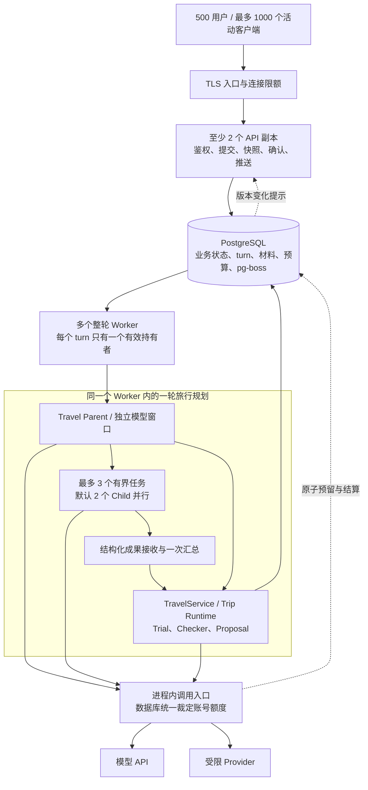

# Travel Agent：500 用户并发商用架构最终核查

日期：2026-09-15。性质：**架构评审与修订设计，尚未实施、尚未通过容量验收。**

2026-09-16 实施补充：已完成 Pi 0.85.1 升级、LinkCode 原生 adapter 内部宿主和部分单轮执行修复，见[实际验证与未通过项](./2026-09-16-pi-085-linkcode-internal-host-validation.md)。本文要求的持久调度、多实例协调和两个 500 容量验收仍未完成，以下设计不能作为已有能力宣传。

用户已明确要求两项同时成立：**500 人可以同时提交规划，排队有界；500 个规划任务可以同时执行，包含各自的多 Agent。** 本文是这一负载要求下的部署、运行所有权、容量与上线验收基准；替代[上一版方案](./2026-09-15-commercial-multi-client-multi-agent-upgrade-plan.md)的单活动进程、默认轮询和人工重启接续假设。[执行设计](./2026-09-15-agent-context-tools-and-handoff-design.md)中的业务上下文、工具权限和交接合同继续有效，持久化与跨进程规则以本文为准。

## 1. 评审结论

**此前方案不能签署“已经齐备、可商用承载 500 并发”的结论。** 它明确了旅行业务、上下文和 Agent 分工，但执行协调仍以单进程为前提，缺少可执行的容量合同与多实例故障恢复。当前源码也没有实现这些升级。

建议的完整方向是：**保留 Pi 与 TravelService，在同一代码库中分开 API 和整轮 Worker；以 PostgreSQL 保存业务事实、执行归属和调用预算，以成熟的 PostgreSQL 队列交付整轮任务。每轮仍由一个 Worker 运行 Parent 和受限 Child。** 500 的明确目标使这些投入有了直接采用依据。

评审分三个层次：

| 判断对象 | 本次结论 | 理由 |
| --- | --- | --- |
| 旅行业务与 Agent 执行方向 | 保留，补充本文的并发边界 | 独立模型窗口、共享版本化事实、受限工具、Parent 验收与统一提交方向成立 |
| 500 并发的目标架构 | 可作为实施基线；容量参数须由实测定值 | 运行所有权、准入、预算、恢复与验收已明确；机器数量与真实供应商吞吐仍不能凭设计确认 |
| 当前产品商用上线 | **不通过** | 未实施新的执行链，未取得真实 500 规划负载、故障演练和完整生产用户路径证据 |

这次核查发现的具体断点：

| 核查项 | 当前证据 | 必须修正 |
| --- | --- | --- |
| 多实例执行 | `workflowExecutionPolicy()` 明确 `coordinatorSupported: false`，多实例关闭语义 fan-out | 实现持久归属后修改入口策略；增加副本本身无效 |
| 运行状态 | analysis / planning coordinator 使用进程内 Map | Map 只管理本进程对象和 AbortController，数据库裁定谁有权继续和发布 |
| 请求生命周期 | HTTP 等待整轮 reply，模型路径末尾保存对话 | 输入与 turn 先持久化；模型执行脱离普通 HTTP 请求 |
| 配额 | AMap 请求调度等是实例内计数/调度 | 按实际供应商账号与端点统一限额，覆盖 Parent、Child、重试、摘要和补查 |
| 数据库 | 五类默认 Pool 上限相加为 32/应用实例；部分 Repository 在请求中运行建表 SQL | 共用有界 Pool，迁移离线运行，计算全部副本连接预算 |
| 上下文恢复 | 已有设计，没有端到端实现；大工作记录集中在 turn JSON | 小状态行与不可变材料分离，恢复时重建授权和模型窗口 |
| 发布和失效恢复 | HTTP server 关闭后退出，没有持久运行迁移链 | API / Worker 分开健康检查、停止接单、接续和版本兼容 |
| 商用数据与端 | Wiki 仍记录生产 OAuth、地图 JS、目标端发布及部分旅行数据能力缺口 | 用当前真实配置逐项验收；历史 smoke 不作上线证明 |

源码依据：[运行策略](/Users/chenge/Desktop/travel-agent/src/api/create-travel-service.mjs:7)、[本地 coordinator](/Users/chenge/Desktop/travel-agent/src/agent/travel-analysis-run-coordinator.mjs:1)、[HTTP 工厂及 Pool 消费者](/Users/chenge/Desktop/travel-agent/src/http/app.mjs:100)、[AMap 调度](/Users/chenge/Desktop/travel-agent/src/providers/amap-travel-research.mjs:723)、[关闭行为](/Users/chenge/Desktop/travel-agent/src/http/server.mjs:23)、[现行产品状态](/Users/chenge/Desktop/travel-agent/wiki/README.md:43)。Pool 数是配置上限之和，不是观测到的实际连接数；Auth 已有 PostgreSQL 持久会话，不能把旧的内存 session 辅助代码误判成当前生产认证。

## 2. 把“500”写成能验收的合同

### 2.1 两个容量承诺同时成立

| 场景 | 负载定义 | 通过条件 |
| --- | --- | --- |
| 在线与跨端 | 500 个独立用户，每人两端，共 1,000 条连接；持续读取、操作与恢复 | 连接、授权、读取、确认不因后台模型请求被阻塞 |
| 同时提交 | 500 个具备必要输入的独立 Trip，在 5 秒内提交复杂规划 | 全部得到唯一、可查的已接收 turn；不能只在内存收下；排队时间与结束状态明确 |
| 同时执行 | 保持 500 个已获得执行资源的复杂规划在途，完成后补充新规划，持续 30 分钟 | 可观察真实模型/工具工作和 Child 交接；不把 490 个等待槽位的任务加 10 个工作任务记成 500 执行 |
| 持续到达 | 另以固定到达率测试；示例为 250 个规划/分钟，持续 30 分钟 | 不能靠系统变慢、压测端随之减少请求来通过；队列不能持续增长 |
| 超载 | 在 500 执行目标之外继续增加提交、重试与重连 | 有界等待或明确拒绝；已经接收的工作、查看与确认仍受保护 |

“执行中”可以在正常模型、工具、网络 I/O 之间切换，不要求 500 个 CPU 同时计算；但未获执行资格、只等待全局模型额度的任务必须另计。500 用户在不同 Trip 上并行；同一 Trip 的互斥和顺序约束仍然有效。

### 2.2 建议上线验收指标

以下是**拟定验收目标，不是当前测量结果**。p95 指至少 95% 请求达到对应时间。

| 用户体验 / 正确性 | 目标 |
| --- | --- |
| 文本规划已保存 | 提交至持久接收 p95 ≤ 2 秒，p99 ≤ 3 秒 |
| 正常容量内排队 | p95 ≤ 10 秒；任何已接收任务等待超过 30 秒，必须结束等待并给出可恢复原因，不能静默悬挂 |
| 首次有用结果 | 从提交开始 p95 ≤ 30 秒；必须是理解确认、可用证据或具体缺口，不能只算“正在思考” |
| 可执行主方案 | 前置条件齐备的基准案例，从提交开始 p95 ≤ 180 秒；整轮执行硬截止 240 秒，超时保留已有有效结果并如实标记 |
| 读取 / 无需外部重核的确认 | p95 ≤ 500 毫秒，p99 ≤ 1 秒；确认若需重新查路线或报价，转明确的重核状态，不能先显示采用成功 |
| 跨端状态变化 | 正常推送 p95 ≤ 1 秒；重连后立即读取最新快照 |
| 基准任务完成 | 技术完成率 ≥ 99%；输入和数据条件齐备的案例，可执行主方案率 ≥ 98%；partial、needs_context 与拒绝分别统计，不能算完整成功 |
| 不可接受错误 | 越权读取、迟到结果覆盖新需求、重复确认生效、遗漏锁定硬约束为 0 |
| 单 Worker 失效 | 有效检查点不丢；普通只读规划在 60 秒内由其他 Worker 开始接续；故障恢复耗时单列 |

正常容量指标建立在生产账号额度和必要 Provider 正常的前提上。供应商故障时仍须快速反馈、保存已完成工作并控制成本；这种受控失败不能计成正常成功。整站月度可用性目标可设 99.9%，但它需要运行时间证明，不能从一次压测推导。

## 3. 容量预算：模型、上下文与 Provider 一起计算

### 3.1 可复算的规划模型

当前没有新方案的真实耗时与 Token 分布，先使用显式假设求资源需求，再用测量替换。

| 参数 | 计算示例中的假设 |
| --- | --- |
| 同时执行的规划 N | 500 |
| 每个规划平均执行时间 T | 120 秒 |
| 每规划总模型请求 k | 10 次，包含 Parent、Child、修正与摘要 |
| 单模型请求平均占用 d | 15 秒，包含上游等待与流式输出 |
| 单次平均输入 / 输出 | 8,000 / 1,000 Token；输出应包含收费的推理 Token，不能只数可见文本 |
| Child 同时运行 | 默认 2，总任务数最多 3；Parent 等待 Child 时释放模型请求槽 |

计算关系：`规划到达率 = N / T`；`模型请求/分钟 = N × k × 60 / T`；`平均模型在途数 = N × k × d / T`。

| 资源 | 稳态计算值 | 增加 30% 容量余量 |
| --- | --- | --- |
| 规划吞吐 | 250 个/分钟 | 准入仍以承诺的 500 活动规划为准 |
| 模型请求 | 2,500 次/分钟 | 3,250 次/分钟 |
| 平均模型在途 | 625 | 813 |
| 两个 Child 同阶段启动的模型峰值 | 1,000 | **1,300** |
| 输入 Token | 2,000 万/分钟 | 2,600 万/分钟 |
| 输出 Token | 250 万/分钟 | 325 万/分钟 |

不能用 813 个平均槽位满足 1,000 路同时工作的峰值。若将每轮并行 Child 从 2 提高到 3，峰值变成 1,500，含上述余量为 1,950；这需要另一次容量验收。多个独立 Agent 的上下文窗口不会相加成一个共享大窗口，发送到模型的材料会分别计入费用。

一批 500 个规划约产生 5,000 次模型请求、4,000 万输入和 500 万输出 Token；它与全天持续 500 活动规划是不同费用规模。平均输入若从 8K 变成 32K，输入吞吐会变为 8,000 万 Token/分钟。若执行时间加倍而到达率不变，在途任务需要 1,000 个，排队将增长。因此上下文裁剪、工具结果长度和长尾超时直接决定商业容量。

计算附件：[输入假设](./assets/2026-09-15-runtime-architecture/capacity-500-input.json)、[计算脚本](./assets/2026-09-15-runtime-architecture/capacity-500-calculate.mjs)、[计算结果](./assets/2026-09-15-runtime-architecture/capacity-500-result.json)。脚本无网络和产品调用，只验证算术，不是压测。

### 3.2 供应商额度不是 API Key 数量

本次官方文档列出 DeepSeek Flash 每账号 2,500 并发、V4 Pro 每账号 500 并发；同账号多个 Key 共用限制。Flash 公布的并发维度高于上述默认峰值，但实际吞吐、延迟、账号其他用途和模型路由仍须验证；不能据此签署 500 个完整规划的容量。[DeepSeek 限速与隔离](https://api-docs.deepseek.com/zh-cn/quick_start/rate_limit/)

DeepSeek 官方当前价格页将 Flash 名称列为 `deepseek-flash`，旧 Flash 别名对应的模型已变更。关于 Pro 的旧搜索快照与当前页面说明不同，因此实施时记录实际请求模型、返回模型和适配版本，不依据旧别名推断能力。当前方案不自行切换模型。[当前模型页面](https://api-docs.deepseek.com/quick_start/pricing/)

Kimi 官方说明存在账号等级与并发、RPM、TPM、TPD 限制。本次未取得该项目账号的有效额度，不能假设它能接走全部峰值；默认路由和每个对外开放的可选路由都应分别验收。[Kimi 限速说明](https://platform.kimi.com/docs/pricing/limits)

上线前取得一张实际账号容量表：模型名称与版本、账号级并发、RPM、TPM、日额度、余额/业务成本上限、其他产品共用量、峰时实测延迟。未公布 RPM/TPM 的供应商填“未公布，实测与服务确认”，不能填无限。

### 3.3 地图与库存可能先到上限

一次 research 工具不等于一次外部请求。地点搜索、详情、天气、报价、逐段路线、替代模式与修正都会增加请求；AMap 的现有实例内排队不能约束多个 Worker 的总速率。

在上述到达率下：

| 每规划真实外部请求数（示例，非测量） | 平均外部 QPS | 加 30% 余量 |
| --- | --- | --- |
| 20 | 83.3 | 108.3 |
| 60 | 250 | 325 |
| 120 | 500 | 650 |

必须按供应商、账号、端点分别计数，不能把总 QPS 当成每家需求。公共地点/天气等仅在许可和新鲜度允许时按规范化查询去重；私人偏好、用户报价、对话和 Agent 结论不做跨用户缓存。路线候选先用现有确定性规则收敛，再查询必要路段，避免为所有候选计算完整两两矩阵。基准测试同时覆盖缓存命中和独立城市/日期的冷数据。

## 4. 目标部署：同一应用代码，API 与整轮执行分工

实现为同仓库、同一部署镜像的 `api` / `worker` 两个启动角色。Worker 数量由测得的安全 turn 容量决定；不拆专业 Agent 服务，不建立跨 Worker 的 Child 任务图。现有照片日志与旅行业务仍复用原服务边界。

运行工厂新增经过持久协调器验证的执行模式，API 角色不创建可绕过队列的规划 Agent。现有 `single_process` 留给本地开发；不能通过把实际多副本环境伪报为一个实例来绕开当前 fan-out 限制。

新增组件各自解决一个确定问题：

- **API 副本**让浏览、确认和跨端连接不随一个执行进程故障而全部中断。
- **整轮 Worker**隔离长任务和普通请求，支持承载 500 活动规划及滚动发布。
- **pg-boss**利用现有 PostgreSQL 交付一轮任务，处理领取、超时和重试；业务输入与入队可在同一事务提交。[事务适配文档](https://pgboss.io/api/adapters)
- **版本变化推送**避免 1,000 个客户端每 1–2 秒轮询造成 500–1,000 次/秒状态读取。快照仍是唯一恢复依据。

不需要在本次引入 Redis、Kafka、微服务网格或自研通用 DAG；如实测证明单 PostgreSQL 无法满足预算与短事务吞吐，再依据瓶颈替换相应模块。队列引入前依项目规则完成固定版本、许可、依赖与写面检查，不能把本次阅读最新文档当成依赖已经获验收。

Pi 使用目前验证过的 SDK 接线。官方 `v0.85.1` 发布说明仍区分受支持本地 SDK 和实验 client/server；新 Harness 不作为本次 500 容量的前提。[Pi 发布说明](https://github.com/earendil-works/pi/releases/tag/v0.85.1) LinkCode 的会话组织继续作为参考，其桌面工作台架构不能替代服务端的账号隔离、准入和提交事务。[原始对比报告](./2026-09-15-linkcode-pi-runtime-architecture-report.md)

## 5. 执行归属、幂等与故障接续必须落在一条控制链

### 5.1 持久对象与唯一真相源

| 对象 | 保存什么 | 不承担什么 |
| --- | --- | --- |
| 现有 Trip / conversation / auth | 旅行事实、确认结果、对话身份与权限 | 不保存运行中 Agent 对象和原始图片 |
| `conversation_turns` | 请求身份、消息顺序、Trip 关联、依据、状态、持有者、generation、lease、截止时间、阶段、公开版本、预算汇总和结果引用 | 不在心跳时重写全部聊天、证据和 Child 输出 |
| `turn_artifacts` | 有大小上限、版本和作用域的 Context manifest、证据/成果引用、接收回执、压缩摘要与恢复记录 | 不共享私有推理，不充当另一份 TripState |
| `runtime_calls` / `runtime_limits` | 真实外部调用尝试、资源预留、状态、用量与账号限额 | 不保存 Provider 密钥或原始模型输入输出 |
| pg-boss 内部表 | `{turnId, schemaVersion}` 任务的投递与重试 | 不拥有业务状态；删除队列历史不能删除用户结果 |

对话完整有效输入/输出仍按业务保留策略存储；内部材料可短期清理，但当前运行或有效 Proposal 引用的材料不能提前失效。效果回执跟随相关业务数据保留，不能随短期队列日志删除。大对象读取分页、有界；公开状态仅返回必要字段和引用。

### 5.2 接收和领取

1. API 核验身份、Trip 权限、请求大小和准入；为 Guest 和用户绑定相同的防滥用/服务额度规则。用户 ID 或 Trip ID 的猜测不能授予读取权。
2. 同一短事务保存规范化用户消息、turn、`requestId + inputHash` 和整轮队列任务。唯一键至少包含主体、conversation 与 requestId；同键同输入返回原 turn，不同输入返回冲突。
3. 模型/网络不在该事务内运行。提交失败就不显示“已保存”。队列不可写时整体回滚，不形成没有任务的已接收输入。
4. Worker 领取后使用数据库短事务取得 turn 的有效租约与递增 `generation`。conversation / Trip 上分别约束最多一份活动规划；未绑定 Trip 的首轮先以 conversation 为作用域，首次保存理解时原子绑定 Trip。
5. 领取、替换、恢复、确认使用固定锁顺序与唯一约束，不依靠先查询再写入。持有者过期只能经原子接管更新 generation；其他 Worker 看到冲突就释放重复领取，不直接执行。

队列 `localConcurrency` 只约束单进程，`groupConcurrency` 官方提示竞争时可能短暂超出。因此它们可以帮助调度，**不能单独作为 Trip 唯一写者或供应商硬限额**。[pg-boss Worker 文档](https://pgboss.io/api/workers)

对外入口建议统一为以下语义，路径可按现有 API 风格调整：

| 接口 | 行为 |
| --- | --- |
| 提交 conversation turn | 携带 requestId、客户端已读版本、输入；返回 turnId、接收状态与公开版本 |
| 读取 turn / Trip 快照 | 校验权限，按版本与分页返回；读取本身不启动模型 |
| 停止或替换 turn | 幂等控制请求，先持久化取消/替代关系，再通知执行者 |
| 确认 Proposal | 携带 requestId、Proposal ID、依据版本和确认内容；返回已提交结果或明确重核/冲突状态 |
| 订阅状态 | 授权后推送版本变化，完整恢复通过快照 |

所有耗时规划入口，包括旧 HTTP、MCP 和 `research_trip_options` 的兼容消费者，最终使用同一个 turn、持有权和额度入口，不能保留一条直接在 API 进程执行的旁路。短只读操作仍直达服务；旧客户端对异步响应的适配需随接口一起交付。

### 5.3 取消、修改和迟到结果

- 新消息先获得服务端顺序号。普通补充可等待当前边界；用户明确替换规划时，原子撤销旧 turn 的发布资格、标记 superseded，再开启新 turn。
- 取消状态先落库，再通知持有 Worker；Worker 向 Parent、Child、Provider 传播 AbortSignal。通知丢失时，心跳和每个工具/发布边界重新检查。
- 所有持久工具效果、交接接收、Proposal 和 turn 完成都同时检查 **有效 generation、租约、未取消状态、依据版本和当前权限**。检查和写入在同一数据库事务，不能在远程请求前检查一次就永远有效。
- Trip revision 会因本轮合法 `save_trip_understanding` 更新，后续 Context Pack 要采用该写入的已提交新版本；它不同于其他设备的新纠正。旧 Child 只有依赖未变化且经过接收器校验才可复用。
- 终态条件更新必须和业务效果对齐。已确认 Trip 不因发布状态失败而重复提交，迟到的 Worker 即使仍在运行也不能把结果发布到新 turn。

Worker 使用 turn 的服务端主体与当前 Trip 权限执行，不保存客户端 Cookie。设备退出只结束该设备连接，已授权后台 turn 可继续；账号停用、Trip 删除或权限撤回则撤销剩余工作及公开读取权。

### 5.4 工具效果和费用是两种幂等

应用写工具使用稳定 `operationId`，由 turn、阶段、规范化参数和依据决定。工具 effect、现有 Trip 变更和回执在同一事务中提交；同操作重试先返回回执。`toolCallId` 只用于模型协议关联。确认请求同样绑定 requestId、Proposal 版本和确认内容；多端重复点击只生效一次。

外部只读查询或模型请求可能在超时后已执行或已计费，数据库无法保证供应商“只执行一次”。每次外部尝试有自己的 attemptId；未知结果保留 `unknown` 与已预留用量，受限补试，不记作零成本。租约到期也不代表远程请求已停止，不能立即释放所有上游容量再发同量新请求。

### 5.5 恢复边界

采用**完整工具批次 / 已接收交接 / 已保存 Proposal**作为检查点。接续时读取用户目标、最新有效依据、已完成成果、效果回执、剩余预算和下一步，重建一个受限 Parent；无需复原私有推理、原 Agent 对象或最后一个 Token。

| 故障 | 自动处理 | 用户看到什么 |
| --- | --- | --- |
| Worker 在模型等待中退出 | 租约过期后新 Worker 重建并重试未交付的只读步骤；消耗同一整轮预算 | 正在恢复；已有草稿保留 |
| Child 已完成但接收尚未提交 | 重新校验该成果及依据，再决定接收或重算 | 不重复出现两个已完成结果 |
| Trip 写成功、响应丢失 | 查询业务回执，修复 turn 公共状态 | 原成功结果，不重复确认 |
| 资料过期或用户已改预算 | 已保存成果做依赖校验；只重算受影响部分 | 说明正在按新要求调整 |
| 多次失败 / 截止时间到达 | 结束自动尝试，保留已有有效材料 | 明确缺口与继续入口 |

建议起始租约 30 秒、心跳 5 秒，接续目标 60 秒内；这些要用事件循环停顿、数据库失联和旧 Worker 恢复演练验证。整轮最多一次故障自动重领；具体 Provider 重试与一次条件补查、一次 Plan–Check–Repair 共同计入原预算，不能叠加成无限循环。只读自动接续范围内不再默认要求所有用户手动点击继续。

turn 是业务执行真相源，pg-boss 的 heartbeat/过期只决定再次投递。两者的间隔要对齐：重复投递看到有效 turn 租约时延后领取，不能把尚未完成的业务误标成功；看到业务终态才安全结束重复任务。Worker 内增加有界周期核对函数，检查过期的非终态 turn 并幂等补投，修复投递/业务记录不一致；它不创建另一套任务状态机。建议核对间隔不超过 15 秒，以便 30 秒租约后仍能满足单 Worker 故障的 60 秒接续目标。

pg-boss 只做投递，不能让整轮启用长时间数据库事务。数据库连接在每次短事务后释放，模型生成期间不占着连接或行锁。[Worker 事务限制](https://pgboss.io/api/workers)

## 6. 上下文、工具、多 Agent 与交接的最终约束

前一份[执行设计](./2026-09-15-agent-context-tools-and-handoff-design.md)已有主体合同，500 并发要求补上以下落地边界。

### 6.1 共享事实，独立工作窗口

Parent 和 Child 共用的是按授权解析的 `Trip revision + inputThrough + evidenceSnapshot + accepted artifact refs`。每次模型请求仍独立组装上下文；不可变引用共享与模型请求 Token 共享是两回事。

- 全局预算、同行人约束、锁定项、日期/到达与天气新鲜度进入每个相关 Pack；只裁掉无关历史，不能裁掉会改变判断的事实。
- 系统规则、用户消息和不可信来源分别保持正确角色；来源正文不能提升为系统指令。读引用时再次核验主体、Trip、候选范围与字段白名单，Child 不能传另一个 turnId 扩大权限。
- 接续、模型切换与阶段改变都重新计算窗口，包含工具 Schema、图片成本、历史、结果、输出与推理预留；模型公布的最大窗口不是默认发送量。
- 作为待测起始上限，可将 Parent 单次输入控制在 64K、Child 24K Token，整轮最多 16 次模型请求、256K 输入与 32K 输出/推理 Token、24 次应用工具调用；真实 Provider HTTP 请求另设 128 次上限。这些次数包含失败补试和摘要，不能靠工具内部循环绕过。每个 Child 最多 3 次模型请求，派发前至少为 Parent 汇总与核验留 4 次请求、96K 输入、12K 输出和 60 秒；实际分配还须满足当前窗口与剩余预算。默认单模型请求超时 60 秒、Child 整体截止不超过 60 秒。该组参数是待测起点，不表示平均输入就是 8K；真实质量或延迟不达标时一起调整参数与容量表，不能靠截断必要上下文取得吞吐。
- 只在完整工具批次边界压缩。Provider 协议若要求同一在途工具轮保留特定推理字段，只能在本 Agent 请求内按适配器处理，不能作为共享记忆或恢复记录。恢复采用新的合法消息链，不能拼出孤立 toolResult。
- 已受理输入不会因 UI 历史窗口裁剪而丢失；摘要有来源区间和版本，用户新纠正始终覆盖旧摘要。

### 6.2 工具调用入口

同一套服务端工具注册与作用域校验用于初次运行和恢复。Child 仅能读取限定证据、读取已接收上游成果、调用无副作用计算；Provider 查询仍由 Parent 的受限取数链发起。Skill 返回 Evidence、needs_context 或 Proposal，不能绕过 Parent 的统一业务提交。

每次调用先检查角色、阶段、依据、取消和预算；业务服务再次检查关键权限与写约束。独立读可并行，写与混合批次按顺序运行。大结果存成有权限的材料，模型只得到短结果与引用；任何投影失败不重做已成功的效果。

模型额度只在真正开始模型请求时取得；等待 Child 或 Provider 的 Parent 不占模型槽。Child 不持槽等待尚未接收的依赖。超时、取消和错误路径都必须归还已确认结束的资源；上游结果未知采用保守占用和查询/超时规则。

### 6.3 工作交接

任务单包含目标、完成条件、依据、作用域、允许工具、依赖与预算；结果包含结论、证据、完成检查、未知项与建议下一步。接收器先做合同/引用/版本校验，Parent 再判断语义结论与完成条件。

- `submitted → accepted / returned / stale / failed` 是正式交接；`accepted(needs_context)` 只说明正确收到缺口，不算该 required task 完成。
- 最多 3 个任务在派发前检测重复 ID、未知依赖、自依赖和循环；依赖未满足不创建正在运行的 Child。
- B 只能拿到 A 已被接收的材料；A 的草稿或正在输出的文本不进入 B。任务之间不自由聊天、不递归创建 Agent。
- Parent 汇总一次，依据 `turn + analysisRound` 唯一生成可追踪 Proposal；若取消或重查，前一轮结果不会再次成为当前方案。
- 一个 required task 失败时不能临时改成 optional 来通过验收；可交付 partial，但 UI、API、统计与 Parent 使用同一 coverage。

### 6.4 一条实际路径证明这些合同连在一起

用户说“带父母玩三天，预算八千，少走路” → 保存理解 → 一次受限取数 → Parent 委派“住宿接驳”和“步行适配” → 两个 Child 读取同一版本的地点/报价，各自多步检查 → 接收成果 → Parent 调用 Trial → Checker 核验 → 一个待确认主方案 → 手机采用。

期间另一端把预算改成六千：服务端先保存新输入并撤销旧发布资格；旧 Child 即使完成也只能进入 stale。系统保留不受影响的公共证据，为新要求重建 Pack，按依赖重算，给出新的唯一 Proposal。验收要真实观察这条路径，不能只检查几个 DTO 或模拟 Agent 输出。

## 7. 配额、数据库与进程资源

### 7.1 统一准入与调用预算

按账号/服务等级、整轮、供应商账号/模型/端点分别设额度。`runtime_limits` 用短事务原子预留并发、速率窗口与成本上界，`runtime_calls` 记录尝试和结算；先统一取得所需预算，再发出请求，避免占住 A 的资源等待 B。初始可用 PostgreSQL 完成，必须在目标请求率下测量热点锁与查询耗时。

作为起始准入配置，每个用户最多一份活动规划和一份等待输入，全站等待队列最多 500 条、等待截止 30 秒；预估无法在截止前开始的额外需求立即返回容量状态及重试时间。500 人首次同时提交落在正常容量内，应全部可受理；已有 500 份执行时的额外需求属于超载测试。新输入替换当前需求按撤销/替代路径处理，不靠不断新建 Guest 或 requestId 重置服务预算。

已知结束才释放实际并发；RPM 不因失败回滚成未调用；Token/费用先按有限 `max_output` 与供应商计量规则预留，收到 usage 后结算。未知费用保守记录。不同账号/端点分开桶；按用户公平调度，Guest 限制不能仅依赖可无限重建的会话 ID。

超额优先保留已有工作、查看和确认资源。Provider 429/503 按有界退避处理，不做所有 Worker 同时重试；持续故障暂停该能力的新调用并显示缺口。备用模型/来源只有通过同样合同、质量与容量验证后才能启用，且仍报告来源变化。

### 7.2 连接预算

当前默认池上限：Trip 10、conversation 10、evidence 4、auth 5、journal 3，共 32。直接复制整个应用到 10 个进程，上限会达到 320，尚未包含队列和推送监听。先共享 Pool、区分角色真正需要的 Repository，禁止逐请求 DDL；Auth 已做迁移 memoization，不应把所有 migrate 调用一概当成每次执行建表。

**示例，不是已验证机器选型：** 假设一台 Worker 在保留资源余量和满足延迟目标时，可安全承载 75 个在途规划，则 `Worker 数 = ceil(500 / 75) + 1 = 8`；失去一个还有 525 个安全槽。75 必须来自真实 payload、Child、工具和 GC 负载测量。

以 2 API / 8 Worker 为该示例：API 业务 Pool 各 12、Worker 业务 Pool 各 8、队列 Pool 各 2、每进程一个专用监听连接、运营预留 10，共 **124** 个应用连接预算。实际还要包含迁移、监控、平台保留与滚动发布重叠实例；必须低于数据库可用上限并预留余量。这里选择会话直连，不能经不支持 LISTEN 的事务池使用专用监听。

上述示例中的队列使用普通有界轮询，独立监听连接用于业务变化/取消；如果另外启用 pg-boss 自带的 LISTEN 连接，每个相关进程再增加一条，重新核算，不能漏算成免费连接。实际 Pool 与轮询参数还须覆盖 500 个任务的心跳、预算事务和领取请求。

若测得安全容量是 50/Worker，就需要 11 个 Worker 才满足单副本故障后的 500；若为 100/Worker，则为 6 个。部署拓扑已确定，副本数按测量计算；没有 CPU/RSS/带宽数据时不承诺某台 4C8G 就足够。

### 7.3 内存、CPU、数据量和网络

- 分别测量空 Worker RSS、每活动 turn 增量、模型历史与 Child 峰值、Provider 大响应、序列化、GC 与事件循环延迟。安全槽需同时满足内存余量、事件循环 p99 和任务延迟；不能只看机器 CPU 平均值。
- 状态/心跳更新小行，Context Pack 以引用延迟装载，已完成 Child 及时释放 Pi 对象；不可把几十轮 history 和完整候选拷贝到所有 Child。
- 外部连接池/HTTP keepalive、文件描述符、DNS、TLS、LB 空闲超时与出口带宽纳入同一负载测试。数据库连接数与模型流连接数分别计算。
- completed 外部调用明细可短期清理并在 turn 中保留用量汇总；正在执行/未知调用与业务效果回执不能被清掉。队列已完成记录短保留，不永久堆积；清理分批执行，避免长事务。
- 若每个 turn 留存 256 KiB、全天保持上述吞吐，数据约增 **87.9 GiB/天**，还未包含索引、WAL、副本和照片。该数是敏感性示例；上线需测真实材料大小，区分峰值时段与全天负载，确定公开保留政策、删除链和恢复能力。
- 原照片日志已有图片数据写入 JSONB；不能把它装入规划/状态快照。图片读取、上传大小和并发单独限额，避免挤占规划与确认资源；若实际照片规模使数据库/备份失衡，再迁移已获保存授权的图片到私有对象存储。

## 8. 多端推送与图片输入不能破坏隐私合同

### 8.1 跨端状态

采用一个 WebSocket 状态协议供目标客户端适配。每条订阅验证当前会话与 Trip 权限；Cookie 或短期受限凭据只用于连接鉴权，不进入 URL 日志或模型。设备撤销、会话过期或访问权变化时关闭订阅，不能只在首次连接检查一次。

数据库提交公开版本后发送 `turnId + version` 提示；API 只向已授权订阅者投影。PostgreSQL NOTIFY 只是唤醒提示，不保存恢复历史；断线重连先拉快照，推送丢失由带抖动的低频版本核对补偿。建议活动页安全核对间隔 30 秒、切前台立即读取；提示丢失的可见延迟单独监控。监听重连后主动刷新相关订阅。[PostgreSQL NOTIFY](https://www.postgresql.org/docs/current/sql-notify.html)

阶段变化与有用材料才触发持久公开版本。Token 流如果展示，只做内存合并、背压和丢弃过时块，不逐 Token 写数据库。每个慢客户端有有限发送缓冲，超限转快照恢复；1,000 连接同时重连使用抖动，不同时读取全部历史。后台任务状态不得覆盖用户尚未提交的输入草稿。

### 8.2 图片链路需要明确一次请求的边界

现行合同要求**原图只存在于本次请求，图片与文字进入同一 Parent 轮并可调用普通旅行工具**。简单把原图放进队列、对象存储，或 HTTP 结束后继续在后台内存保留，都不符合这个边界。[现行图片合同](/Users/chenge/Desktop/travel-agent/agent.md:11)

采用以下接线，避免把同一用户意图拆成“先看图、用户再问”：

1. 保存不含图片字节的 turn 元数据并取得整轮 Worker。API 在原上传请求仍存活时，通过受认证的内部通道把临时图片交给该 Worker；无法在准入时限内取得资源就明确返回可重试，图片不进入持久队列。
2. 同一个原生多模态 Parent 接收图文并直接使用正常旅行工具。需要原图的期间保持该请求存活，通过状态通道显示真实阶段；图片请求的等待/大小/内存指标单列，不能套用文本 2 秒接收指标。
3. Parent 达到完整工具批次边界，已经形成足以继续的非敏感结构化观察、需求和证据引用后，保存检查点；从 Agent 状态、待发上下文和临时缓冲中移除原图，再结束上传请求。同一个 turn 可继续后台规划，不建立另一个仅做图片摘要的 Agent 或要求用户重复发问。
4. 如果当前决策仍需要原图，就继续保持请求；请求断开或进程丢失时清除原图，标记 `needs_attachment`。已完成文字与工具成果保留，原图不可在其他端或新 Worker 凭空恢复。用户明确重新提供后再继续。

这是现有隐私边界下可落地的恢复例外。产品必须显示“图片处理中 / 已转入后台规划 / 需要重新提供图片”的区别，不能承诺任何图片都可在立即关页后继续。实施时验证同一 Parent、同一 turn 及工具路径不退化成二手摘要链。

容量测试增加 500 图文规划的压力场景，使用产品允许的真实图片大小和当前视觉路由；按现有 HTTP 6 MB 上限，500 份请求载荷就可能达到约 3 GB，尚未包含解析、拷贝和模型窗口。该数字只是内存风险上界提示。若视觉路由/内存只能支持较小容量，应公开独立限额，不能将文本 500 的通过结果用于宣称图文也支持 500。保存到照片日志与发送模型继续使用各自授权。

## 9. 商用上线还需要什么

### 9.1 可用性和运维

- API 至少两个副本；Worker 至少能容忍丢失一个后的目标容量。生产 PostgreSQL 使用经验证的高可用与备份恢复配置；所有角色共享同一权威写库，读副本不承接需要立即一致的确认或状态判断。
- 接单 readiness 同时检查数据库写入和队列能力；Provider 不可用要暴露能力状态。liveness 不因供应商短暂错误频繁重启 Worker。发布时 API 退出连接、客户端重连，Worker 停止领取并有界排空；不能假定旧进程一定准时消失。
- 使用先扩展后收缩的数据库变更，任务记录带 schema/工具协议版本；新 Worker 只接兼容记录，不兼容旧任务排空后再升级。发布失败可回滚代码，不倒退已提交业务数据。
- 建议同区域故障自动切换已确认写入 RPO=0、服务恢复 RTO≤5 分钟；备份灾难恢复目标 RPO≤5 分钟、RTO≤60 分钟。它们是需要供应商能力和演练支持的目标，不能把主从复制当作备份。
- 受限运营查询能以 turnId 找到阶段、持有者、队列等待、Token、Provider 请求、重试、失败原因和恢复入口；只收集脱敏元数据。告警围绕排队、完成率、429、预算、旧租约、DB 连接/磁盘和恢复失败设置。
- 提供停止新规划、停用单个故障 Provider、取消一个 turn 和冻结超额账号的受控操作；不靠直接改数据库状态“修好任务”。

### 9.2 业务与安全

500 并发只说明容量。商用还要通过真实目标用户从自然输入到已核验主方案、手机 Today、一次约束变化和确认的路径。数据未知要标出；路线不通、价格无依据、外宾入住或无障碍条件不明时，不能靠多 Agent 讨论宣布已经解决。

生产账号/Guest 归并、设备撤销、每次对象访问权限、CORS/CSRF、公开内容注入、只读社交 Worker 与凭据隔离按已有产品边界完成验证。新 Artifact 接口、推送与恢复入口必须进入同一权限测试，不能只测试原有 HTTP 路由。

收费产品需将已购买服务或试用权益绑定账号、配额和服务范围，成本统计覆盖整趟准备及约定调整。首批可使用明确的外部收费与人工权益发放流程；若发布自助购买，再接真实支付回调和去重的权益发放，不能用付款截图自动授予额度。本方案不新增旅行预订收单、自动购买或退改能力。

记录每个成功交付的完整成本：模型输入/输出/推理、缓存、Provider、失败与未知调用、人工支持和基础设施。定价未确定时不能宣布单位经济性成立；上线容量、允许模型和服务范围必须与可承担成本一致。

## 10. 上线验收：哪些证据缺一不可

### 10.1 先测出真实工作量，再放大

先在目标部署环境测一批覆盖中英文、父母/儿童、预算变化、冷缓存、长历史和图文的真实旅行请求。记录每轮模型次数、实际 Token、真实外部请求数、阶段耗时与材料大小，回填容量表。模型与 Provider 版本、账号额度、部署配置和代码快照随结果记录。

接着分开做两类测试，再交叉验证：

| 测试 | 证明什么 | 不能替代什么 |
| --- | --- | --- |
| 可控供应商延迟/错误的后端负载测试 | API、队列、DB、上下文组装、500 owner、取消、故障与推送的能力 | 真实模型质量、供应商额度与最终用户完成率 |
| 真实模型 / Provider 的完整负载测试 | 500 规划的真实吞吐、Child 执行、长尾、上游限流和成本 | 目标端真实交互与故障恢复验证 |

固定 500 活动规划与固定到达率分别测试。到达率测试采用 open workload，避免服务变慢后发压端自行减速；检查负载机是否出现 dropped iterations，不能把压测器没发出的请求忽略。[k6 负载模型说明](https://grafana.com/docs/k6/latest/using-k6/scenarios/concepts/open-vs-closed/)

### 10.2 必须覆盖的真实验收

1. **两项 500：** 500 用户双端连接、500 突发提交、500 持续在途及固定到达率同时具备记录。复杂案例实际运行两个有用的 Child，不用关闭多 Agent 或减少必要 Checker 来获得吞吐。
2. **用户结果：** 自然语言直接走到主方案，不补发专用口令；真实地图/数据、手机采用、Today 与局部重排可用。只读草稿与待确认 Proposal 的边界清楚。
3. **一致性：** 同 Trip 两端同时修改/确认、相同 requestId 重试、旧 Worker 恢复、晚到 Child、跨用户猜测引用，均不产生越权或重复效果。
4. **故障：** 满载终止一台 Worker、一台 API，断开 DB、丢失推送、供应商 429/503/超时；观察接续、预算、队列与错误状态。任务写成功但完成确认丢失也必须验证。
5. **上下文：** 长于当前历史窗口的用户纠正依然生效，压缩不丢否定和人物归属，跨 Agent / 跨 Worker 恢复不能读取别人的材料，原始图片不落盘/日志/队列。
6. **资源：** 冷缓存、最大允许材料、慢客户端、1,000 连接重连、数据库连接耗尽前的背压、材料清理与备份恢复。确认图文路由的独立容量结论。
7. **运行稳定性：** 500 在途持续测试至少 30 分钟；可控供应商场景做更长稳定性运行以发现泄漏。最终真实负载必须包含目标峰值时段与完整队列排空，不用较小 live smoke 推导 500 已通过。

报告同时列出总提交、受理、开始工作、完成、可执行、partial、needs_context、失败、取消、拒绝与剩余积压；时间以客户端提交至用户可读结果计算，不能只记模型内部耗时。确认的数据可读且业务唯一，才算完成。

真实 500 压测会产生供应商费用与流量，应使用专门测试租户、允许测试的数据和明确的费用上限。本次没有发起此类调用，也没有取得账号后台配额。

## 11. 实施顺序与最终签署条件

| 实施包 | 完整结果 | 主要落点 |
| --- | --- | --- |
| 一：完成一轮真实旅行 | 连续规划、Context Pack、工具取数、两个真实 Child、接收与 Trial；得到每轮耗时/Token/请求分布 | conversation Agent、fan-out、TravelService、严格 TS 核心合同 |
| 二：一轮可持久执行与接续 | 输入/入队原子、唯一持有者、检查点、效果回执、取消与重建；API / Worker 分工 | turn/artifact Repository、运行协调 TS 模块、HTTP 与启动入口 |
| 三：把同一能力放大到 500 | 全局准入/预算、共享 Pool、推送、多副本、容量调参、500 真实负载和故障演练 | runtime calls/limits、Provider 调用入口、部署和各目标客户端 |
| 四：开放付费使用 | 生产登录/地图/来源/目标端、服务权益、支持与成本闭环；只发布通过的能力 | 当前产品与部署链，不另建通用工作台 |

四包是同一个目标的依赖顺序，第一包或一个 SDK 探针不能代替整体完成。新增核心并发与提交规则使用严格 TypeScript；保留现有 TripStore、Checker、业务确认与 Provider 适配。文档修订不自动修改受保护的 `agent.md` / `.pi/SYSTEM.md`，具体执行接线实施时同步其必要行为合同。

**最终签署条件：代码完成上述责任链；实际供应商额度覆盖模型与端点预算；两项 500 与故障/上下文/真实用户路径验收通过；运维和服务成本边界可执行。满足前只能称为“500 并发目标设计”，不能称为“已支持 500 用户并发商用”。**

本次完成了源码与方案复核、官方资料核对、容量算术、设计修订及文档一致性检查。未改产品代码、未安装依赖、未访问账号秘密、未部署、未做真实模型或负载验收。当前工作区包含其他未提交改动，评审事实基于读取时的源码，不以 git HEAD 代替整个工作区快照。
