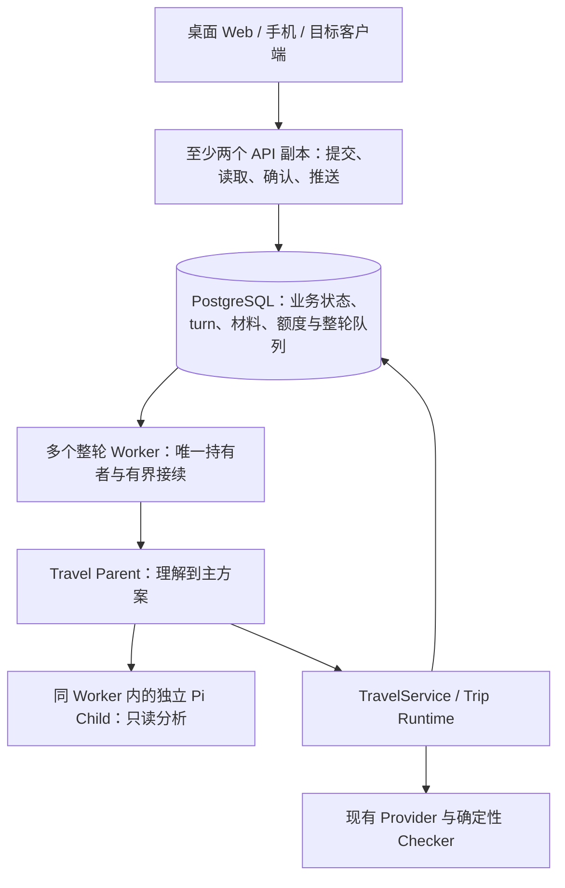

# Travel Agent 商用升级方案：完整旅行交付与 500 并发目标

日期：2026-09-15。状态：**按用户确认的两项 500 并发目标修订，尚未实施**。产品代码与受保护的 Prompt、AGENTS.md 未修改。

[500 并发最终架构核查](./2026-09-15-commercial-500-concurrency-final-review.md)是当前部署、运行所有权、容量与上线验收基准。原先单活动进程、默认轮询和人工故障接续的首批方案已被该目标替代；本文保留产品结果与实施范围。

执行核心见：[上下文、工具、多 Agent 共享与工作交接设计](./2026-09-15-agent-context-tools-and-handoff-design.md)。其中的上下文组装、工具授权、成果接收和连续性记录属于本次完整升级范围；本文负责产品、部署与交付顺序，执行细节以该设计为准。

## 1. 当前设计结论

**一份能实际使用、跨端接续、条件变化后可调整的旅行，是交付结果；500 个并发规划是该结果的容量要求。** 用户已确认同时满足“500 人同时提交、等待有界”和“500 个规划同时执行、包含多 Agent”。

因此保留一个应用代码库，将普通 API 与整轮 Worker 分开部署，复用 PostgreSQL 和现有 TravelService / Trip Runtime；使用成熟的 PostgreSQL 队列交付整轮任务。每轮由一个有效 Worker 运行 Parent 与最多三个有界 Child 任务，默认两个 Child 并行。上下文、交接、唯一写者、调用预算和失败恢复必须在这条执行链内完成。

这一规模已经构成引入多实例持有权、全局额度和推送的依据。容量不能靠副本数量或 SDK 并行探针确认，仍须取得真实模型与 Provider 的每轮工作量、账号额度和完整负载证据。产品连贯性、输入持久化、权限、取消、真实来源和确认保护与容量一起交付。

## 2. 代码中真正影响商用的断点

### 2.1 普通规划请求未必进入按天规划能力

当前 `planningTurn` 同时要求加载 `plan-trip` 和通过 `itineraryPlanningIntent()`。新会话默认加载理解与研究 Skill；按天规划的工具又只在 `planningTurn` 时开放。研究结束还可能通过 `terminate: true` 结束当前轮。

本次用项目现有函数做了无模型、无网络的入口检查：

| 用户输入 | 新会话的 planningTurn | 已有候选时的 planningTurn |
| --- | --- | --- |
| “帮我安排上海三天行程，带父母，少走路，预算八千。” | false | false |
| “Plan a relaxed four-day trip to Shanghai for my parents…” | false | false |
| “优化路线” | false | true |

这证明这组输入不能通过现有专用规划入口；它不等于完整用户流程测试，也不说明模型的全部回复内容。**优先改造的是让已理解的规划目标自然走到确定性核验，用户不应靠补发特定措辞触发下一阶段。**

证据：[入口结果](./assets/2026-09-15-runtime-architecture/planning-entry-result.json)、[可复跑脚本](./assets/2026-09-15-runtime-architecture/planning-entry-probe.mjs)、[工具选择与终止逻辑](/Users/chenge/Desktop/travel-agent/src/agent/travel-conversation-agent.mjs:1153)、[Skill 选择](/Users/chenge/Desktop/travel-agent/src/agent/travel-skill-loader.mjs:30)。

### 2.2 并行分析完成前，已有资料也没有呈现给用户

Provider 已并行取数，但组合层等待所有来源和天气返回；`researchTripOptions()` 随后等待语义分析，再保存候选 Proposal。HTTP 又等待整个 `reply()` 结束。用户的等待包含多层汇合，增加子 Agent 不会消除这些等待。

先让已归一化、有来源的研究结果成为可查看的只读草稿，再继续分析与核验。需要核验的内容保持明确状态；不让模型半成品变成可确认方案。

证据：[Provider 汇合](/Users/chenge/Desktop/travel-agent/src/providers/travel-research-provider.mjs:479)、[候选保存时机](/Users/chenge/Desktop/travel-agent/src/api/travel-service.mjs:1588)、[同步 HTTP](/Users/chenge/Desktop/travel-agent/src/http/app.mjs:497)。

### 2.3 接收需求和跨端继续缺少可靠的执行记录

正常模型路径先在内存中追加用户消息，结束时才保存整个 conversation。网页依赖本地 `status.loading` 等待响应；它不能协调另一台设备，也无法让新打开的设备知道后台正在做什么。保存时的版本冲突保护不能替代执行前的协调。

应把“需求已保存”和“规划已完成”分开：先保存输入并返回稳定 turnId，再执行；任意端读取同一条执行状态。确认、查看与后台分析的交互状态也要分开，避免一个 loading 锁住整个工作区。

证据：[输入和保存](/Users/chenge/Desktop/travel-agent/src/agent/travel-conversation-agent.mjs:759)、[前端提交](/Users/chenge/Desktop/travel-agent/src/web/travel-app.jsx:1971)、[Repository 版本检查](/Users/chenge/Desktop/travel-agent/src/persistence/postgres-conversation-repository.mjs:48)。

### 2.4 更多 Agent 不能补齐数据和履约缺口

现有 Child 从少量归一化候选做单次 JSON 分析，没有工具。它不能凭空核实外宾住宿、房态、无障碍或“当地人才知道”。地图、库存与内容来源是否可用，会直接决定产品承诺能否兑现。多 Agent 的贡献需要对照同样资料下的 Parent 单独执行验证。

证据：[Child 输入裁剪与单次调用](/Users/chenge/Desktop/travel-agent/src/agent/travel-analysis-fanout.mjs:83)、[当前产品边界](/Users/chenge/Desktop/travel-agent/wiki/current/01-product.md)。

## 3. 首批用户购买的结果

沿用当前产品方向：入境自由行优先，英文形成完整闭环；国内用户使用同一能力。城市作为测试场景，不限制产品城市范围。

首批服务交付物是：**一份符合同行人、预算、抵达与时间约束的旅行安排，能在手机上执行；条件变化时保留已确定部分并完成局部调整。**

一次完整使用应连续发生：

1. 免登录提出真实旅行需求，Agent 回显理解；缺少关键条件时只追问会改变安排的问题。
2. 已查到的资料陆续可看，用户能比较和补充偏好；系统继续形成一条主路线与少量有意义的替代。
3. 同一请求内部完成路线、时间、预算和同行人核验。资料不足时给出具体缺口；只有路线骨架时不能标成可执行日程。
4. 用户采用方案后，手机继续查看 Today、地址、导航和正规预订入口；登录继承匿名旅行。
5. 用户反馈“下雨了”“父亲今天少走一点”，系统只修改受影响部分，再交给用户确认。

收款方式与价格尚无当前证据支持，本方案不自行确定。建议以“整趟旅行准备与调整服务”作为首批付费验证单元，观察用户是否愿为这个结果付费。纯生成次数、模型 Token 数或 Agent 数不作为用户价值。

## 4. 架构：同一代码库，API 与整轮执行分工

运行管理负责整轮生命周期，旅行规则仍在 TravelService / Trip Runtime。Child 留在拥有该 turn 的 Worker 内，分析拓扑继续使用一个有界 fan-out，不建设跨 Worker 的通用 Agent 任务图。多副本的唯一写者和预算由数据库裁定，进程内 Map 只持有临时对象和取消信号。

### 持久化改造

- `conversation_turns` 保存请求身份、输入输出、依据、状态、持有者、generation、lease、截止时间、公开版本、预算汇总与结果引用；心跳不重写大 JSON。
- `turn_artifacts` 保存有大小上限的 Context manifest、资料/成果引用、接收回执和 Parent continuation。内部材料与公开 API 投影分开；运行中的 Pi 对象与私有推理不持久化。
- 对话的显示窗口可以裁剪，有效输入输出仍由持久记录按保留策略保存；TripState 保存旅行事实、Proposal 与确认历史。
- 输入与 turn、整轮队列任务在同一短数据库事务提交；同 requestId 同输入返回原结果，不同输入拒绝。完成时追加结果，不回写开头读取的旧对话 JSON。
- 既有确认接口补齐稳定操作身份和效果回执，与 Trip 变更原子保存；重复请求返回原结果，版本失效返回可恢复冲突。
- 真实外部调用统一经过账号额度预留与用量结算，未知费用保守处理；供应商调用不在数据库事务内执行。

具体数据责任、队列与业务租约关系、Pool 预算、负载模型和故障边界见最终核查第 4–8 节。机器数量由实测的安全 turn 槽位决定。

## 5. 多 Agent：围绕具体问题委派

Parent 保持对整趟旅行的理解。Child 的任务应类似：

- “在相同入住日期与现有报价证据下，哪个住宿锚点能降低总预算和接驳负担？”
- “这几个活动中，哪些确实适合这位同行人，哪些推荐理由超出了来源支持？”

当前预算库存、当地体验、同行人适配的分析能力继续复用，但不要求每次全部启动。简单解释、确认一个已有选择、查看 Today 直接走已有服务；复杂比较才委派。

具体实现边界：

1. Parent 先给出本轮目标与需要独立判断的问题；Runtime 校验任务范围、数量和预算。现有并发默认 2、上限 3 先保留，是否提高由实测决定。
2. 真正需要多步取舍的 Child 使用独立 Pi Agent、独立上下文和只读工具，可按候选 ID 读取本轮证据、做已有纯函数计算，再返回建议。单次标注继续使用现有轻量调用，不把它宣称为自主 Agent。
3. Child 仍不能调用 Provider、任意 URL、Shell、写状态或再次委派。资料不足返回 needs_context，Parent 通过现有来源链补查。数据只取一份，避免三个 Agent 分别重复搜索。
4. 保留现有截止时间和调用预算。确定性计算、路线分钟与硬约束由 Checker 负责，Child 提供判断理由与待查问题；不以模型意见替代核验。
5. 必需的分析失败时结果明确 partial；增强性分析可以不阻塞主方案。必需性在任务开始前确定，不能为了宣称成功临时删除失败项。所有已知硬约束仍必须通过检查。
6. Parent 汇总成一个方案并继续 `plan_itinerary_trial`，复用现有一次修正能力。一个用户请求可以包含内部阶段转换，无需用户再次发出“优化路线”。

Child 不新增常驻服务；已完成成果与接收回执保存在本轮记录，运行中的 Pi 对象和私有推理不持久化。执行中模型槽只在真实模型请求期间占用，Parent 等待工具/Child 时释放，避免 Parent 占满额度后 Child 永远无法开始。上下文按任务切片，依赖任务通过已接收成果交接，详细规则见执行设计。

Parent 的新工具链将现有研究服务拆出受限取数与委派入口，让它在证据回来后决定分析问题，再进入原有 Trial/Checker。旧 research_trip_options 仅作为既有消费者的兼容组合入口；一次请求只有一条分析路径，具体接线和合同变动见执行设计第 6 节。

**采用检验：** 相同需求、来源与模型预算下比较 Parent 单独执行和按需委派；核对约束遗漏、用户实际采用的选择、等待时间与总费用。某类 Child 没有带来可辨认的结果改善就关闭该类委派，保留多 Agent 能力本身。

## 6. 多端与并发：同一旅行连续可用

### 多端同步

所有端复用提交 turnId、读取版本化快照、通过统一服务确认的协议。500 用户按每人两端共 1,000 条连接验收；采用 WebSocket 推送已授权的版本变化，重连立即读取快照，活动页以有抖动的低频查询补偿丢失提示。数据库和公开快照是真相源，不持久化每个输出 Token。

客户端区分已保存、排队、处理中、已有可看结果、待确认、需补充与恢复中。容量内排队 p95 目标不超过 10 秒；已接收需求等待超过 30 秒必须明确结束等待并说明恢复办法。用户输入草稿、地图选择与滚动位置不被后台结果覆盖。

桌面 Web 与手机浏览器先证明接续；Electron、Capacitor、小程序复用同一合同并完成其对应登录、切后台、恢复和发布验收。某端是否可商用以其真实路径为准，不以代码共用推断。

### 并发规则

- 不同用户、不同 Trip 并行；目标是 500 个实际工作中的规划，排队等待执行资源的任务另计。
- 同 conversation 消息使用服务端顺序；同 Trip 只运行一份主动规划。新要求明确替换时原子撤销旧轮发布资格，再启动新轮。
- 所有写入与接收同时检查有效持有者、generation、未取消、当前权限和依据版本；旧 Worker 或 Child 迟到不能发布。
- 读取和确认不占模型执行槽；需要外部重新核验的确认进入明确重核状态，不假装立即成功。
- Parent 等待 Child 时释放模型请求槽。按真实供应商账号/模型/端点实施全局限额，覆盖各 Worker、重试与补查。
- 正常 500 容量和额外超载分开验收；超载有界等待或拒绝，不能用无上限队列替代承诺的执行能力。

## 7. 可靠性与恢复边界

| 场景 | 目标处理 |
| --- | --- |
| 提交响应丢失 | requestId 查询/重试得到同一个持久 turn |
| 手机切后台、页面关闭 | 已完成持久接收的文字规划继续；回来读快照与结果 |
| Worker 崩溃 | 从完整工具批次/已接收成果检查点重建 Parent；60 秒内开始有界接续，原预算与截止时间不重置 |
| 写成功但响应丢失 | 先查效果/确认回执，不重复写入 |
| 用户停止或改要求 | 先持久撤销发布资格，再传播取消；每个后续边界重新检查 |
| 模型或来源失败 | 保留有效资料，说明缺口；不把 partial 或来源不可用报告成完整成功 |
| 两端重复确认 | 操作身份、依据与原子回执保证单次生效 |

不恢复私有推理或中断 Token；外部超时调用是否已经计费单独记录。至少两个 API 副本，Worker 在失去一个副本后仍满足经测量确定的容量；数据库使用可演练的高可用和备份。发布采用兼容任务版本与有界排空，不能让旧执行者在失效后继续发布。

图片遵守现有 request-only 合同：同一 Parent 在原请求内看图并使用普通工具，形成足以继续的安全检查点并清除原图后，才可转入后台；此前断开需要重新提供图片。原图不进 turn、队列或日志，照片日志保存与模型发送继续区分授权。具体接线与图文容量验收见最终核查第 8 节。

## 8. 商用成立还差两类证据

### 8.1 旅行结果真的可以使用

每份对外称为可执行的方案应回答：日期、抵达、住宿锚点、每日安排、移动时间、预算依据、同行人约束和下一步。无法核实的外宾住宿、预约或设施等执行风险必须显式保留，不靠更多分析消除“不知道”。

实施时按当前生产配置逐项验证地图、真实库存、登录和目标渠道发布条件。历史 smoke 或 Wiki 中的状态不能代替当前上线证据。没有官方自动化数据时可以提供具名来源与人工确认入口，但如果缺口让路线无法执行，就不能把该方案交付为完整结果。

### 8.2 每交付一趟旅行的成本能被收入覆盖

记录从首次规划到约定调整服务结束的全部模型、Provider、失败重试与人工支持成本；超时但供应商处理情况未知的调用不能记为零。每轮、每用户与每日运营预算到达上限后停止新增调用。Guest 也有额度限制，不能靠不断创建匿名会话绕过限额。

首批运营用现有日志加受限查询即可回答：哪位用户的哪次需求卡住、卡在哪里、花了多少、怎样恢复。无需先做完整运营后台。

用真实目标用户验证从“获得方案 → 采用 → 手机上实际使用 → 变化后继续使用 → 愿意付费”的链路。试用满意和口头意愿仍不等于付费转化；具体付费实验在价格与服务范围明确后开展。若主要损耗是资料不可用、路线不适合或人工修正过多，下一笔投入应解决这些问题。

容量以两项 500 为验收目标：同时提交、实际并发执行都要成立。先用真实请求得到每轮工作量，再进行 500 在途、固定到达率、1,000 连接和故障演练；读取/确认同时受测。首次有用结果、最终方案、排队、失败/partial、限流、费用与资源数据一并记录。具体负载与拟定指标见最终核查第 2、3、10 节，不能根据 Agent 实例数量推导容量。

## 9. 按用户结果交付，不按基础设施分期

| 顺序 | 一次交付要形成的完整结果 | 主要代码落点与验收 |
| --- | --- | --- |
| A：一趟旅行、两个端 | 普通中英文需求自然走到已核验主方案；输入先保存，候选先可看，手机接续并确认 | `travel-conversation-agent`、Skill/工具选择、`TravelService`、turn Repository、HTTP、客户端。用真实模型/Provider 从无会话开始操作；不能补发专用测试口令 |
| B：多人使用、按需多 Agent | 多个独立 Trip 同时完成；真实 Child 有实际贡献；持久接续、取消和重复确认可控 | 复用 fan-out，加整轮 Worker、持有权、检查点和统一额度。对照单 Parent 与委派结果，验证完整工具和交接路径 |
| C：500 容量下接付费用户 | 两项 500 与目标端完整旅行路径通过；故障能恢复，数据、费用和服务权益可控 | 真实负载、生产登录/地图/库存、满载故障与备份恢复、支持和实际付费验证。只开放通过验收的能力与渠道 |

A 包含必要的执行保存和跨端同步，不等全部后台设施建完才展示产品；B 的多 Agent 是完整升级范围，不能用单 Parent 的 A 代替交付。通过 A 取得真实阶段耗时、资料缺口和改造面，再给剩余工作排期。

本轮不调整受保护的行为合同。实施规划连贯性时需要把现有 Prompt、工具可用性和状态检查对齐当前产品目标；这属于具体功能改造的一部分，不能只加几条正则或扩大工具并发开关。

## 10. 当前扩展边界

API / Worker 分工、持久队列、跨实例运行归属、全局额度与多端推送已经是用户明确 500 目标的实施范围，不再作为未来可选项。暂不增加专业 Agent 服务、自由多 Agent 聊天、通用 DAG 或另一套长期记忆数据库。

Pi 新 Harness 仍作隔离候选，不把实验 client/server 接入作为容量前提。若以后稳定发布及同一旅行案例的恢复、成本和性能验证证明收益，再替换执行适配层。[Pi 官方发布说明](https://github.com/earendil-works/pi/releases/tag/v0.85.1)

## 11. 本次验证边界

重新读取当前含未提交改动的源码、产品定义与旧调研；HEAD 为 `d676c3138259db170ce8435bbb27f0e896842493`。使用项目的 `node --import tsx` 运行了入口判断探针，结果记录源码哈希，可独立复跑。核实了 Pi 官方发布说明与 Node.js 并发工作方式。

本组研究已完成源码核查、入口与 SDK 探针，以及显式假设下的 500 容量计算。本次修订没有修改产品代码、安装依赖、调用付费模型、做真实用户流程或负载测试。最终核查明确当前上线不通过；实施与真实验收完成前只能称为目标设计。
