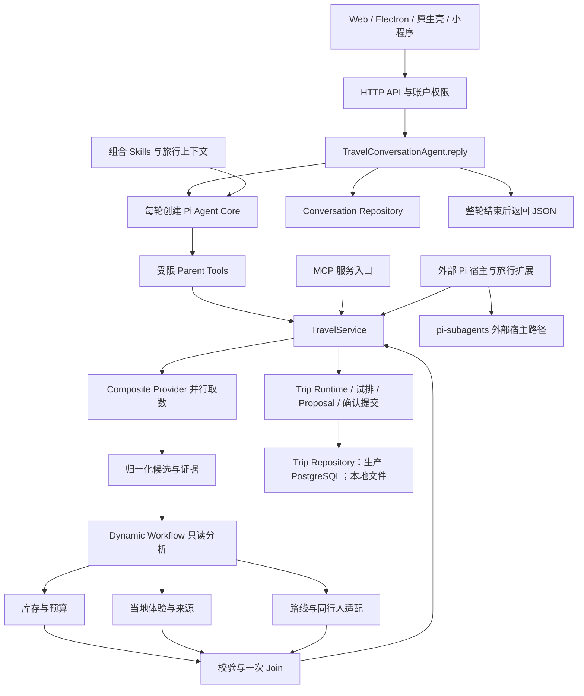
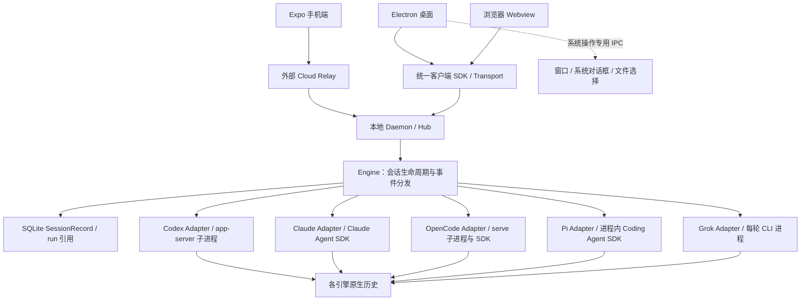
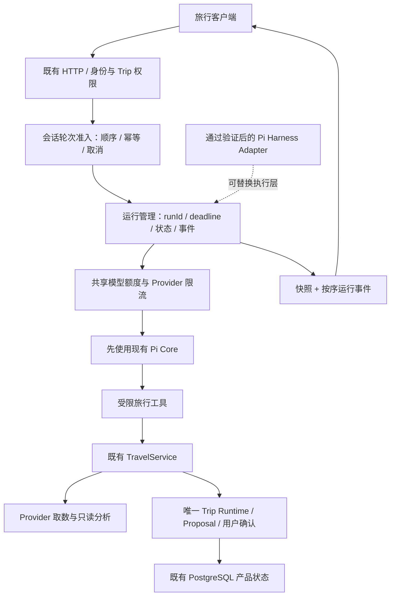

# Travel Agent、LinkCode 与 Pi 新架构对比报告

调研日期：2026-09-15。范围：当前 Travel Agent 工作区、`turnsu/linkcode`、项目实际依赖的 Pi 官方仓库 `earendil-works/pi`。

## 1. 结论与决策建议

**当前并发问题不能归因于“Pi SDK 只能串行”。已有 SDK 支持工具并行和多 Agent 实例并发；更直接的限制来自 Travel Agent 自己的工具执行策略、每轮子任务额度、进程内任务协调和同步 HTTP 返回方式。** 本次以已安装 Pi 0.84.1 做了无外部模型调用的行为验证，结果见第 9 节。

建议分三条处理：

1. **现在改善现有 Pi 集成。** 明确同一会话的输入顺序、全局模型调用额度、取消传播和真实进度；用测量决定是否把研究并发从 2 调到 3。
2. **借鉴 LinkCode 的会话管理和统一事件设计。** 它的优势是把多种 Agent 包装成有生命周期、可恢复历史、可多端连接的会话；它没有替代 Pi SDK，也没有自动解决旅行业务的一致性。
3. **Pi 新 Harness 作为迁移候选，先做隔离验证。** 官方主分支已经实现 durable Session、AgentLane 和部分恢复机制，但服务端仍属实验性；截至本次查验，最新正式 Release 为 `v0.85.1`，未取得名为 `2.0` 的正式稳定发布证据。本文的“Pi 新架构”指官方源码中的这一代实现，不把它等同于已发布的 2.0 产品。[Pi Releases][P1] [Harness 规范][P2]

**推荐方向：保留 TravelService / Trip Runtime 作为业务状态所有者，在它上方补齐运行管理；不把 Travel Agent 整体改造成通用编码 Agent 工作台。**

### 1.1 三个系统分别解决什么问题

| 系统 | 主要对象 | 核心价值 | 不应混淆的能力 |
| --- | --- | --- | --- |
| Travel Agent | 旅行者、候选、行程、证据、确认 | 把吃住行玩变成可信、可执行的旅行决策 | 旅行业务一致性不等于 Agent 会话一致性 |
| LinkCode | 工作区、Agent 会话、工具事件、历史、终端 | 在同一工作台管理不同厂商 Agent，并连接桌面、浏览器和手机 | 多会话并发不等于同一任务的多 Agent 协同规划 |
| Pi SDK / 新 Harness | 模型调用、工具调用、上下文、lane、operation | 提供可嵌入的 Agent 执行能力；新架构进一步管理持久化执行与恢复 | 运行时持久化不等于产品权限、Provider 配额或业务提交事务 |

## 2. 取证基线与可信度

| 对象 | 本次查验基线 |
| --- | --- |
| Travel Agent | HEAD `d676c3138259db170ce8435bbb27f0e896842493`，**以当前含未提交改动的工作区为准**；未覆盖用户已有改动 |
| 项目 Pi | `pi-agent-core`、`pi-ai`、`pi-coding-agent` 锁定 `0.84.1`；实际安装的 agent-core 也为该版本 |
| 项目编排包 | `@quintinshaw/pi-dynamic-workflows` `3.5.1`；外部 Pi package 使用 `pi-subagents` `0.46.0` |
| LinkCode | `turnsu/linkcode` 的 `master`，SHA `22c337f197665e1c53cc717b88859a45cfd8a43d` |
| LinkCode 上游关系 | GitHub 显示 fork 自 `arcboxlabs/linkcode`；本次比较上游 master 与 turnsu master 为 identical，ahead/behind 均为 0 |
| LinkCode 自带 Pi | 受管依赖闭包记录 `pi-coding-agent` / `pi-agent-core` `0.80.6`；实际运行也可能选择已解析的受管入口，不能只凭 package.json 的范围断言用户机器版本 |
| Pi 新架构源码 | `earendil-works/pi` 的 `main`，SHA `f9bcd351dc3cedf989bc5fc0f8aa012db5737df2` |
| Pi 正式发布 | Release `v0.85.1`，2026-09-05；与 main 源码快照分开评估 |

证据等级：**源码确认**说明实现存在；**本地 fixture 验证**说明指定行为在模拟模型下成立；**推断**说明由调用链推得、尚未压测；**未验证**包括 LinkCode 实机、Pi 新 Harness 实跑、多用户真实模型负载与生产恢复。

本次未安装 LinkCode 或升级 Pi，未调用付费模型。浏览器连接和命令行代理不可用后，改用 GitHub 只读接口读取固定 SHA 的源码。旧架构文档中“当前”“目标”“实施结果”混有不同时间状态，本报告以消费者源码和本次验证为准。

## 3. Travel Agent 当前架构

### 3.1 真实调用链



源码入口：[HTTP messages 路由][T1]、[Parent Agent][T2]、[服务工厂][T3]、[TravelService][T4]。

### 3.2 所有权分层

| 层 | 当前责任 | 架构判断 |
| --- | --- | --- |
| HTTP / 账户 | 身份、会话归属、请求入口 | 应继续是客户端共用服务边界 |
| TravelConversationAgent | 意图、上下文、工具集合、轮次预算、结果解释 | 同时承载不少编排与展示逻辑，适合逐步提取运行管理责任 |
| Pi Agent Core | 模型—工具循环、事件、abort、单实例 prompt 状态 | 使用的是底层 Core，不是完整 Coding Agent Session Host |
| TravelService | Provider 研究、证据、分析、试排、确认、持久化调用 | 现有真实业务接线的汇合点，应保留 |
| Trip Runtime | revision、Patch、约束、确认与状态转换 | 不应交给编码 Agent 的文件写入或自由工具调用替代 |
| 分析协调器 | 当前 Trip 的 active run、supersede、lane 完成、Join | 进程内 Map；不提供重启恢复或跨实例所有权 |
| Repository | Trip 与 conversation 的独立存储、storageVersion 检查 | 防止静默覆盖；并不协调完整 Agent turn 与跨表业务事务 |

**Web 与外部 Pi package 是两条入口。** Web 自己加载组合 Skill，并内联注册旅行工具；外部 Pi 宿主通过 package extensions / `pi-subagents` 工作。把外部宿主换成 LinkCode，并不会自动改变 Web 的 `reply()` 或 fan-out 链路。[Parent][T2] [package manifest][T5]

### 3.3 当前“子 Agent”到底是什么

Web 三条 lane 实际调用 `createTravelAnalysisAgentRunner()`：用 `pi-ai.completeSimple()` 做一次紧凑 JSON 分析，模型不能调用工具，输出再做结构与证据范围校验。Dynamic Workflow 管理并发、预算和收集。

因此它们是**有界语义分析任务**，不是三个持久运行的 Coding Agent Session。引入完整 Coding Agent SDK 不会天然提高这类短任务的吞吐，反而可能带来不需要的扩展加载、会话文件和工具权限。[分析实现][T6]

## 4. 并发限制逐层归因

### 4.1 并发不是一个开关

| 并发层面 | 当前实现 | 限制来源 | 本次判断 |
| --- | --- | --- | --- |
| 同一 Agent 的两次 prompt | 第二次重叠调用被拒绝，可用 steer/followUp 表达后续输入 | Pi 单实例语义 | 合理限制，不能让两轮无序修改同一上下文 |
| 同一模型响应里的多个工具 | Core 默认支持并行；项目总配置为 sequential，且每个内联工具都标 sequential | **项目策略** | 不能声称 SDK 不支持工具并行 |
| 一次研究的三个分析 lane | 默认 2 并发，最多 3；第三条排队 | **项目容量与任务设计** | 环境项可选 3，但需真实延迟/配额证据 |
| 多个独立 Agent / 不同行程 | 每次 reply 创建独立 Agent；未见这条链上的全局模型准入器 | 应用与 Provider 容量 | 单进程可以并发处理 I/O；没有已验证的用户容量数字 |
| 同一 conversation 的重叠 HTTP 请求 | 都能进入 reply，读取相同 storageVersion 后各自运行 | **应用缺少轮次准入** | 保存时可能冲突；repository 写队列不是 turn 队列 |
| 多个服务进程/实例 | 无跨实例 coordinator 时关闭语义 fan-out，报告 blocked 状态 | **项目明确部署边界** | 换 SDK 不能独自解决 |
| 数据源并行 | Composite Provider 已用 Promise.all / allSettled 并行来源与天气 | 已实现 | 不应让每个 lane 重复请求同一批 Provider |
| 多端看到过程 | HTTP 等待 reply 完成后 response.json | **交互与传输实现** | “一直等待”不等于底层没有并发；目前缺少持续过程推送 |

来源：[Pi 已安装执行循环][T7]、[Parent][T2]、[fan-out][T6]、[执行策略][T3]、[Provider][T8]、[conversation 存储][T9]。

### 4.2 两个最容易改错的地方

**第一，只把 `toolExecution` 改为 `parallel` 不够。** 项目所有内联工具还各自设置 `executionMode: "sequential"`。Pi 0.84.1 的循环检测到批次内任意 sequential 工具，就让该批工具走串行执行。应逐个审查读写依赖；保存理解→研究候选→确认提交不能无序执行。

**第二，“默认并发 2”只约束一次 fan-out。** 每轮 `runWorkflow()` 各有额度；多个用户同时运行时，额度会相加。假设 10 个独立研究都到达分析阶段，理论上可能同时产生约 20 条 Child 模型请求，另有 Parent 和其他请求；这只是拓扑推算，不是实测容量。把单轮并发改为 3，也可能把该部分瞬时需求提高约 50%。

### 4.3 当前更值得优先处理的缺口

1. **会话输入顺序。** 两个 reply 可以读取同一版本，先运行再竞争保存。乐观锁保护的是存储覆盖，不会回滚另一个请求已经执行的旅行工具。应在运行前决定排队、拒绝还是替换，并给用户明确反馈。此为源码推断，未做生产冲突重演。
2. **取消与 deadline 传播。** Parent 有 90 秒 abort 定时器，但 `research_trip_options.execute()` 没有把工具调用的 AbortSignal 继续交给 TravelService；分析又有自己的 run deadline。不能仅凭父层 `abort()` 宣称整条研究链会即时停止。[工具入口][T2] [研究服务][T4]
3. **运行状态持久化。** runs、activeByTrip、AbortController 与 Join 状态只在进程内。进程丢失后无法靠 conversation 或 Trip JSON 自动恢复到中断步骤。当前“Join 一次”只在这个进程和协调器生命周期内成立。[协调器][T10]
4. **容量与公平性。** 需要区分单用户预算、模型账号总额度、不同 Provider QPS、队列等待和实际执行时长；当前每轮上限不能代替这些控制。
5. **过程可见性。** Pi 事件目前主要进入 activities / agentTrace，HTTP 在整轮结束时返回。过程展示应由实际运行事件驱动，断线重连后可读到运行快照，不能靠前端计时动画推断后端状态。

### 4.4 单轮速度可以改善多少

完整研究大致耗时：Parent 生成工具参数 + Provider 取数 + Child 调度/分析 + Join/业务校验 + 可能的 Parent 总结。将三条 Child 从 2 并发调到 3，只减少 Child 排队部分。

举例：三个独立分析各 30 秒，2 个槽约需 60 秒，3 个槽约需 30 秒；但整轮还有其他阶段，且模型服务可能因限流变慢。因此这不是“整体提速两倍”的承诺。应先记录各阶段 p50/p95、429、超时、JSON 校验失败、完整 coverage 和每轮费用，再决定额度。

## 5. LinkCode 底层架构

### 5.1 架构形态



LinkCode 是本地优先的 TypeScript monorepo。`apps/daemon` 持有执行端；`packages/host/engine` 管理会话；`agent-adapter` 统一不同引擎；`foundation/schema` 定义 Zod 合同；客户端复用 SDK、数据层和工作台组件。桌面业务数据经 Transport，窗口等系统操作才走 Electron IPC。[架构文档][L1]

### 5.2 五种引擎并不是同一种接入

| 引擎 | 源码确认的接入方式 | 隔离与生命周期含义 |
| --- | --- | --- |
| Pi | `createAgentSession()`、`session.subscribe()`、`session.prompt()` | SDK 在 daemon 进程中导入；不是每个 Pi Session 一定独占 OS 进程 |
| Codex | 启动 `codex app-server`，通过 stdin/stdout 请求与通知通信 | 有子进程边界，连接管理请求 ID、挂起响应、退出错误 |
| Claude Code | Claude Agent SDK，流式输入队列与 Query | 使用 SDK 的原生运行与控制语义，再转换为统一事件 |
| OpenCode | 启动本机 `opencode serve`，用 SDK 访问 | 独立服务进程、端口与关闭管理 |
| Grok Build | 每次 prompt 启动 CLI，`--resume` 续接、streaming-json 输出 | 轮次级进程，不是 ACP 通用服务连接 |

源码：[Pi][L2]、[Codex][L3]、[Claude][L4]、[OpenCode][L5]、[Grok][L6]。

**LinkCode 的 Pi 路径比 Travel Agent 使用了更高一层 SDK；并没有绕过 Pi。** 它加载资源、接扩展 UI、包装权限和历史；这些是通用工作台需要的能力，不是并发优化本身。其 Pi adapter 还明确拒绝 MCP server 注入，不会默默当作已支持。[Pi adapter][L2]

### 5.3 多会话能力来自哪里

`SessionOrchestrator` 维护 `Map<SessionId, LiveSession>`，每个 live session 由工厂创建一个 adapter，并附带独立资源 scope；Engine 用 Effect 管理任务生命周期、取消与清理。生命周期服务对同一 session/import 使用单许可 semaphore，避免 resume / 切模型 / 导入竞争。[Orchestrator][L7] [生命周期][L8]

但同一个会话仍有 busy gate：`SessionInputDispatcher` 对已有活动轮次的 prompt/command/shell-command 返回 conflict。Pi adapter 的底层 followUp 能力存在，不代表上层 UI 请求默认允许并发输入。[输入分发][L9]

因此可借鉴的是：**把会话、轮次、状态、事件与清理做成明确对象；不同会话并发，同一上下文有序。** 不能把文档里的“many concurrent sessions”解释为无限负载或自动协同。

### 5.4 存储与恢复边界

LinkCode 的 SQLite 存 SessionRecord、run 与原生历史 ID；transcript 仍由各 Agent 原生历史保存，通过 adapter 读取。它能表示 stopped 的冷会话并重新 resume，但这种“重新打开历史”不能等价于跨崩溃精确恢复任意工具副作用。[架构文档][L1]

主机是一个 channel × profile 对应一个 daemon / 状态目录。Hub 支持多客户端接入和 reply 路由；手机通过外部 relay。当前仓库不包含生产 relay 的服务端实现，不能据此认定云端鉴权、权限与多租户部分已可自行部署完整替代。[架构文档][L1]

### 5.5 许可与文档局限

- LICENSE 实际是 **Business Source License 1.1**，含 Additional Use Grant 与竞争性托管/嵌入条件；对应版本经过规定的四年后转 Apache-2.0。品牌资源另有许可。不能仅因 fork 到 turnsu 下就认为许可发生变化。[许可证][L10]
- 本次只研究设计，不建议直接复制实现。是否符合商业产品的具体使用条件，应依据实际产品形态单独核实；项目要求的固定 SHA、依赖与写面审计仍应在代码采用前完成。
- `ARCHITECTURE.md` 的 Open questions 仍写着 Pi 集成方式待定，但当前 adapter 已实现。这说明文档有滞后，不能只读 README 就判断实现状态。
- 本次确认源码结构与部分测试文件存在，未运行 LinkCode 桌面、手机、relay 或多引擎实测；没有可靠的跨项目性能比较数据。

## 6. Pi 官方新架构：“2.0”应如何理解

### 6.1 版本、API 层与实验实现分开看

```text
当前 Travel Agent
  pi-ai + pi-agent-core Agent 0.84.1
    └─ 应用自己拥有会话存储、工具、研究协调和状态提交

LinkCode Pi adapter
  pi-coding-agent createAgentSession
    └─ 完整 Coding Agent 会话、资源加载、扩展与历史桥接

Pi 官方 main 新一代实现
  AgentHarness + AgentLane + Branch + durable Session
    ├─ accept / drive / requestAbort / inspectExecution
    ├─ Memory / JSONL / SQLite 等存储实现
    └─ 实验性 server / session worker / 多展示端与 Chord 服务
```

0.85.1 的发布说明明确：0.85.0 曾误发布内部实验代码导致 SDK 导入失败；0.85.1 将实验 client/plugin 子路径和 server/client 命令收回为源码测试入口，受支持的本地 SDK 和 stdio RPC API 保持不变。**主分支有新架构代码，不代表更新 npm 版本就得到稳定可用的完整服务系统。**[Release][P1] [稳定版本 package][P3]

### 6.2 新架构的实质变化

| 概念 | 含义 | 对当前项目可能的价值 |
| --- | --- | --- |
| Session | 会话全局持久化数据与统一修改顺序 | 中断后读取完整运行状态，不依赖进程内 Map |
| Branch | entry tree 中一条带可移动 tip 的数据路径 | 分支历史、上下文选择与分叉研究 |
| AgentLane | 在 Branch 上增加模型配置、输入队列与执行状态 | 多路独立分析可共处一个 Harness，仍各自有序 |
| AgentHarness | 管理多个 lane、工具/资源/Hook | 把执行与恢复协议从业务代码中抽离 |
| Operation | 已接受的一次 run、compaction 或 navigation | 接受任务与执行任务分开，可持久记录身份与阶段 |
| accept / drive | 先原子记录任务，再推进到下一阶段 | 与后台 worker 或调度器衔接；避免“请求已收到但任务未记录” |
| Intent / settlement | 外部调用前记意图，返回后记结果与下一状态 | 明确中断时哪些副作用已经完成、哪些结果尚不确定 |
| Chord | 服务、插件分面、状态复制与远程服务边界 | TUI/Web/Worker 的能力与状态桥接；不是旅行业务调度器 |
| pi-server / worker | 展示端 attachment 路由与 worker 生命周期 | 同一 Session 多端接入、执行与界面分离 |

来源：[Harness 规范][P2]、[Session/Branch/Lane 分离][P4]、[Chord][P5]、[Server][P6]。

这里的“并行”仍有明确边界：一个 lane 只接受一个当前 operation；源码返回 `LaneBusy`。多个 lane 可并行推进，但同一 Session 的持久化修改仍必须有序。新架构增加的是执行、恢复和分支模型，不是允许任意并行写同一状态。[lane 实现][P7] [Harness 实现][P8]

### 6.3 已实现与未稳定部分

**源码中确认存在：** lanesByName 管理、durable accept/drive、LaneBusy 检查、工具执行与结果阶段、SQLite repo，以及实验 Session worker manager。它们不是只有设计图。[P7] [P8] [P9] [P10]

**仍需谨慎：**

- Harness 规范 §0.9 将 WP00–WP07 标为完成，但同时列出 `watchSession`、搜索、JSONL 快照压缩、fork 的后续工作、遥测等缺口；本次直接确认 `watchSession()` 仍抛 `SliceNotImplemented`。[P2] [P8]
- 存储 format 4 明确仍在稳定前阶段；不能把现有业务生产数据直接迁入并假设永久兼容。[P2]
- `pi-server` README 自称 experimental，Unix transport 没有替应用做 peer authentication；应用还负责 Session 发现、管理与 worker 生命周期。[P6]
- SQLite 后端明确不做跨进程 writer lease。宿主必须保证一个 Session 同时只有一个被指派的写入进程；错误地多开 writer 是宿主责任。[SQLite 所有权说明][P11]
- 持久化 intent 并不能让任意外部副作用天然 exactly-once。外部操作发生、结果尚未提交时仍存在不确定窗口，需要幂等键、对账或人工恢复策略。[P2]
- PostgreSQL 分区保留等部分仍属未来设计。**Travel Agent 已有的 PostgreSQL 业务库不能因为新 Harness 支持 SQLite 就被替代。**

### 6.4 对 Travel Agent 的采用判断

| 选择 | 判断 | 理由 / 触发条件 |
| --- | --- | --- |
| 继续现有 Agent Core | **现在采用** | 并发基本能力已具备，优先修复实际调用链与会话顺序 |
| 升级正式 SDK 到 0.85.1 | **独立兼容性验证后再决定** | 当前宿主兼容门明确 `<0.85.0`；还需验证 TypeBox、模型适配、扩展、subagents 和 package consumer |
| 新 AgentHarness | **隔离试验** | 当需求包括后台长任务、重启恢复、多端接续时价值明显；先确认业务工具与恢复合同 |
| 实验 pi-server / Chord 全面迁移 | **暂不作为当前生产前提** | 实验协议、宿主认证、writer 所有权、存储格式与部署接线都需要额外工作 |
| 直接替换成 LinkCode Engine | **不建议** | 产品对象不同；引入大量编码工作台概念、许可与部署依赖，不能直接解决 TripState 一致性 |

## 7. 横向架构对比

| 维度 | Travel Agent 当前 | LinkCode 当前源码 | Pi 新架构 main |
| --- | --- | --- | --- |
| 业务中心 | Trip / Evidence / Proposal | Session / Workspace / Agent | Session / Branch / Lane / Operation |
| 执行抽象 | 直接 Agent Core + 应用工具 | 统一 Adapter 包装五类引擎 | durable Harness 与 lane |
| 多会话 | 独立 reply 可并发，缺集中准入 | 明确 LiveSession registry / scope | Session worker 与多 lane |
| 同一会话顺序 | 保存时 CAS，缺完整 turn 准入 | busy gate + 生命周期 semaphore | lane operation admission |
| 多源取数 | 已有旅行 Provider 并行 | 由各 Agent 工具负责 | 不代替业务 Provider |
| 子任务协作 | 最多三条只读分析、一次 Join | 多会话宿主；不能推定业务协作规划 | 多 lane 基础，业务 join 仍由应用定义 |
| 持久化 | 产品快照与 conversation；run Map | SessionRecord + 引擎原生历史 | conversation + operation + usage |
| 取消 | Parent、研究各有机制，传播有缺口 | 统一 cancel / 清理 / adapter 映射 | request cancellation 与 durable abort 分离 |
| 多端过程 | 整轮 HTTP JSON | Transport/Hub 事件与状态 | 实验 attachment / service replication |
| 分布式扩展 | 明确限制 single_process fan-out | 本地主机优先，外部 relay | 实验 server/worker，非现成多租户平台 |
| 业务状态安全 | revision、约束、确认门 | 通用工具权限与工作区策略 | 执行恢复协议，业务权限另做 |
| 本次性能证据 | 本地模拟并行验证 | 无实机吞吐验证 | 无新 Harness 性能验证 |

## 8. 建议的演进架构与实施顺序

### 8.1 建议目标图



图中运行管理属于建议新增职责，不代表已有实现；初期可在同一服务进程内完成，不要求立即添加独立服务或另一套框架。多模型 Provider 切换与多 Agent 引擎切换是不同问题：前者已有 pi-ai 路由，不应为更换模型而引入五套引擎。

### 8.2 第一阶段：解决当前使用问题

| 工作 | 为什么先做 | 用户可见验收 |
| --- | --- | --- |
| 同一 conversation 的 turn 准入 | 防止重叠运行后才发现保存冲突 | 快速连发两条、两个页面同时操作时顺序可解释，输入不丢失 |
| deadline / AbortSignal 全链传播 | 防止用户已停止但后端继续分析 | 点击停止后后续 lane 不再启动，取消状态不被迟到结果覆盖 |
| 全局/按 Provider 调用额度 | 避免单轮并发额度在多人场景无限叠加 | 一个用户的深度研究不会挤占全部额度；超额时显示排队或可恢复提示 |
| 实际运行事件与状态快照 | 缩短无反馈等待，便于定位慢阶段 | 用户看到取数/分析/核验的真实进度，重连能读取当前 run |
| 测量后选 2 或 3 并发 | 只优化有证据的关键路径 | 相同样本下完整方案耗时改善，错误、费用与降级率不恶化 |

不建议第一步全量放开父工具并行。先允许没有状态依赖的只读工作并发；状态创建、候选生成、试排与确认仍经过明确顺序和统一提交。

### 8.3 第二阶段：需求确实进入后台与多实例时

- 在已有 PostgreSQL 体系内持久记录运行的接受、状态、结果与必要事件；TripState 仍是唯一业务状态。
- 明确 worker 所有权与失效后的接管规则；不能只删掉 `single_process` 保护或把实例数改大。
- 使用稳定 requestId/runId、幂等接收与受约束的状态转换，处理客户端重试和迟到结果。
- 定义重启后哪些只读步骤可重跑，哪些操作必须检查已有结果；不要无条件重放确认提交。
- 满足按 Trip/会话协调、取消、结果提交与重连后，再开放多实例语义分析。

这些能力可以先由现有技术实现；**不预设 Redis、Kafka、Temporal 或全量 Effect 迁移。** 是否引入新设施由实测容量和恢复需求决定。

### 8.4 Pi 新 Harness 的最小验证范围

使用隔离目录与固定 SHA，复用脱敏 fixture 和现有旅行输出合同，只运行“只读研究→结构化分析→生成待确认 Proposal”路径。验证：

1. 两条 lane 真正重叠运行；同 lane 重叠输入按合同处理。
2. 在接受任务后、模型返回后、工具结果落库前分别终止 worker，重启后的结果可解释。
3. 同一 run 重试不生成竞争 Proposal；旧 revision 的结果不进入当前方案。
4. 取消能传播到模型与工具；断开展示端与中止持久任务是两个明确动作。
5. Session 存储与 Trip PostgreSQL 之间失败时能恢复，不制造第二份 TripState。
6. 比较冷启动、内存、完整响应 p95、费用、失败恢复复杂度；至少证明一个当前痛点得到改善。

只有通过这些验证，且接口/格式风险可接受，才决定迁移。由于目前 Child 是单次无工具分析，新 Harness 的优先价值在**恢复与长任务生命周期**，不是承诺让三条短分析自动更快。

## 9. 本次验证与未验证范围

### 9.1 本地 SDK 行为验证

环境 Node `v26.7.0`、实际安装 Pi `0.84.1`；使用 SDK 自带 faux provider，不请求外部模型。

| 场景 | 结果 |
| --- | --- |
| 默认配置，同一轮两个只读工具 | 同时执行峰值 2 |
| 显式 sequential，同一轮两个工具 | 同时执行峰值 1 |
| 两个独立 Agent 同时 prompt | 模拟模型执行峰值 2 |
| 同一 Agent 重叠 prompt | 明确拒绝，符合 SDK 单实例合同 |

此验证证明并发能力存在，**不证明真实模型 QPS、延迟或可服务用户数**。

### 9.2 当前项目行为复验

运行现有 `tests/travel-analysis-fanout.test.mjs` 与 `tests/workflow-execution-policy.test.mjs`：最终 11 项通过，覆盖默认并发重叠、第三 lane 排队、单次 Provider 取数、一次 Join、陈旧运行、失败降级，以及多实例部署的明确保护。

首次受限环境运行时，HTTP 健康接口用例未取得本地监听地址而失败；允许本机回环监听后，同一命令通过。该环境失败不被计作架构缺陷，也未通过修改测试绕过。

验证命令：

```bash
node --import tsx --test tests/travel-analysis-fanout.test.mjs tests/workflow-execution-policy.test.mjs
```

验证附件：[SDK 并发探针](/Users/chenge/Desktop/travel-agent/wiki/research/assets/2026-09-15-runtime-architecture/pi-concurrency-probe.mjs)、[探针结果](/Users/chenge/Desktop/travel-agent/wiki/research/assets/2026-09-15-runtime-architecture/pi-concurrency-result.json)、[现有测试日志](/Users/chenge/Desktop/travel-agent/wiki/research/assets/2026-09-15-runtime-architecture/project-tests.log)。

### 9.3 明确未验证

- LinkCode 五引擎实机可用性、并发容量、手机 relay 与生产鉴权。
- Pi 新 Harness 编译、完整测试、故障恢复实跑和实际 npm 包可用表面。
- Travel Agent 真实模型负载、Provider 配额、PostgreSQL 多实例协调、生产断线恢复。
- 本次只新增研究报告与验证附件，没有修改产品运行逻辑、升级依赖或改变现有部署。

## 10. 关键源码索引

远程源码链接固定到本次 SHA；Release 链接固定版本。工作区链接指向本次读取的本地文件，未提交改动不能由 HEAD 单独复原。

### Travel Agent

- [T1 HTTP messages 路由][T1]
- [T2 Parent Agent 与内联工具][T2]
- [T3 服务工厂与单进程执行策略][T3]
- [T4 TravelService：研究、规划、确认与持久化][T4]
- [T5 外部 Pi package manifest][T5]
- [T6 Web 分析 fan-out 与单次模型 runner][T6]
- [T7 已安装 Pi Core 工具执行循环][T7]
- [T8 Composite Provider 并行取数][T8]
- [T9 conversation repository：写队列与版本冲突][T9]
- [T10 进程内 run coordinator][T10]
- [宿主兼容门](/Users/chenge/Desktop/travel-agent/src/agent/pi-host-compatibility.mjs:4)
- [PostgreSQL Trip 保存](/Users/chenge/Desktop/travel-agent/src/persistence/postgres-trip-repository.mjs:112)

### LinkCode

- [架构总览][L1]；[Pi adapter][L2]；[Pi 受管闭包版本][L11]
- [SessionOrchestrator][L7]；[生命周期 semaphore][L8]；[输入 busy gate][L9]
- [许可证][L10]

### Pi 官方

- [v0.85.1 Release][P1]；[该版本 Coding Agent package][P3]
- [Harness 规范与 §0.9 实现缺口][P2]；[Session/Branch/Lane 分离][P4]
- [lane 实现][P7]；[Harness 实现][P8]；[SQLite repo][P9]
- [实验 session worker manager][P10]；[SQLite 写入所有权][P11]
- [pi-server][P6]；[Chord][P5]

[T1]: /Users/chenge/Desktop/travel-agent/src/http/app.mjs:497
[T2]: /Users/chenge/Desktop/travel-agent/src/agent/travel-conversation-agent.mjs:1195
[T3]: /Users/chenge/Desktop/travel-agent/src/api/create-travel-service.mjs:7
[T4]: /Users/chenge/Desktop/travel-agent/src/api/travel-service.mjs:1588
[T5]: /Users/chenge/Desktop/travel-agent/travel-agent-pi-package/package.json
[T6]: /Users/chenge/Desktop/travel-agent/src/agent/travel-analysis-fanout.mjs:214
[T7]: /Users/chenge/Desktop/travel-agent/node_modules/@earendil-works/pi-agent-core/dist/agent-loop.js:287
[T8]: /Users/chenge/Desktop/travel-agent/src/providers/travel-research-provider.mjs:487
[T9]: /Users/chenge/Desktop/travel-agent/src/persistence/conversation-repository.mjs:158
[T10]: /Users/chenge/Desktop/travel-agent/src/agent/travel-analysis-run-coordinator.mjs:1
[L1]: https://github.com/turnsu/linkcode/blob/22c337f197665e1c53cc717b88859a45cfd8a43d/docs/ARCHITECTURE.md
[L2]: https://github.com/turnsu/linkcode/blob/22c337f197665e1c53cc717b88859a45cfd8a43d/packages/host/agent-adapter/src/native/pi/adapter.ts#L318
[L3]: https://github.com/turnsu/linkcode/blob/22c337f197665e1c53cc717b88859a45cfd8a43d/packages/host/agent-adapter/src/native/codex/app-server.ts
[L4]: https://github.com/turnsu/linkcode/blob/22c337f197665e1c53cc717b88859a45cfd8a43d/packages/host/agent-adapter/src/native/claude-code.ts
[L5]: https://github.com/turnsu/linkcode/blob/22c337f197665e1c53cc717b88859a45cfd8a43d/packages/host/agent-adapter/src/native/opencode/serve.ts
[L6]: https://github.com/turnsu/linkcode/blob/22c337f197665e1c53cc717b88859a45cfd8a43d/packages/host/agent-adapter/src/native/grok-build/process.ts
[L7]: https://github.com/turnsu/linkcode/blob/22c337f197665e1c53cc717b88859a45cfd8a43d/packages/host/engine/src/session/orchestrator.ts#L152
[L8]: https://github.com/turnsu/linkcode/blob/22c337f197665e1c53cc717b88859a45cfd8a43d/packages/host/engine/src/session/lifecycle-service.ts#L547
[L9]: https://github.com/turnsu/linkcode/blob/22c337f197665e1c53cc717b88859a45cfd8a43d/packages/host/engine/src/session/session-input-dispatcher.ts#L48
[L10]: https://github.com/turnsu/linkcode/blob/22c337f197665e1c53cc717b88859a45cfd8a43d/LICENSE
[L11]: https://github.com/turnsu/linkcode/blob/22c337f197665e1c53cc717b88859a45cfd8a43d/packages/host/assets/src/pi-closure.gen.ts
[P1]: https://github.com/earendil-works/pi/releases/tag/v0.85.1
[P2]: https://github.com/earendil-works/pi/blob/f9bcd351dc3cedf989bc5fc0f8aa012db5737df2/packages/agent/docs/harness.md
[P3]: https://github.com/earendil-works/pi/blob/v0.85.1/packages/coding-agent/package.json
[P4]: https://github.com/earendil-works/pi/blob/f9bcd351dc3cedf989bc5fc0f8aa012db5737df2/packages/agent/docs/work-packages/06-session-branch-lane-separation.md
[P5]: https://github.com/earendil-works/pi/blob/f9bcd351dc3cedf989bc5fc0f8aa012db5737df2/packages/chord/README.md
[P6]: https://github.com/earendil-works/pi/blob/f9bcd351dc3cedf989bc5fc0f8aa012db5737df2/packages/server/README.md
[P7]: https://github.com/earendil-works/pi/blob/f9bcd351dc3cedf989bc5fc0f8aa012db5737df2/packages/agent/src/harness/runtime/lane.ts
[P8]: https://github.com/earendil-works/pi/blob/f9bcd351dc3cedf989bc5fc0f8aa012db5737df2/packages/agent/src/harness/runtime/harness.ts#L305
[P9]: https://github.com/earendil-works/pi/blob/f9bcd351dc3cedf989bc5fc0f8aa012db5737df2/packages/session-backends/sqlite-node/src/sqlite/repo.ts
[P10]: https://github.com/earendil-works/pi/blob/f9bcd351dc3cedf989bc5fc0f8aa012db5737df2/packages/coding-agent/src/experimental/session-worker-manager.ts
[P11]: https://github.com/earendil-works/pi/blob/f9bcd351dc3cedf989bc5fc0f8aa012db5737df2/packages/agent/docs/work-packages/07-sqlite-host-ownership-live-forks.md
