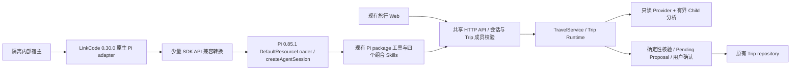

# Pi 0.85.1 升级与 LinkCode 内部宿主验证

日期：2026-09-16。范围：现有 Travel 项目，保留 Web 产品与 TravelService/Trip Runtime；不部署、不引入 DSH、不复制 LinkCode 源码。

## 结论

项目依赖已升级到 **Pi 0.85.1**；现有 `pi-subagents@0.46.0` 和 `@quintinshaw/pi-dynamic-workflows@3.5.1` 保留。隔离的 **LinkCode 0.30.0 原生 Pi adapter** 已能加载本项目工具与 Skills，并通过现有鉴权 API 操作同一业务状态。

这不是商用容量通过结论。500 在线并提交与 500 个规划任务同时执行两个目标均保留，验收合同见[500 并发最终审查](./2026-09-15-commercial-500-concurrency-final-review.md)。本次未实现分布式任务所有权、租约或 fencing，也未执行 500 用户负载测试。

## 实际接线



- Pi 0.85.1 不再提供旧 `AuthStorage` 导出，`ModelRegistry.create()` 也不再存在；新接口是 `ModelRuntime` 与 `new ModelRegistry(runtime)`。LinkCode 0.30.0 原生 adapter 仍使用旧接口，直接组合会启动失败。
- `linkcode-pi-085-sdk.ts` 只转换认证和模型注册接口，并将同一个 `ModelRuntime` 交给官方 `createAgentSession`。会话、模型循环、资源加载、事件、取消与历史仍由 Pi 和原生 adapter 执行；没有第二个 Runner。
- API 宿主模式不构造本地 TravelService/TripStore。14 个业务工具映射到固定 HTTP 路由，服务端重新校验身份和 Trip 权限。补齐 scope、research、trial、booking handoff/confirmation、disruption 路由。
- 每个宿主单独进程、隔离 HOME/agentDir；历史按 API origin + userId 分区。模型和 API 凭据只进入运行进程，模型凭据使用内存存储。历史保存交互记录，不是业务状态真相源。
- 通用 Shell、文件工具、浏览器工具、MCP、递归 subagent 和权限绕过均关闭。Skill 仅通过四个枚举名称读取。研究仍由服务端已有 Child fan-out 执行。
- 确认、拒绝、预订跳转准备、外部预订确认记录、反馈都要真实 UI 确认；没有 UI 就拒绝。预订工具不执行购买。
- 原生 Pi 会持久化会话内容，所以内部宿主在进入 Pi 前拒绝图片、音频和资源块。图片继续走 Web 的 request-only 路径，不能宣传宿主已支持无落盘图片。

## 修复了什么

| 问题 | 改动 |
| --- | --- |
| 普通完整行程请求拿不到规划工具 | 同一 Parent 轮次可依次保存、研究、读取最新候选、试排与核验；保留最多一次修正和总工具预算。直接优化仍可走精简入口。 |
| 真实 Child 输出被 600-token 上限截断 | 上限调为 1600，截断作为明确失败；不把不完整 JSON 当有效结果。 |
| Child 添加合同外字段导致整条分析失败 | 只接纳合同字段；运行身份、revision、lane、Skill 版本由 Parent 填写。必须提供 findings 数组和有效分析内容；可选集合缺省为空，空对象和嵌套 JSON 片段拒绝，候选与引用仍受输入范围约束。 |
| Child 先等待主模型失败再切换，增加整轮延迟 | 已通过真实 Child smoke 的 Kimi 优先承担只读分析，既有推理模型作为回退；Kimi 未通过门控时不进入路由。Parent 模型配置保持原有选择。 |
| 失败/部分分析可能一直被缓存复用 | 启用 fan-out 时只复用覆盖完整的分析；相同请求可重新执行失败研究，维持一份当前 Proposal。 |
| 取消后迟到的 Provider/路线结果可能继续入库 | API → 服务 → Child/规划传播 AbortSignal；在结果入库前复核取消。已进入原子提交的请求仍需重读状态确认结果。部分 Provider 网络请求本身尚不能立即中止。 |
| 反馈 body 可覆盖 URL 中的 Trip ID | 路径资源 ID 优先，防止一次已鉴权请求转写到其他 Trip。 |

Parent 的写操作仍顺序执行，独立 Child 分析并行；没有把所有工具改成并行。输入顺序、跨实例协调和 500 容量的后续工作仍按容量方案实施。

## 验证与边界

| 验证 | 结果 |
| --- | --- |
| 无凭据、只读、禁网的 Pi 与 LinkCode import smoke | 通过；不是在线 Provider 验证。 |
| `npm run check` | 通过：核心及桌面类型检查、285 个测试通过/4 个 PostgreSQL 条件跳过、Web 构建、小程序静态合同。构建有既有大 chunk 提示。 |
| Pi consumer 真实 Kimi Child | 通过：加载既有组合 Skill，受限工具面，无业务写入。 |
| 小规模真实模型三分支 fan-out | 首次 partial，复验 complete；不能据此推导容量或稳定性 SLA。 |
| 原生 LinkCode/Pi/API 合同集成 | 通过：真实 adapter/SDK/API，模型响应使用本地 fixture；读取 Skill、共享业务状态、真实确认请求取消、进程重启续接并读取新状态。 |
| 原生宿主 + 真实 DeepSeek | 通过：模型实际调用 travel_read_skill、create_trip；测试经共享 API 读回目的地杭州及预算 6000。此样本未触发外部旅行 Provider，也未验收正式 LinkCode 桌面 UI。 |
| 真实 Provider 快照 + 三个真实 Kimi Child | 通过：3/3 分支完成、一次 Join，耗时 35.645 秒；使用已采集的真实来源快照，没有重新请求 Provider。这是单次小样本，不是容量或延迟承诺。 |
| 宿主权限和持久化 | Shell/权限绕过/媒体输入被拒绝；凭据与拒绝的图片未进入 profile/history。 |
| 旅行回归 | 同 Trip 冲突、过期分析丢弃、Join 幂等、确认边界、跨 Trip 权限、取消迟到结果、图片不进入对话存储、照片记忆的现有回归通过。 |
| 真实模型 + Provider 完整黄金路径 | 未通过：首次存在分析截断及 Provider 缺项，不完整选择被提交门拒绝。分析问题修复后的真实快照复验通过，但完整的重新取数 → 规划核验 → 用户确认链仍未取得通过证据。 |
| 本地真实 Web 操作 | Mac 锁屏、浏览器连接失败，尚未完成。构建和 API 回归不替代目测。 |
| PostgreSQL/多实例/500 并发/故障演练 | 未验收；仍保持 single_process 限制。 |
| 全局 Pi | 仍为 0.74.0，兼容性检查按预期拒绝；本项目使用锁定的 0.85.1，没有修改全局环境。 |

证据目录：[结构化验证记录](./assets/2026-09-16-pi-upgrade/)。固定第三方 SHA、许可、隔离范围见 [third-party-audits.json](./assets/2026-09-16-pi-upgrade/third-party-audits.json)。没有 push、部署、购买、真实预订或修改全局 Pi/Node。

同一来源快照在修复输出合同后，先走原主路由再回退 Kimi 的一次运行耗时 67.575 秒；直接使用已验证 Kimi 的一次运行耗时 35.645 秒。该结果支持调整默认 Child 路由，但样本不足以声称稳定提速比例。供应商重新取数时间也没有计入这两次回放。

## 与 500 并发目标的关系

本次交付了可运行的 SDK 升级、内部宿主与局部执行修复。两项容量目标都没有缩减，也都尚未通过：

- **500 人同时在线并提交：** 还需要持久化接收、异步 turn、跨端状态推送和共享连接预算，不能以当前同步 HTTP 路径作容量承诺。
- **500 个规划同时执行：** 还需要持久运行所有权、失效接管、全局模型/Provider 配额，以及真实负载和故障演练；不能把等待中的任务算作执行。

下一轮应按容量报告的依赖顺序，先使一轮真实旅行稳定完成，再实现整轮持久执行与接续，最后以实际账号额度和成本上限验收两个 500 场景。当前只能开放受控内部验证，尚不满足该规模的商用上线条件。

## 内部运行方式

```bash
# 依赖仍安装在独立目录；源码来自固定 SHA，未放入 Travel 仓库。
LINKCODE_SOURCE_DIR=/path/to/audited/linkcode-v0.30.0 \
  node --import tsx scripts/smoke-linkcode-travel-host.mjs

npm run host:linkcode -- --source /path/to/audited/linkcode-v0.30.0 --profile /path/to/private/host-profile
# /history 查看本账号的会话；/stop 取消；/exit 退出。
# 使用 --resume <historyId> 续接；--json 使用原生事件及输入合同。
```

宿主进程需要运行配置 `TRAVEL_AGENT_API_BASE_URL`、`TRAVEL_AGENT_API_ACCESS_TOKEN`、`TRAVEL_HOST_MODEL`、`TRAVEL_HOST_MODEL_API_KEY`。Token 来自既有真实登录流程，不能写入提示词、文档或 shell 历史。可选 `TRAVEL_HOST_MODEL_BASE_URL` 仅用于受控模型网关。宿主拒绝没有真实确认 UI 的提交；测试程序的自动回答仅针对隔离 fixture。

当前已验证的源码目录为 `/private/tmp/travel-agent-research/linkcode-v0.30.0-20260916`，其独立依赖与 lockfile 在同级 `linkcode-v0.30.0-host-deps-20260916`；两者都不属于产品构建或发布依赖。换机器需先按固定 SHA 和锁文件重建隔离依赖并重跑 smoke。入口还校验 adapter 文件 SHA-256，版本漂移会拒绝启动。

LinkCode 与其 `@linkcode/tunnel` 依赖为 **BUSL-1.1**。本次仅内部评估宿主，不复制/分发其源码，不据此声称可以商业嵌入或托管。正式 LinkCode 桌面 UI 尚未接入该受限配置；本次交付的是使用其真实原生 adapter 的内部终端宿主。
