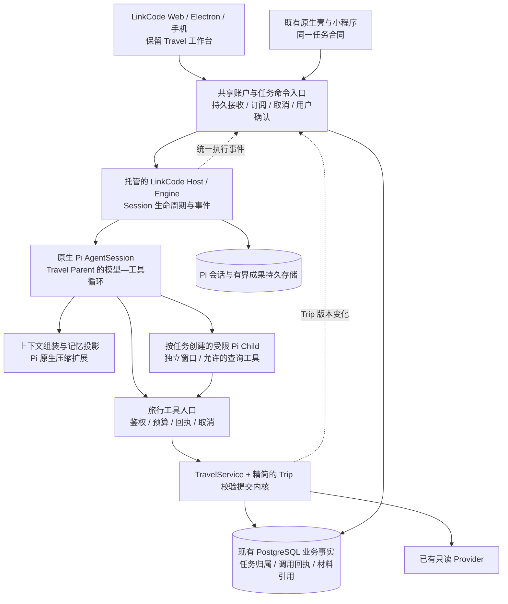

# LinkCode 统一执行界面与 Travel Agent 新架构、迭代合同

> **后续决策已取代本稿的整体融合方向。** 用户随后确认：考虑两者技术栈差异，借鉴 LinkCode 改造现有工作台。当前代码采用原工作台、Pi 原生 AgentSession 与产品持久执行层；实现和真实未通过项见[执行架构改造与验收记录](./2026-09-18-workbench-native-pi-execution-implementation.md)。以下保留为当时设计历史，不作为 LinkCode Workbench / Engine 已接入的声明。两个 500 的验收要求仍保留。

日期：2026-09-18。状态：**可交付主任务实施的设计；不代表已经实现或通过商用验收。**

## 0. 本次决策与完成定义

用户本次明确要求：LinkCode 作为统一执行界面，支持多端；保留已经设计好的旅行工作台；重新设计记忆、上下文压缩及 Agent 执行；把方案交给原主任务执行。

本文件修订此前“LinkCode 仅作为可选内部宿主”的方向。LinkCode 的客户端、执行交互和 Host/Engine 接线进入正式产品架构；既有地图、行程、证据、照片日志与确认体验保留。Pi 继续提供原生模型—工具循环。TravelService/Trip Runtime 保留业务能力和提交校验，逐步移出其中的 Agent 调度责任。

两个原容量目标同时保留：500 用户在线并同时提交；500 个规划任务实际并发推进。旧 [500 验收报告](./2026-09-15-commercial-500-concurrency-final-review.md)的服务指标、故障和生产用户路径要求继续有效；其中固定整轮 Worker、LinkCode 可选入口及固定 Child 分工，以本文件修订为准。架构图、单模型 smoke、压缩率或测试通过数均不能代替这些验收。

**用户可见的完成路径：** 电脑发起旅行 → LinkCode 中看到真实执行、工具和必要的询问 → 现有地图/行程工作台持续更新 → 手机上继续修改同一旅行 → 长对话压缩后仍遵守原决定 → 必要 Child 能补查并交接 → 明确确认后修改行程 → 执行器故障后按已保存成果继续。

## 1. 取证基线与会影响实施的发现

| 来源 | 本次核查 | 对设计的影响 |
| --- | --- | --- |
| `turnsu/linkcode` | 2026-09-18 读取 master ref，SHA 为 `22c337f197665e1c53cc717b88859a45cfd8a43d` | 作为本次源码设计基线，不跟随浮动 master |
| LinkCode UI | `WorkbenchProviders`、`Workbench`、`shellComponent`、`WorkbenchShellProps`、`useSeededConversation` 已存在 | 可以组合旅行 Shell 与领域面板；不能声称上游已提供任意领域插件插槽 |
| LinkCode 远程能力 | 上游文档的生产 Server 位于仓库外 `linkcodehq`，本仓库没有该 Server app | 多端云接入要落实到自有鉴权入口，不能依赖未取得的上游云服务 |
| LinkCode 输入 | `SessionInputDispatcher` 对活动 turn 的新 prompt 返回 busy | 多端排队、替换、steer 需要显式产品命令语义，不能靠多个客户端直接 prompt |
| LinkCode 历史 | 客户端 seed 从 provider history 重建；接收序号属于本连接视图 | UI 历史不能充当持久执行状态；跨账号缓存命名空间和跨 Host 的重放游标需要补齐 |
| 本项目 Pi | 实际安装 `0.85.1`；具备原生 Session compaction 和自定义摘要 hook | 优先复用，不再写第二个 LLM loop 或独立压缩引擎 |
| 既有内部宿主 | 固定 LinkCode `0.30.0` / `da9c0673…`，与本次 fork 基线不同 | 实施第一步统一源码、SDK 兼容层、文件 hash 和依赖锁；不得混装或删除版本校验绕过 |
| 当前 Web Child | 三条预设 lane，通过单次模型调用输出 JSON，没有工具循环 | 作为短分析能力保留；不再以它证明自主多 Agent 执行 |
| 旅行工作台 | `travel-app.jsx` 组合地图、行程、移动操作、账号、照片日志与目的地体验 | 提取领域视图和状态适配，保留视觉资产与交互，避免整体重写 |

源码依据：[LinkCode 架构](https://github.com/turnsu/linkcode/blob/22c337f197665e1c53cc717b88859a45cfd8a43d/docs/ARCHITECTURE.md)、[Workbench 入口](https://github.com/turnsu/linkcode/blob/22c337f197665e1c53cc717b88859a45cfd8a43d/packages/client/workbench/src/surface/workbench.tsx)、[Shell 合同](https://github.com/turnsu/linkcode/blob/22c337f197665e1c53cc717b88859a45cfd8a43d/packages/client/workbench/src/surface/shell.tsx)、[输入分发](https://github.com/turnsu/linkcode/blob/22c337f197665e1c53cc717b88859a45cfd8a43d/packages/host/engine/src/session/session-input-dispatcher.ts)。本地事实见 [现有升级记录](./2026-09-16-pi-085-linkcode-internal-host-validation.md) 与本次读取的源码；本次没有重新跑 live 或负载测试。

### 许可边界要准确

该版本 BUSL-1.1 的 Additional Use Grant 允许符合附加条件的生产使用，限制向第三方提供与其收费版本显著重叠的竞争性托管/嵌入产品；品牌资产另有许可。**不能笼统写成 BUSL 禁止商用，也不能把旅行垂直产品自动判为已获商业授权。** 主任务应在版本审计中记录产品形态、使用及分发范围、依赖和品牌处理，内部集成可继续；正式生产分发必须有适用于该形态的明确结论。此处是原条款与采用边界记录，不是法律保证。[固定版本许可](https://github.com/turnsu/linkcode/blob/22c337f197665e1c53cc717b88859a45cfd8a43d/LICENSE)

## 2. 界面融合：一个执行入口，一个旅行工作台

### 桌面与 Web

- 使用真实 LinkCode `WorkbenchProviders → Workbench` 数据与交互链，提供 Travel 专用 `shellComponent`。
- 保留统一任务列表、聊天输入、执行进度、停止/继续、工具过程与权限询问。旅行用户不需要 Git、终端、源码文件树或任意执行器切换；通过明确能力配置裁剪，服务端同步拒绝相关能力。
- 现有旅行地图、候选比较、每日行程、预算、证据和确认区成为该 Shell 中的 Travel 面板。保留原有空间布局与视觉层级，不把地图缩成工具日志里的小卡片。
- 主视图以旅行工作台为中心，聊天和执行活动可并排或折叠。切换任务时按同一个 `taskId/tripId` 更新两侧；禁止保留两套输入框分别启动两个 Parent。
- `shellComponent` 目前不足以直接取得全部旅行业务数据：新增一个窄的领域绑定接口，把当前 task/session 和 Travel view-model 传给 Shell；不把旅行逻辑写入通用 presentation 包。独立实现一个字段清晰的接口即可，不建立通用插件市场或动态页面框架。
- 领域按钮（试排、锁定、采用方案）与聊天指令经同一产品命令入口；地图高亮、面板切换等纯展示操作留在客户端。

### 手机与现有各端

- 手机浏览器复用 LinkCode/Travel 的响应式视图，执行与旅行面板用底部导航/抽屉切换，延续已有移动键盘、返回、滚动与确认交互。
- 既有 iOS/Android 壳沿用 Web 视图；微信/支付宝小程序保留原生视图，通过适配器使用同一任务命令、快照和事件合同。React DOM 组件不能直接当作 React Native 或小程序组件复用。
- 上游 Expo 手机端不是本次额外新建客户端的前提；原有端必须纳入共享状态与确认验收，不能在报告里只验证桌面便声称多端完成。
- 桌面关闭后云端已接收工作可以继续。短暂离线显示最后快照和更新时间；有副作用的操作恢复联网后重新鉴权、校验版本再提交，不显示虚假成功。
- 账号与会话访问沿用现有身份服务。各端连接前、订阅时及每次命令都校验 task/Trip 成员关系；前端隐藏按钮不构成权限控制。

**迁移策略：** 先提取原工作台为可注入数据与 callbacks 的领域视图，用同一真实 Trip 在旧、新入口比较；再将原入口变为新 Shell 的兼容入口。切换期每个 task 固定一个执行 backend，不能同时向新旧 Parent 双写。

## 3. 目标责任链与唯一所有者

这是责任划分，不要求把每个框拆为服务。保持同一产品仓库；前端、API 与 Host 执行进程按依赖和故障边界部署。LinkCode 的源代码集成需遵循固定版本和许可审计，不拼接两个不同版本的包。

| 对象 | 权威所有者 | 其他层的职责 |
| --- | --- | --- |
| 用户确认的行程事实、锁定项、报价依据 | 现有 Trip repository，经 TravelService/Trip 校验提交 | UI 与模型读取投影，不能另存一份可独立改写的 Trip |
| Agent 的模型/工具循环、原生消息及压缩记录 | 同一个 Pi Session，由 LinkCode Engine 驱动 | 不保留一套 Web 自建 Parent loop 并行运行 |
| 产品任务输入、执行归属、取消、交接接收、工具回执 | 服务端持久任务记录 | Engine 内存对象只表示当前已取得执行权的实例 |
| 用户可见执行流与领域快照 | 从已记录事件和 Trip 版本生成 | LinkCode conversation store 与本地 cache 为视图，不是授权或恢复依据 |
| 长期偏好 | 用户范围的记忆记录；若现有资料字段可承载则直接复用 | 当前任务事实优先，不把模型猜测自动升级为用户长期事实 |

`taskId ↔ productConversationId ↔ tripId` 稳定；LinkCode 的 `sessionId/historyId` 作为当前执行绑定，重建后可以改变。服务端拥有映射，客户端不能提交任意 cwd、historyId 或账号目录获得访问。应用所需的跨端 durable cursor 不直接复用本连接的临时 eventSeq。

### 接收、插话、确认与恢复

1. 命令携带 `requestId`、已读版本与任务 ID。先持久化身份绑定、规范化输入和执行意图，再返回接收回执；模型和外部网络在事务外运行。
2. 同任务多端输入获得服务端顺序：普通补充进入 inbox；明确修改依据时使受影响工作失效；显式停止先持久化。新输入在 Pi 可处理的工具/模型边界进入循环，不能声称可在任意 token 中途改写正在生成的请求。
3. 同一任务只有一个有效提交者；generation/租约在发布、工具效果和交接接收处校验。模型、工具、Child 可以并行，不等于允许无序写同一 Trip。
4. 等待用户、长任务回执或配额时保存状态，释放模型槽位；逻辑 Session 不要求永久占用独立 Worker。当前适配依赖进程级配置，未证明隔离前禁止多租户共享同一个可变 Pi 全局环境。
5. Pi 原生会话恢复只能证明历史可读，不等于工具完成状态可恢复。恢复先读产品回执并核对最新事实，再重建模型窗口。已确认生效的业务动作不重做；不确定调用先核对结果；模型流中断可重发并计费，不能承诺 token 级继续或外部效果 exactly-once。
6. 最終采用由用户在任一端明确操作，生成绑定 Proposal、revision、用户和时效的确认凭据；Parent 的提交路径验证它。模型不能签发确认凭据，普通工具许可不能替代业务采用确认。

Pi 新 Harness 的 `accept/drive`、持久状态和恢复可作为后续执行适配候选；本轮先使用已锁定 SDK 与原生 Session，补齐上述产品接收/回执边界。若 SDK 的安全扩展点不能完成恢复，必须以故障验证证据升级执行层决策，不能自行复制其模型循环。实验 Harness 通过验证前不成为 500 容量承诺的前提。[Pi 0.85.1 发布说明](https://github.com/earendil-works/pi/releases/tag/v0.85.1)

## 4. 记忆设计：让 Agent 记得，提交时仍有依据

**采用记忆与上下文机制，同时精简 Trip Runtime 的职责。** 记忆帮助 Agent 理解和延续工作；提交校验处理过期版本、权限、并发和已确认约束，二者解决不同失败。不会因为摘要写着“已经确认”就授予执行权限。

| 记忆类别 | 内容及来源 | 进入模型的方式 |
| --- | --- | --- |
| 任务事实记忆 | Trip 当前事实、明确用户原话的出处、确认/锁定、预算、日期与同行人约束 | 从现有 TripState 生成只读 Fact View；关键项每次调用显式注入 |
| 用户偏好记忆 | 用户允许跨旅行保留的偏好和禁忌 | 按当前任务相关性读取，显示来源/时间，可更正与忘记 |
| 工作记忆 | 当前目标、已完成步骤、待解决问题、候选方案及其证据引用 | Agent 可写结构化工作笔记，经字段/大小/引用校验保存；不当作已确认事实 |
| 证据材料 | 来源记录、查询条件、时间、价格与适用范围 | 保存有界、脱敏材料；模型先看摘要及 ID，按需展开 |

实现先复用 Trip、conversation 与 artifact/repository；需要长期偏好时只补一个用户作用域记录，不先引入向量数据库、全局 Memory 服务或图数据库。

规则：

- 明确用户输入可以更新本次 Trip 的事实，按现有权限和修订合同落库；普通偏好不增加逐条确认弹窗。跨旅行记忆通过明确保存意图或已开启的记忆设置获得范围授权。
- “酒店不能换”存为带来源的当前约束；压缩后重读它，不依赖摘要记忆。用户后来明确解除时保存新的版本与出处，旧值标记 superseded。语义不明确就保留开放问题，不能自行解除锁定。
- 长期“偏好低预算”不覆盖本次“预算 12000、希望住好一点”；旧报价按新鲜度失效，用户明确决定不会因材料 TTL 自动消失。
- 同一权威输入序列决定冲突顺序；不能把“最后到达的 Child 输出”当作最新用户决定。Child 只能返回 memory/proposal 建议，不能写用户记忆或当前行程。
- Agent 的私有推理、身份/支付资料、Cookie、Token 和浏览器 profile 不进入任何共享记忆、摘要或检索索引。
- 用户“忘记”操作作用于源记录及其派生摘要/索引；撤销或删除后，旧摘要不能重新激活该事实。审计保留遵循产品保留规则，不把可删除的聊天摘要当永久授权。

精简后的提交内核只负责身份/确认、版本与依赖、锁定/硬约束、新鲜度及原子提交。旅游策略、选择补查什么、如何解释取舍，交给 Agent 和领域工具；不把它们重新写成庞大规则引擎。

## 5. Context rot 与压缩：采用什么，如何证明有效

### 5.1 调研结论

- Chroma 的控制实验表明，在其测试模型与任务中，输入变长会降低可靠性；这支持主动控制上下文，但不能从该实验推导本项目的最佳 token 数或当前模型的精确衰减曲线。[Context Rot](https://www.trychroma.com/research/context-rot)
- Anthropic 提供的可组合办法包括按需取材料、压缩、结构化笔记和子任务隔离。它们适合组合使用，不能把“记忆系统”等同于无限追加历史。[Context engineering](https://www.anthropic.com/engineering/effective-context-engineering-for-ai-agents)
- Pi 已安装版本提供 `session_before_compact`、摘要记录与保留边界，适合承载旅行专用摘要。不能给现有 Web Agent Core 仅加一个配置就声称接入了 Session compaction；先完成统一执行接线。[本地 Pi compaction 文档](../../node_modules/@earendil-works/pi-coding-agent/docs/compaction.md)
- 全量 context reset 会引入交接成本，而且收益与模型有关；作为失效恢复或阶段交接的受控手段，不固定每 N 轮清空。[长任务 Harness 实验](https://www.anthropic.com/engineering/harness-design-long-running-apps)

### 5.2 采用的流水线

`已授权输入/工具结果 → 来源与版本标记 → 去重/失效过滤 → 有界材料保存 → 任务相关检索 → Fact View + 工作摘要 + 最近完整交互 → Pi 模型调用`

1. **工具结果先减量。** 原始返回只留必要字段；重复同一版本返回短引用，长表分页。HTML、重复工具 schema、过期候选和无关 Child 轨迹不填满主窗口。保留关键引用及时间，不能只剩不可核验结论。
2. **事实与摘要分开。** 硬约束、确认、当前 revision 和预算来自实时权威数据；摘要保存工作进展与尚未解决问题。摘要中的事实被源版本否定时，先失效再重建。
3. **按需检索。** 首先按 task/Trip/用户/权限/时效过滤，再按相关性排序；可以由 Agent 读取授权 artifact 的指定字段。初期结构化索引与关键词查询足够，只有实测召回不足才加向量检索。
4. **使用 Pi 原生压缩入口。** 在完整工具批次结束后和下一模型调用前触发，接入 `session_before_compact` 生成并校验领域摘要。保留完整工具调用—结果对；不在未结算效果中间随意截断或重启。
5. **限定摘要内容。** `objective / completed / openQuestions / rejectedAlternativesWithReason / evidenceRefs / pendingTools / nextActions / basis`；已完成工具的原始大输出移出活跃窗口，保留回执 ID。不能摘要私有推理；摘要提示和序列化器必须主动排除 thinking 内容与秘密字段。
6. **防止反复摘要漂移。** 新摘要关联所覆盖的 message/event 边界和源版本；从权威事实与引用材料校核，不能只对上一版摘要继续改写。必要时从材料重新生成；事实、单位、否定词、日期、锁定项和未完成事项逐项检查。
7. **失败不破坏旧状态。** 校验通过再原子发布摘要；保留可恢复的上一版摘要和引用。超过预算且无法保留关键内容时，拆小任务或返回明确缺口；禁止静默丢弃约束。
8. **污染边界。** 外部网页、工具输出和记忆笔记都保留数据身份，不能升级为系统指令。重复失败、无进展、使用被否定事实触发重读/诊断；不能仅凭 token 数判断是否健康。

### 5.3 初始 token 策略（待实测调参，不是模型能力事实）

设模型总窗口 C、输出/推理预留 O、下一批有界工具结果预留 T、安全余量 H。活跃输入预算 `B = min(角色目标, C - O - T - H)`，schema 和系统指令计入输入；B 非正或关键材料超出时拒绝无效调用。

- Parent 角色目标先用 24K，Child 先用 8K；小窗口模型取更低实际预算。每次调用测量/估算并保留安全余量，不能按字符数假装精确 token。
- 输入预测超过 80% B 时，在安全边界清理和压缩；目标回到约 60% B，仅为初始调参。原生接近窗口上限的自动压缩作为最后保护，不能作为唯一 context rot 策略。
- 子任务只接收自己的目标、必要事实、当前证据索引与授权工具；结果通常为短成果加引用。父级按需展开，不能把所有 Child 历史合并。
- 压缩和检索消耗也计入任务成本、并发与 deadline；不能每次轻微增长都新增摘要模型调用。实际压缩调用属于执行工作并单独计量；不能仅凭“压缩中/等待中”标签，把没有资源或没有工作推进的任务算作实际规划并发。

### 5.4 验收方法

使用同一批有人工/确定性真值的旅行轨迹，对比现状裁剪、Pi 默认压缩、上述领域压缩；模型和来源输入一致。必须覆盖长对话多次压缩、事实在头/中/尾、用户反复纠正、同名地点、日期与货币、否定词、锁定酒店、工具未完成、恶意来源指令、另一设备插话和删除记忆。

关键门：在验收案例中硬约束/授权事实不丢失或被反转、过期材料不复活、跨用户泄露与重复提交为 0；同时记录任务完成率、事实召回、错误记忆、重复工具、输入 token、压缩额外成本及首个有用结果延迟。先保真，再优化压缩率；工具冗余明显的案例以输入减少 30% 为优化目标，未达到时如实报告，不改验收真值。

## 6. Agent、工具与交接

### 6.1 执行模型

- 一个 Travel Parent 持续拥有本任务目标。它根据当前问题动态选择直接答复、工具查询、委派、修正、等待用户或完成；不预设每次都跑三个角色。
- 默认最多两个 Child 同时运行、一次规划最多三个有界子任务；这是初始成本/并发政策，不是永久任务拓扑。增加并行前按实际账号配额和完成质量验收。
- 真正需要自主调查的 Child 使用原生 Pi 独立 Session/窗口和受限工具循环；短预算分析仍可用单次模型函数。二者在日志和产品能力声明中分开。
- Child 无递归委派、确认提交、用户记忆写入、Shell、任意 URL 或凭据权限。只向 Parent 交成果；结构化状态与所依赖证据由运行端验证。

### 6.2 工具合同

| 工具能力 | 允许的执行者 | 效果与控制 |
| --- | --- | --- |
| 读任务事实、展开授权证据、查询已有候选 | Parent / 有需要的 Child | 身份与字段限制；分页；短结果加引用 |
| 受限旅行来源检索、路线/设施核验 | Parent / 明确授权的 Child | 复用已审计 Provider；全局额度、超时、取消与同条件请求去重 |
| 确定性预算/路线检查与试排 | Parent；Child 可计算自己负责的草案 | 不直接提交 Trip；输入/结果带依据版本 |
| 写工作笔记、交接成果 | 各自任务作用域 | 大小/字段/引用校验；不能写成用户已确认事实 |
| 提交 Proposal / 用户记忆变更建议 | Parent | 由业务服务校验，返回 proposed/conflict/needs_context 等明确状态 |
| 采用方案、解锁、记录外部预订确认 | Parent 的受保护提交路径 | 必须有本次用户意图/确认依据；Child 与普通模型输出不授予权限 |

粗粒度 `research_trip_options` 可作为兼容组合工具保留，但新增补查必须能够调用明确范围的查询工具；不能让每个 Child 都重复抓取四域。任何旧 HTTP/MCP 入口最终使用同一任务归属、调用预算及提交边界。

每个工具调用绑定服务端 `callId/taskId/runGeneration/inputHash/deadline/budget`。结果包含状态、依据、来源时间、可重试性与 artifact/receipt 引用。写面回执幂等；外部请求费用不承诺 exactly-once。权限扩大、重复工具风暴或预算耗尽会终止相应动作并保留已完成成果。

### 6.3 工作交接的最小合同

- **派发：** 目标、可验证完成条件、Context 引用及版本、依赖 read set、工具 allowlist、时间与剩余预算。运行端绑定身份，Child 不能覆盖。
- **返回：** outcome、结论、证据引用、已完成工具回执、未决事项、建议下一步、已消费预算。只返回可检查的工作记录，不共享私有推理。
- **接收：** Parent/运行端校验身份、依赖、权限、新鲜度和完成条件，记录一次 accepted / needs_context / rejected / stale 回执；收到一段文字不等于交接成功。
- **变更与恢复：** 新输入改变依赖时取消相关 Child；未受影响成果经 read set 校验后可复用，不能仅改 revision 标签。接手者先读最新事实再继续；同一成果不能被两次提交。

实际验收场景：已经订酒店的旅行遇到下雨 → Parent 只委派室内活动与交通补查 → 用户在手机上改出发时间 → 旧时间相关结果失效 → 长对话压缩后仍保留酒店锁定和新时间 → Parent 给可核验替代方案 → 用户明确采用 → 两端读到同一版本。失败来源清晰可见，不用编造库存凑完整。

## 7. 500 容量、云接入与运维

LinkCode 的 local-first Host 需要被托管到产品控制的执行环境；统一 UI 不代表现成 SaaS 隔离。复用现有 API 作为鉴权与命令入口，新增受限的 LinkCode transport 接入，禁止把完整本地 daemon RPC 原样暴露到公网。

- 鉴权入口映射产品 task 到有效 Host；所有命令有 schema、权限、大小、速率和版本校验。LinkCode 连接和事件协议复用，业务领域 payload 沿用严格 TS 合同，不维护两份各自可变的完整业务 schema。
- PostgreSQL 持有输入接收、归属、租约/generation、效果回执和全局预算。需要队列时使用审计过的现有 PostgreSQL 队列实现；队列安排工作，Parent 决定下一步，二者不能重复拥有任务策略。
- Pi 原生历史保存在隔离的持久位置；必须验证 Host 损失后的可读性、最新安全检查点与回执对账。仅在临时磁盘保留 JSONL 不能签署恢复通过。数据库任务行不复制全部 Pi transcript。
- 安全检查点至少绑定执行 generation、Pi history/已结算 entry 边界、context manifest、最新 Trip 依据与工具回执位置。先使会话快照/材料在故障后可读，再以事务发布其引用；只到达原生 UI 的事件不算检查点。恢复从最后有效边界开始，并对边界后的调用回执逐一核对；不得直接重放所有工具。若 SDK 缺少可验证的落盘/结算边界，M4 必须补齐窄适配或重新选择执行持久层，不能把文件存在当作恢复成功。
- LinkCode 的原生进程配置当前可能使用全局目录；先按执行隔离边界分进程/容器并实测 RSS。不能假设单机装 500 个独立 Pi 宿主成本可接受，也不预建 500 个常驻容器。按测得的每 Host 安全会话数、工具/模型槽和资源上限扩容。
- 一处统一管理模型账号与 Provider 端点的配额。Parent、Child、摘要、重试和恢复全部计数。等待人、等待额度、工具 I/O、模型执行分别统计；不把 490 个排队任务加 10 个工作任务算作 500 执行。
- 公共事件含 `taskId/generation/sequence/eventId/visibility`；客户端断线按游标补发，缺口超出保留窗口则回到快照。两个设备回复同一问题/确认时，只有第一次合法响应生效。
- 现有 `single_process` 限制只在持久归属、故障接管及所有消费者路径真正接通并验收后解除；不得伪报实例数绕过限制。
- 复用共享有界 DB Pool；心跳和状态事务不持有模型等待。监控阶段耗时、队列、有效执行数、取消传播、过期成果、费用、存储与恢复；健康检查和滚动发布先停止接单再接续。

容量验收沿用两项 500 场景，新增真实 LinkCode transport、跨端操作、压缩、Child 补查、断线和 Host 故障。先以可控模型/Provider stub 验证调度上限和故障行为，再分级跑有真实数据的 1/10/50/100/500；stub 通过不等于真实供应商容量通过。500 大规模实际调用应有确认的账号额度和费用上限，不能在费用未知时自动启动。

## 8. 隐私、照片及多端缓存

- 上游当前的附件支持表有前端静态声明，不能直接继承为旅行能力。由服务端宣告实际支持，UI 与 Host 同时执行。
- 原图分析复用 request-only 视觉链，原始 bytes/base64 不进入 Pi 持久历史；只让经过清理的描述/证据进入任务。用户主动保存照片日志沿用已有独立保存流程，不能把附件上传默认等同于持久照片记忆。
- 现有照片日志、目的地体验及地图渲染保持原有能力与局限；上下文摘要和重启恢复不得悄悄补存图片。
- LinkCode seed cache、用户偏好与草稿按用户/租户/任务/执行绑定分区；退出或权限撤销时清除相应缓存。historyId 随机性、客户端 cwd 或 UI 不显示均不能替代授权。
- 摘要不能充当删除机制。用户删除材料/记忆后，其引用、摘要投影和检索结果需一致失效；日志只留最小非敏感运行信息。

## 9. 迭代顺序、代码落点与每轮可见交付

以下是同一目标的依赖顺序，主任务应持续实施完整范围；一轮结束只说明对应能力完成，不自动把总体目标缩成内部 smoke。

| 迭代 | 做什么 / 主要落点 | 必须出现的完成证据 |
| --- | --- | --- |
| M0 固定集成基线 | 锁定 LinkCode fork、许可及依赖，复核 Pi 0.85.1 兼容层；确认真实 Workbench/Engine 启动方式，保留脏工作区 | 实际 LinkCode GUI 与原生 Pi 能连到本项目鉴权 API；不是仅 CLI adapter |
| M1 融合工作台与统一入口 | 从 `src/web/travel-app.jsx` 提取领域视图；LinkCode `Workbench/shellComponent`、领域绑定、任务映射；旧 Web 入口按 task 切到同一执行者 | 电脑/手机浏览器操作同一旅行，地图/候选/确认和停止状态一致；原有工作台主要交互与视觉回归通过 |
| M2 事实记忆与上下文压缩 | 在 Pi package 的扩展与严格 TS 上下文模块实现 Fact View、工作摘要、artifact 读取、压缩 hook；现有个人资料/记忆记录扩展 | 长对话多次压缩和跨端纠正后仍保留关键约束；记忆可更正/忘记，来源可查；三策略对照有真实行为结果 |
| M3 动态 Agent 与工具交接 | `travel-conversation-agent.mjs` 逐步成为兼容入口；将 `travel-analysis-fanout.mjs` 固定分析保留为能力，增加原生受限 Child；从 TravelService 分离运行编排 | 真实 Child 完成至少一类按需补查，明确 needs_context；雨天改计划场景有接收回执、过期丢弃、一次最终提交 |
| M4 托管执行与所有权恢复 | `src/http/` 共享命令/订阅、`src/persistence/` 任务与回执、LinkCode Engine 托管适配；全局额度和执行资源 | 多端重复提交/取消、进程失效、工具不确定结果、重启后接续均正确；所有规划入口通过同一归属和预算检查 |
| M5 商用规模及全端验收 | 按测量配置 Host 池，分级真实负载、故障与成本；原生壳/小程序协议接入与真机；生产身份/地图/来源/发布配置 | 两个 500 场景、完整真实旅行路径、压缩质量、租户隔离、滚动发布/恢复达标；发布只覆盖已经通过的端与能力 |

新增运行/上下文/交接的核心合同放入现有严格 TypeScript package 或对应严格 TS 模块；不要把核心规则散落回未检查的 `.mjs`。不改无关前端、既有用户输入或受保护规则来制造通过。LinkCode 上游缺少的域插槽、云 transport、持久会话接续必须作为实际修改点验证，不能写成已有功能。

### 每一轮的验证层次

- 行为回归覆盖真实业务效果；正常路径与失败恢复使用同一入口，不做截图专用逻辑。
- 受影响共享控制链运行项目 `npm run check`；对应端发生变动才扩大到原生/小程序检查。
- UI 融合必须在真实 LinkCode GUI、桌面和手机视口操作；构建、组件存在或 mock event 不能代替。
- 真实模型、真实 Provider、真实用户确认、PostgreSQL、多实例和负载分别记录。单次回放与小样本不能推广为 SLA。

### 回滚与兼容

先给任务绑定执行版本，旧会话保持可读；兼容入口映射到同一运行所有者。发生切换回滚时停止新版本接单、等安全边界或接续现有任务，不能让同一 task 同时跑两个 Parent。数据库变更优先向后兼容，保留恢复工具；用户已确认行程和记忆不能靠回滚前端恢复成旧值。

## 10. 给原主任务的执行要求

接收任务：**调研 Linkcode 与 Pi 架构**，ID `01a0a30e-d5b0-70d2-8d8c-f32bc0fe99f3`，工作区 `/Users/chenge/Desktop/travel-agent`。这是本次侧聊用户明确要求的原主任务，不是另一个 Harness 任务。

执行本文件 M0–M5，遵守现行项目边界和用户最新纠正。重点是实际 LinkCode 统一执行界面、保留工作台、事实记忆+受控压缩、可补查的 Agent 与交接、持久恢复及两个 500 验收；不得仅交付文档、SDK 升级或一个薄适配探针后宣称完成。

主任务开始时先读本文件并核对正在进行的改动；保持单一实现所有者，不启动协作子 Agent、不覆盖脏工作区。按阶段完成可运行、可审查结果，复用已授权操作；公开发布、许可采购或大规模付费压测若缺少具体授权，完成其他工作并准备最后可审批的目标、参数、费用和回滚材料，再处理该缺口。不能用一个外部门阻止全部内部工程，也不能静默跨过它。

本次侧聊只新增本设计文档并负责交接；没有修改产品源码、依赖、全局配置或部署状态。
