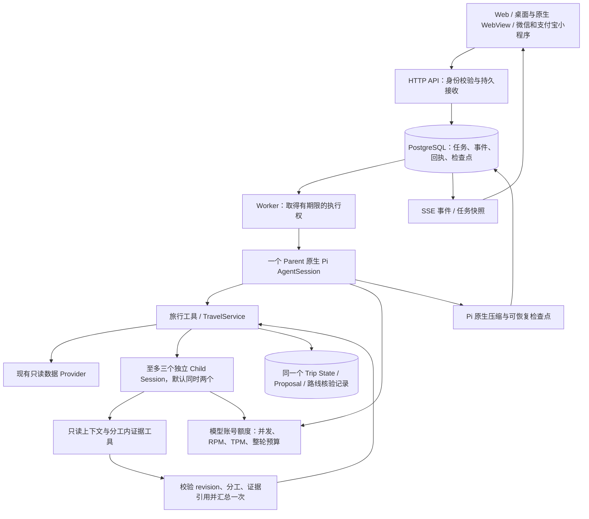

# 原工作台 + 原生 Pi：执行架构改造与验收记录

日期：2026-09-18。状态：**已实施本地代码与验证，尚未完成 500 个真实复杂规划的商用验收。**

## 1. 已执行的决策

采用用户最后确认的方向：**借鉴 LinkCode 的任务接收、执行事件和恢复方式，改造现有旅行工作台；运行时使用已安装的 Pi 0.85.1 原生 AgentSession。** 不把 LinkCode Workbench / Engine 整体嵌入旅行产品。原有地图、候选比较、行程试排、确认和照片日志继续沿用同一产品与技术栈。

这取代 [此前的整体融合稿](./2026-09-18-linkcode-unified-travel-agent-architecture-and-iteration.md)。两个 500 目标仍按 [容量合同](./2026-09-15-commercial-500-concurrency-final-review.md)验收，不能因实现路线调整而降低。

Pi SDK 承担单个 Agent 的模型、工具与上下文循环。并发调度、账号额度、用户身份、取消、崩溃接续和旅行业务提交由产品层负责。没有复制第二套模型循环，也没有新增 Redis、消息中间件或独立 Agent 微服务。

## 2. 当前实际调用链

| 责任 | 代码入口 | 真实边界 |
| --- | --- | --- |
| 持久接收与任务归属 | `src/persistence/execution-repository.mjs` | PostgreSQL 唯一约束、事务、租约与递增执行代次；SQLite 仅本地开发 |
| 执行与预算 | `src/agent/travel-execution-service.mjs` | API / Worker / combined 三种角色；单任务一个 Parent |
| 原生模型窗口 | `travel-agent-pi-package/src/host/travel-agent-session.ts` | 官方 AgentSession、内存 SessionManager、原生 compaction |
| 旅行工具和意图 | `src/agent/travel-conversation-agent.mjs` | 现有旅行工具进入原生 Session；工具失败不能被模型成功文案覆盖 |
| Child 工具和交接 | `src/agent/travel-analysis-fanout.mjs`、`travel-agent-pi-package/src/host/analysis-handoff.ts` | 独立窗口、不可变分工、限定候选与证据、Parent 验收 |
| 跨端协议 | `src/http/travel-execution-routes.mjs` | 同一权限边界下的接收、快照、事件与取消 |
| 用户工作台 | `src/web/execution-progress.jsx`、两端小程序页面 | 实际进度、停止、重连、继续与问题选项 |

Trip、Conversation 与执行记录共用 Trip repository 的 PostgreSQL Pool；认证、照片日志目前仍各有自己的连接池。部署连接总预算必须把这些池一起计算。

## 3. 一次请求如何完整走完

1. 客户端生成稳定 `requestId`。服务端先校验当前对话所有者、输入和队列容量，再保存命令，返回 `202`。同一请求重试得到原 run；相同 ID 携带不同内容返回冲突。
2. 多个 Worker 从同一数据库批量领取。不同旅行可并行；同一对话，以及已绑定到同一 Trip 的不同对话，按服务端顺序执行。
3. Worker 在模型调用前保存用户输入。工具开始、完成、失败与 Child 交接产生持久事件。浏览器关闭或断网不会撤销已接收工作。
4. Parent 通过旅行工具保存要求、研究、试排和解释。业务状态继续由 TravelService / Trip Runtime 校验 revision、read set、write contract、锁定项与时效。
5. 用户在任一端停止，服务端先保存取消状态；模型和只读 Provider 接收中止信号。数据库在**同一事务内**检查执行代次和有效租约，再允许业务写入。取消之前已经提交的内容保留，取消之后的迟到写入被拒绝。
6. 遇到真正需要用户决定的信息，问题和选项持久化，任务进入 `awaiting_input`，释放 Worker 与模型槽位。回答是同一对话的新请求，可读取之前的问题、检查点与当前事实；不会在等待回答时自行继续修复路线。
7. `completed` 只说明这次执行已结束。另有 `outcome` 标明资料缺域、未完成分析和路线核验状态；部分结果在工作台显示“已有部分结果，仍有待补充项”。

路线能力还有确定性前置检查：当前服务无法提供路线资料时，保留已有候选并明确说明影响，不把这个服务故障当作用户信息缺失，也不要求模型重复修复。已知旅行再次请求优化时可直接返回缺口，不消耗模型调用；服务恢复后同一份计划可以继续核验。

### HTTP 协议

| 方法 | 路径 | 用途 |
| --- | --- | --- |
| POST | `/api/conversations/:id/runs` | 幂等提交；正文含 `requestId`、`text`、可选模型与图片 |
| GET | `/api/conversations/:id/runs` | 找回正在执行或最近结束的任务 |
| GET | `/api/runs/:id?after=N` | 状态、结果与游标之后的事件 |
| GET | `/api/runs/:id/events?after=N` | Web / 桌面 SSE；重连从持久游标接续 |
| POST | `/api/runs/:id/cancel` | 请求停止 |

旧 `/messages` 入口也进入同一执行队列。Web / 桌面 / WebView 使用新接收和 SSE；微信、支付宝源码已改用新接收、任务快照轮询和取消。小程序退到后台停止观察，回前台查回已有任务；网络错误后不把已接收任务再次发送。小程序平台登录和真机布局仍需独立验收。

SSE 当前每秒查询持久快照；慢客户端停止本次连接后从游标重连，服务端不无限缓存事件。它已经覆盖本次 1,000 连接测试，但并非通知式推送，数据库读压力和 p95 ≤ 1 秒的传播目标还需持续负载验证。

## 4. 上下文、工具与多 Agent 交接

### 4.1 三种信息分别保存

| 信息 | 保存位置 | 如何进入模型 |
| --- | --- | --- |
| 用户要求、逐人约束、已确认事实、当前版本 | 原有 Trip repository | 每次 Parent 模型调用重新读取精简事实视图；覆盖旧对话和旧摘要中的事实 |
| 当前对话、工具消息、压缩摘要 | Pi 原生会话检查点，存入执行记录 | 恢复原生消息结构；不只把最后几条聊天拼成新 Prompt |
| Child 分工与分析结果 | 分工快照、结构化结果、Proposal 及交接事件 | 各 Child 只取分工材料，Parent 只接收受校验结果 |

每个模型窗口上限设为 32,768 Token；原生自动压缩预留 8,192，保留近期 4,096。压缩调用也经过统一模型预算。检查点保留原生压缩边界，删除不完整的工具调用/结果对，去掉图片原始字节、隐藏推理及签名元数据，并执行敏感内容检查。

Parent 的每次模型调用只装入当前阶段的两个组合 Skill：理解与研究阶段使用 `understand-trip` / `research-trip`；研究结果到达后切换 `research-trip` / `plan-trip`。当前事实不包含整份候选 Proposal，避免把工作台状态全量复制进系统提示词。

这次没有引入另一套长期记忆库。已保存的旅行事实与用户明确输入仍是依据，摘要不会成为可独立改写行程的事实源。

### 4.2 多 Agent 共享什么

**共享同一份带版本的事实与成果引用，各自拥有独立的模型窗口。** 三个 32K 窗口不能相加成一个 96K 窗口，也不能把每个 Agent 的全量聊天互相广播。

Child 分工绑定 `runId`、`tripId`、`baseRevision`、检索条件指纹、lane、候选 ID 和证据引用。上下文摘要的 hash 覆盖实际分配的要求、同行人、天气、锁定项及候选内容，避免 ID 不变而内容改变时误收旧结果。

Child 只有两个只读工具：`read_analysis_context`、`read_analysis_evidence`。后者拒绝读取其他分工的候选。没有 Provider 请求、Shell、任意文件、任意 URL、提交、购买或递归委派权限。Child 每条模型路由最多四次模型调用、四次工具调用，降级路由仍受整轮统一预算限制；默认同时两个 Child，最多三个业务分工。

Parent 接收时验证身份、版本、分工和证据范围，再汇总一次。原始结果中的身份冲突和跨分工引用先被拒绝，不能通过删除引用或改写身份变成有效交接；检查也覆盖每条 finding 内部的候选与证据。格式不合规时，同一路由可在上述模型预算内纠正一次，纠正阶段移除工具，不能重开研究。仍不合规或已过期的结果记为失败，保留其他分工的有效分析。来源缺失不会自动触发一次无效重查；只有明确可通过检索条件修正的问题才建议重查。

### 4.3 工具回执与业务事实

工具回执保存调用 ID、工具名、参数摘要和状态，不把完整参数、Provider 原始结果或推理文本发给进度 UI。写工具继续顺序执行；独立 Child 的只读工具可并行。

HTTP 幂等与工具回执解决重发识别，**不宣称外部效果 exactly-once**。本产品仍不提供购买、自动退改和社交写。模型也不能把“没有确认住宿”“不确认”等否定表述当作确认授权。

已核验的路线预览现在写入 PostgreSQL，并同时受短期过期时间、Provider 新鲜度与 Trip 版本约束。另一个 API 实例可以读取并确认同一份预览，不会因为命中了另一台服务器就丢失路线方式或重复核验。

## 5. 并发与故障处理的已实现边界

- 默认每 Worker 16 个活动任务，集群 32 个、每用户 2 个；集群活动上限允许配置至 500。待执行队列默认最多 1,000；单用户活动加待执行最多 4。**配置为 500 不构成容量证明。**
- 租约 30 秒，批量续租不超过两秒一次。执行硬截止 240 秒。队列超过 30 秒转可恢复中断；API 即使没有可用 Worker，也会维护超时状态。
- 仅在 PostgreSQL 模式、无图片、没有业务写入且工具回执均为只读时，允许一次自动接续。已写入或效果不确定的工作不会自动重放。用户明确继续时，系统会先找回已提交但尚未关联对话的 Trip，避免重复创建草案。
- Parent、Child、模型降级和压缩共用账号级并发 / RPM / TPM 额度。整轮最多 32 个模型请求、默认 400,000 Token 预算；已返回可信用量的调用按实际用量结算整轮预算，未结算或用量未知保留预留。滚动 RPM / TPM 仍保守保留请求预留。
- 生产模式没有对应模型账号额度时拒绝调用；非法额度配置不静默替换为宽松默认值。同一付费账号的多条模型路由必须使用同一个 `account` 标识。
- 图片不落盘，保留在接收 API 的请求内存，最多同时保留四个图片命令，并由该实例执行。实例丢失后明确要求重新附图。这是 API 完全无状态化的已知例外。

### 启动方式

先在目标环境完成备份及版本验证，再执行 `npm run db:migrate`。本轮只在隔离测试库执行迁移，没有操作生产数据。

公共配置：`DATABASE_URL`、已配置的模型和 Provider 凭据、`TRAVEL_AGENT_WORKFLOW_EXECUTION_MODE=postgres_run`，以及按**实际合同额度**填写的 `TRAVEL_AGENT_MODEL_LIMITS`。该 JSON 以 provider 为键，每项含 `account`、`concurrent`、`rpm`、`tpm`；它不是购买额度的接口。

- API：`TRAVEL_AGENT_EXECUTION_ROLE=api npm run api`
- Worker：`npm run worker`
- 本地单实例：默认 `combined`。没有 PostgreSQL 的原子文件与 SQLite 模式不能作为多实例商用部署。

跨源白名单、生产平台回调、TLS、密钥管理与外部数据权限继续使用现有部署约定。保留旧 HTTP 入口便于客户端分批升级，回退时必须先停止接收并处理活动任务，不能让旧 Worker 和新 Worker 同时竞争相同任务。

## 6. 实测证据与不能推出的结论

### 6.1 本地受控容量

[原始容量结果](./assets/2026-09-18-workbench-refactor/controlled-500.json)由 `scripts/smoke-execution-capacity.mjs` 生成：两个 API、两个 Worker、真实 PostgreSQL、真实 HTTP 鉴权和原生 Pi 工具循环；500 个独立用户建立 1,000 条 SSE，500 个 Parent 同时进入受控模型等待，释放后各写入一份旅行。

负载任务是“保存旅行要求”。模型响应受控，未调用外部模型或旅行 Provider；本次耗时 16.7 秒，提交 p95 1,988 毫秒、p99 2,405 毫秒，最终保存 500 份旅行。**它证明这一受控负载下的接收、跨进程执行和双端观察，不证明 500 个真实复杂规划或 30 分钟稳定性。** 精确延迟与内存以 JSON 中最新记录为准。

### 6.2 故障与真实依赖

- 实际 SIGKILL 一个 Worker 后，另一个 Worker 约 30.2 秒开始接续；最终只有一条用户输入和一份旅行。旧执行代次不能写入、过期执行不能发布成功、取消后不能出现迟到成功；陌生用户不能读取事件。
- 使用独立 PostgreSQL Pool 验证了同 Trip 顺序、跨进程账号预算、写后崩溃的人工继续，以及跨 API 复用已核验路线与确认。它们不是纯内存 mock。
- [最新真实模型与旅行资料结果](./assets/2026-09-18-workbench-refactor/live-single-trip.json)：一条虚构的上海家庭旅行，通过 HTTP、PostgreSQL、原生 Parent 和三个原生 Child 的只读工具。运行约 49.7 秒后返回部分结果；两路分析被接收，`local_discovery` 返回结构不合格被标记失败。最终候选仍缺餐饮和住宿，不能视为完整规划。路线前置检查发现服务不可用，停止试排，没有再要求用户选择无法解决故障的“规划基准”。**完整旅行规划验收未通过，脚本返回非零退出码。** 此测试没有购买或确认候选。
- 当次配置核验表明：本地 `env_travel.local` 加载结果没有 `AMAP_API_KEY`，因此高德地点与市内路线能力不可用；这不能推断其他部署环境也缺少配置。最新真实结果之后新增了 Child 格式纠正和原始引用校验，已通过自动行为回归；尚未再次执行真实模型验收。
- 真实浏览器在 390×844 和 1365×900 下检查了提交、刷新恢复、停止、继续、持久问答与选择答案；使用专用测试服务和受控模型，只证明这些交互与接线，不证明旅行内容质量。小程序已通过状态与请求行为测试及项目合同检查，尚无平台真机证据。
- 最终验证命令与结果见 [verification.json](./assets/2026-09-18-workbench-refactor/verification.json)。构建仍有既存的大 bundle 警告；它不影响本轮检查通过，也不能替代移动网络性能验收。

## 7. 商用 500 验收仍需完成的工作

| 尚未关闭 | 具体下一步与通过依据 |
| --- | --- |
| 完整的真实旅行黄金路径 | 解决当前餐饮 / 地图资料可用性与路线阻塞，使用真实 Provider 形成可采用 Trial，随后由明确确认完成同一份方案；partial 与 needs_context 单独统计 |
| 500 个复杂规划持续并发 | 取得实际模型与地图 / 库存账号的并发、RPM、TPM、端点 QPS 和费用上限；在目标机器上跑两个 500 场景、30 分钟持续负载与故障演练 |
| 旅行 Provider 的共享限流 | 当前统一预算只覆盖任务内模型调用；AMap 的实例内排队以及直接 HTTP / MCP Provider 入口尚未统一到账号级调度。不能靠增加 Worker 放大上游请求 |
| 滥用与运营边界 | 现有用户任务上限不能阻止批量创建 Guest；上线入口还需实际生效的滥用准入、租户用量 / 费用控制、告警和状态监测 |
| 数据与恢复运维 | 为任务 / 模型回执设置保留与删除策略，验证备份恢复、滚动升级和数据库连接预算；当前任务日志不会自动按运营策略清理 |
| 目标端与生产身份 | Web、原生壳、微信 / 支付宝的真实生产回调与跨设备账号恢复，平台真机的停止 / 重连体验，以及签名和发布仍需验收 |

这些项是同一个商用目标的未完成部分。不能把本轮“代码已接通”和“500 受控短时负载通过”改写成“已经可商用承载 500 个复杂规划”。
