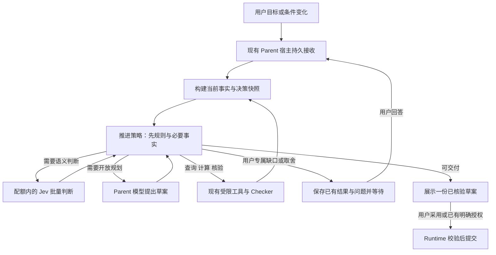

# 旅行规划的自动决策、用户交互与 Jev 协作架构

2026-09-22 追溯说明：本方案的简单交互、自动推进、授权边界和固定配额继续有效。最新用户决定要求业务模型与 Parent/Jev 连续联动，上下文同时改造；具体开发规范见 [current/14](../current/14-continuous-planning-business-model.md)、[current/15](../current/15-model-context-and-handoff.md)及[主线程交接](./2026-09-22-continuous-planning-redesign-handoff.md)。不能仅凭本文或前序修复记录声称新闭环已实现。

2026-09-20 · 第二版 · 按用户纠正深化自动推进、交互边界与固定 1,200 RPM 约束

**产品目标：用户说清想法，系统自动把能做的工作推进到可用草案；只在缺少用户才能提供的信息、存在重要取舍或需要新的授权时打断。** 用户主要面对一份持续更新的方案、简短的变化说明和必要时的一张选择卡。

Jev 承担高频、有限范围的语义判断，代码决定允许的动作与执行顺序，Parent 模型处理开放规划和复杂解释。自动化程度由证据、授权、后果和判断可靠性共同决定。旅行仍只有一个 Parent 责任所有者和一套 Runtime 写入校验。

本版将 **1,200 RPM 作为 Jev 的固定总上限**，重试也计入；不以扩容、增加 API Key 或提高套餐为成立前提。

2026-09-21 实施更新：本稿保留第二版决策依据；服务端 HTTP 判断、自动接续、稳定问题协议与配额持久等待已实现，未安装额外 SDK。真实 Jev 接口评估已执行，自动模板仍受校准门槛约束，500 商用验收尚未完成。当前代码、复现命令与证据见[实现记录](./2026-09-21-jev-automatic-planning-implementation.md)及 `current/`；“借鉴 LinkCode、改造现有工作台”的方向保持有效。

2026-09-21 业务返工：用户否定了“强制结束工具调用后用固定文字交付”的修补。当前实现改为核验结果继续回到 Parent，比较替代、补查并交付最新可见草案；完整性覆盖受托日期、餐次、住宿和全部到访路线，新增要求保留原站序但撤销旧路线证明。跨请求历史采用原生摘要并保持持久等待语义。新的业务复测、失败与未通过门槛见[返工报告](./2026-09-21-traveler-business-rework.md)，本稿的已确认目标和 1,200 RPM 上限不变。

## 1. 从视频中应该学到什么

视频展示了同一批物体随自然语言条件重新排列：“可以穿的东西”变为“冬天可以穿的东西”，以及“减重”“组乐队”“磁铁能吸引的东西”等。最有产品价值的是**一句话改变条件，现有内容立刻围绕新条件组织起来**。

它提示我们把旅行工作台做成可持续调整的决策界面：用户说“少走路”“中午要回酒店”“更喜欢当地生活”，候选、路线和待解决问题都随之更新。画面本身不能证明后端模型、准确率、API 延迟或完整任务能力；这些需要单独验证。

链接任务《Install TypeSafe skill》的最新报告，评估的是 Jev 对 Codex 开发材料的筛选。该报告没有证明开发流程稳定提速，也明确没有评估旅游对话。它不能代替本次产品判断。反过来，视频的交互吸引力也不能代替旅行规划验收。

官方已经提供“并行判断 → 按结果补充问题 → 代码决定下一步”的工作流案例，因此将 Jev 用于持续推进任务有能力依据；具体旅行效果仍是待验证的产品假设。[官方工作流案例](https://evals.typesafe.ai/customer_service)

## 2. 现有链路的具体限制

以本次读取的工作区代码为准：

| 当前实现 | 对用户体验的限制 | 建议调整 |
| --- | --- | --- |
| `analysisCandidates()` 每个领域只取前两个候选 | 后面的好选项在语义比较前就被遗漏 | 先按事实过滤、去重和保留差异，再在明确预算内扩大比较范围 |
| 三条固定 lane：库存预算、当地体验、可执行性 | 分工围绕角色，难以表达某次旅行真正的关键分叉 | 根据当前目标和未解决条件创建一批具体问题 |
| `applySemanticAnalysis()` 主要附加理由与调整排序 | 判断完成后，对“接下来该做什么”的推动有限 | 输出可复用判断与下一步建议，驱动受限的查证、试排和追问 |
| 已有 Parent 的 Plan–Check–Repair | 已具备完整方案的校验入口 | 保留并接入批量判断结果，继续由同一入口核验全局可行性 |

代码依据：[分析分工](../../src/agent/travel-analysis-fanout.mjs)、[研究与试排入口](../../src/api/travel-service.mjs)、[交接校验](../../travel-agent-pi-package/src/host/analysis-handoff.ts)。已有持久执行和取消恢复见[上次实施记录](./2026-09-18-workbench-native-pi-execution-implementation.md)。

## 3. 目标体验：把准备工作和小决定交给系统

### 用户看到什么

- **一个输入入口：** 自然语言或已明确的选项按钮。要求没有变化时，不重复收集目的地、日期、同行人等信息。
- **一份当前方案：** 系统在后台补查、比较、试排、核验，结果按稳定批次更新。用户正在查看或已选中的项目不因微小分数波动来回移动。
- **一条变化说明：** 例如“已减少第二天的步行，午休和已预约活动保留”。只有取得实际核验结果，才展示具体减少的距离和费用。
- **必要时一个问题：** 两三个具有实际差异的选项，附推荐理由，支持自由输入；安全且不阻碍正确性的情况允许“先按推荐安排”。缺少必要事实时不伪造默认答案。
- **一次采用：** 自动工作先完成可审阅草案，用户采用时一起提交相关变更。已明确点名确认的现有候选，经校验即可执行该授权，不再次要求同样的确认。

界面显示推荐、待核验、已确认的真实区别。内部的 Agent 数量、模型置信度、工具调用和排队配额不成为用户必须理解的概念。

“随你安排”允许系统在用户边界内完成草案选择，不要求用户逐个决定餐厅和活动；它不会自动解锁预约、改变预算上限或产生购买权限。

### 两种请求走不同路径

**已有方案上的小调整，直接走批量判断。** 例如用户正在比较酒店，说“更安静一点，中午能回来休息”。宿主把当前候选、已有事实和这句原话交给 Jev，同批询问范围是否仍是当前比较，以及各候选与本次要求的关系。候选问题直接读取原话，不依赖同批其他答案。范围不适用或无法判断时丢弃这批候选判断，交 Parent 处理；适用时先更新待确认的比较视图。字段完整的差异可以用来源与计算结果生成短说明，不必等待一次完整的生成模型回复。

**从零规划或改变核心目标，进入 Parent 的规划循环。** Parent 理解需求、提出策略，Jev 批量完成其中可明确回答的问题，随后组合和校验。碰到新目的地、未知地点、复杂多人取舍时，也走这条路径。

两条路径都在现有 Parent 宿主的执行、权限和状态边界内。快速比较只产生派生视图或 Proposal；修改用户要求和确认行程仍走原业务工具。这里的 Parent 是任务责任所有者，并不意味着每次轻量比较之前都必须先等待一轮生成模型。

### 示例：一次完整旅行怎样拆

用户说：“和爸妈去上海三天，每天走路别超过三公里，中午回酒店休息，想逛博物馆、看夜景，总预算六千。”

以下是设计示例，不是真实模型输出或已核实的上海行程。日期、酒店位置、预算包含范围如果尚未确认，应保留为未知。不能由“爸妈”推断年龄、疾病或无障碍需求。

| 阶段 | 拆出的具体问题 | 执行者与并行关系 | 给用户或下一阶段的结果 |
| --- | --- | --- | --- |
| 理解 | 本轮是创建、比较还是修改？哪些是明确要求，哪些只是偏好？ | Parent 结合原话和当前事实；明确按钮操作走已有代码 | 可纠正的要求摘要，不提前声称方案可行 |
| 找关键分叉 | 酒店是否已订？未知酒店位置会不会改变午休与路线选择？ | 已知字段检查由代码做；必要的语义歧义交 Jev 或 Parent | 如果会改变方案，只问一个最关键问题；同时推进不依赖答案的研究 |
| 获取事实 | 有哪些候选？营业、预约、天气和路线资料覆盖到哪？ | 现有 Provider 按需要并行，合并重复请求 | 带来源、时间与未知项的候选集 |
| 批量判断 | 每个候选与博物馆/夜景偏好多契合？现有材料是否支持午休需求？某方案是否过于拥挤？ | 同一批已取得材料上的独立 Jev 问题可以合并请求 | 各维度判断、证据关联、未覆盖问题；不直接丢弃所有低分候选 |
| 组合方案 | 围绕酒店安排，还是集中在一个片区？如何保留一个重要晚间活动？ | Parent 结合判断提出少量有实际差异的组合 | 一到两个可比较的待核验草案，不枚举所有地点排列 |
| 核验 | 步行总量、转场、午休、预约时间和预算能否同时满足？ | Mobility、预算与 Checker；独立取数可并行，结果依赖必须等待 | 通过、需要修复或缺少事实；精确数字由代码核算 |
| 推进 | 应替换哪个活动、补查哪项事实，还是请用户作一次取舍？ | 代码先列出合法修复方向，Jev 可并行评估，Parent 汇总 | 局部修复或一个具体问题，最后给出唯一待确认方案 |

例如两份经过路线核验的草案，一份更省钱但午休往返更费时，一份预算更高但休息方便。系统应该展示真实差异，让用户选择优先项；不能把四个领域各自第一名拼接后宣称“最优”。

### 用户追加“第二天下雨，尽量别在外面走”

1. 把这句话识别为条件更新；用户假设的下雨与 Provider 的实际预报分别保留。
2. 找出第二天的户外活动、步行路段及其餐饮衔接；已有住宿与其他天的安排继续保留。
3. 并行评估受影响活动的替代候选，以及替换后是否仍符合原来偏好。
4. 只核验改变的路段和日程，再核对全程预算与锁定项目。
5. 展示“改了什么、保留了什么、哪些仍待确认”，等待用户接受该版本。

这里的价值是缩短一次调整所需的工作量，并让用户立即看见相关变化。

## 4. 怎样形成可控的 Agent Team

### 4.1 按问题分工，按依赖汇合

逻辑上有理解、匹配、舒适度、组合和核验等分工；执行上优先把独立判断放进同一 Jev 请求。每个小问题不需要创建一个 Pi 会话。



图中的回路有当前 run 的期限、调用预算和修复上限，达到上限即返回部分结果或明确问题。

官方接口在一个请求内让所有问题独立读取同一个 `state`。因此“候选符合偏好吗”和“材料是否支持安静休息”可以并行；“按刚选中的酒店核算午休路线”必须在酒店选择或对应分支资料就绪后执行。[State](https://docs.typesafe.ai/concepts/state)、[并行提问](https://docs.typesafe.ai/patterns/fan-out)

可对便宜、有限的分支提前计算，例如同时比较两个已存在的住宿方案；不能为所有可能意图预先查询所有城市、日期和酒店。开放问题交 Parent 拓展候选，重复出现的判断沉淀为版本化问题模板。首版不加入模型自行编写并执行任意工作流的能力。

### 4.2 Jev 具体回答什么

| 问题 | 形式 | 结果怎样推动规划 |
| --- | --- | --- |
| 材料对某个需求是支持、冲突，还是信息不足？ | Choice，显式包含 `unknown` | 支持则进入比较；冲突则提出替代；未知则决定补查或展示缺口 |
| 一个候选与当前兴趣有多契合？ | Score，逐级描述匹配程度 | 与其他独立维度一起参与排序，保留原始分数 |
| 用户是否明确表达了某个偏好？ | Noul 或含“未提及”的 Choice | 辅助理解；关键限制仍须关联原话，不凭概率补充事实 |
| 两个可行替代中，哪个更符合当前优先项？ | Choice，含都不合适/无法判断 | 建议下一次局部修复；失败后可扩展候选 |
| 已核验的方案是否体现用户要求的轻松节奏？ | Score，依据明确休息与活动安排 | 调整体验与排序，不能覆盖步行或时间超限 |

每个问题只判断一个方面。候选 ID 必须写进问题正文或结构化引用，不能只放在 question key：官方 API 明确 key 不参与推理。[API](https://docs.typesafe.ai/api)

日期比较、预算加总、路程、剩余时间、权限与是否已确认直接用代码。Score 是描述性档位上的概率加权结果，不能据此估算“准确步行 1.8 公里”或“花费 247 元”。[Score](https://docs.typesafe.ai/primitives/score)

### 4.3 什么决定“下一步”

代码根据现有事实列出允许动作，接收 Jev 的判断后自动执行符合条件的下一步。这里要区分“模型答得确定”和“系统有权且有依据行动”。

| 情况 | 系统默认行为 | 是否等用户 |
| --- | --- | --- |
| 距离、时间、预算重算，已知字段读取，缓存有效性检查 | 代码直接计算或查验，不调用判断模型 | 不等 |
| 偏好匹配、候选排序、证据片段相关性，结果只影响可撤回的草案 | 经校准的高置信判断通过检查后，更新比较并继续试排 | 不等 |
| 草案可以在现有预算、锁定项和明确需求内修复 | 自动尝试允许的局部替换或顺序调整，再交 Checker；沿用最多一次修复 | 不等 |
| 缺营业、路线、设施等可查事实 | 自动调用现有只读 Provider 做必要补查，结果带时效；不可查则保留缺口 | 不让用户处理系统取数问题 |
| 模型拿不准一句话，但已有材料可能足够 | 用相关证据重新组织问题或交 Parent 处理一次，复用已经完成的判断 | 先不等；仍有实质歧义才问 |
| 两个候选都合适、差异很小 | 优先保留当前选择，其次按已知偏好与减少变更的规则给出一个推荐，保留替代项 | 不要求用户逐个裁决 |
| 日期、预算包含范围或已订酒店等未知，且会改变下一步正确性 | 询问一个具体事实，先完成不依赖它的可用部分 | 阻塞相关步骤 |
| 现有约束无法同时满足，必须增加预算、删除必去活动或动到锁定项 | 展示冲突及真实代价，提出明确选择 | 等相关选择 |
| 提交尚未获接受的方案 | 展示核验后的草案与变更范围，等待采用 | 等确认；已有明确授权不重复问 |
| 购买、自动退改等 V1 不具备的动作 | 说明能力边界，提供已有的准备或跳转能力 | 不进入自动执行，也不把提问当成能力授权 |

**自动放行需要同时满足六项：** 动作属于当前请求范围；必要事实有依据且仍有效；不违反硬约束或锁定项；判断适用于已验证的模板/语言场景；用户可见变更可恢复或已有明确授权；期限与调用预算允许。确定性动作不附加模型置信度门槛。

对于语义动作，阈值按问题模板定义，并以“被自动放行的样本实际错了多少”来校准。新的模板先提供建议，不直接获得自动执行资格。高置信度的错误、中文否定、反复纠正和多人指代都必须进入回归样本。不能把所有步骤的 confidence 相乘当成旅行正确率，也不能让整体平均分掩盖一个关键输入不确定。

### 4.4 低置信度要分清原因

1. **偏好没有明显差异：** 给出稳定推荐即可，用户仍可换一个。
2. **缺可获取的事实：** 自动查证；事实存在性、未知值与“否”分别保存。
3. **模型能力或表述问题：** 内部有界处理，不把模型的困难变成用户填表。
4. **真正缺少用户的意愿或私有事实：** 才提问。问题说明答案将改变什么，例如“预算六千是否包含往返机票”，而不是“请补充更多信息”。

即使 confidence 很高，若用户要求“预算不变、所有必去点保留、步行减半”，代码发现不能同时满足，也应问用户愿意放宽哪一项。相反，低置信度的两个餐厅如果都满足要求且差异很小，系统可以在草案内选择一个，无需打断。

### 4.5 自动推进怎样收尾

每次得到新事实、用户回答或校验结果，都重新判断下一步；一旦已有可核验的草案且不存在影响当前目标的阻塞，就交付它。可选的深度研究不自动延长关键路径。

候选不足时允许一次有依据的研究条件修正；同一个状态、同一个失败原因不重复执行相同动作。修复无效、资料不可用或预算耗尽时保留已完成结果和明确缺口。等待用户的分支不自行采用答案；等待期间不持有模型连接或 Worker 槽位。

例：用户要求第二天轻松一些。如果系统能在原预算内减少步行并保留午休与预约，应直接准备好调整草案。只有所有可行草案都必须在“多花钱”和“取消必去点”之间取舍时，才询问用户。用户选定后，系统自行完成剩余重排与核验，不要求再输入“继续”。

## 5. 上下文、工具和交接合同

### 5.1 共享事实，每次判断只取相关部分

TripState 继续保存确认事实；Pi 会话保存对话与摘要；Jev 请求读取不可变的决策快照。各模型不共享一块可以随意修改的上下文窗口。

快照至少区分：当前用户原话、已确认约束、推断的偏好、待确认选项、Provider 证据与时间、已计算指标、明确未知项。不同判断使用相应字段，例如酒店比较不加载全部餐饮评论；跨域组合必须同时看到相关住宿、交通与午休条件，避免切分后失去依赖。

同一轮共享小型约束摘要。外部原文按需要带有限片段，作为待评价数据；外部页面中的指令不进入系统规则。只传必要的出行需求，不传姓名、联系方式、证件、支付信息、Cookie 或完整个人会话。判断结果不是新的外部事实证据。

### 5.2 一份可校验的交接记录

以下为拟议的内部合同，不是 TypeSafe 原生响应，也不是已经加入代码的类型：

```text
DecisionAssignment
  runId / decisionId / tripId / ownerScope
  baseRevision / readSet / contextHash
  candidateIds / evidenceRefs / evidenceVersions
  questionSetVersion / modelVersion
  allowedNextActions / deadline / budget

DecisionResult
  decisionId / contextHash / questionSetVersion / actualModelVersion
  answers[questionId] = typed value + probabilities + applicable confidence
  missingFacts / unresolvedQuestions
  usage / latency / failure status
```

宿主负责身份、版本、资料引用和缺失字段；模型只返回它被问到的答案。不能要求 Jev 生成自由格式长报告来冒充交接。

接收方逐项核对问题、答案类型、候选范围和当前 read set。旧 revision 的结果不得直接覆盖新状态；只有涉及的事实与证据版本均未变化，才可重新验证并复用。任何最终提交仍须经过现有 revision、锁定项、执行租约与写入校验。

用户跨端改条件后，旧判断被中止或标记过时；迟到结果不进入新方案。断线后从已有持久事件恢复。进程重启先核对当前状态和已记录判断，仅重做缺失且仍相关的只读步骤，重试继续记入费用和调用预算，不宣称外部推理 exactly-once。

### 等待用户是有依赖的暂停

同一旅行最多展示一个当前有效的关键问题。问题记录除现有 questionId/文字/选项外，需增加：对应的决策 ID、依赖的事实版本、受阻步骤、稳定的选项 ID、每个选项对应的实际影响和状态。它复用现有执行结果与待确认方案存储，不建立第二个问题库。

“一个问题”指一次关键决策，可以包含天然关联的必要字段，例如抵达日期与时段。不要把一次能填清的事情拆成多轮追问。可选的偏好缺失先用明确可修改的草案假设处理，不能把假设写成用户已确认事实。

在发布问题前先保存已有结果，并完成便宜且不依赖答案的工作；问题发布后进入现有 `awaiting_input`，释放执行资源。首版不为了等待用户而维持后台 Agent。用户回答触发新一轮执行，只恢复相关步骤，并重新检查当前事实。

回答不是简单拼到对话末尾：必须校验问题归属、选项和依赖是否仍有效。另一端已经修改酒店后，旧“住哪里”的选项不能覆盖新决定；重复点击只处理一次。已经失效的问题从各端撤下，必要时依据新情况提问。用户改变目标时重建受影响步骤，保留其原始输入与未被覆盖的要求。

可自行恢复的服务限流进入系统等待，界面保留当前方案；它与等待用户不同。用户不需要反复点“继续”才能让系统重试一个可恢复的读取。

### 5.3 工具调用仍只有一条控制链

- Jev 返回判断或允许动作 ID；服务端组装和校验工具参数。
- 自由文本、地点解析或开放计划仍由现有 Parent/Provider 处理；不能用大量 Choice 拼接一段行程文本。
- 查询参数来自当前快照，执行前重读必要事实；使用现有 TravelService 的研究、预算和试排入口。
- 判断任务没有 shell、任意网络地址、递归委派或提交工具。
- 用户接受方案仍是现有确认流程；高置信度不会成为购买、预订或状态变更授权。

官方有闭集函数名和参数选择的示例，可借鉴其映射方式；实际工具执行和授权由本项目掌握。[Function calling](https://docs.typesafe.ai/cookbooks/function_calling)

### 5.4 让条件变化真正变快

判断可复用键包含 owner/trip 隔离范围、相关输入、证据版本与有效期、问题模板版本、模型版本。初期保存在已有运行结果/Proposal 中，避免另建长期记忆系统。

只改变“价格和舒适度哪个更重要”，且各维度定义与输入未变时，可由代码重新组合分数，不调用模型。酒店、日期或偏好语义改变，则相关判断失效；过期房价和天气必须重新获取。硬约束先过滤，未知状态单独呈现，然后才进行软偏好排序。[多维评分模式](https://docs.typesafe.ai/patterns/composite-scoring)

## 6. 怎样嵌入当前仓库

### 模块划分按稳定责任划分

保留单体服务与现有 Worker 部署。以下是代码责任，不是五个新服务，也不是五个独立 Agent：

| 模块责任 | 输入 → 输出 | 维护边界 |
| --- | --- | --- |
| 上下文构建 | TripState、用户本轮输入、证据 → 不可变决策快照 | 归属、时效、事实/推断/未知分离；不做语义裁决 |
| 判断执行 | 快照、版本化问题 → 有类型的回答、usage 与错误 | Jev 可替换；不决定权限，不直接调用业务写工具 |
| 推进策略 | 快照、判断、能力状态 → 下一步动作 | 纯 TypeScript 函数；可脱离模型重放和测试 |
| 规划与执行 | 合法动作 → 研究、方案、核验或提交结果 | 复用 Parent、TravelService 与 Runtime；保留唯一提交者 |
| 持久调度 | 待执行步骤、账号预算 → 领取、延后、取消和恢复 | 复用 execution repository；独占配额预留和实际调用记账 |

推进策略只返回有限类型：`execute_read`、`revise_draft`、`delegate_parent`、`ask_user`、`deliver`。调度层可将可执行动作延后；最终提交只走已有明确授权的提交命令，不由判断模型生成权限。动作携带目标 ID、read set 和允许的影响范围，不携带任意代码。

策略顺序固定：先检查状态和权限，再处理硬冲突与必要事实，然后处理用户专属未知，最后选择自动工作或交付。高置信度只能影响其中的语义分支。复杂规划仍由 Parent 提出，但模型不能绕开同一个策略和 Runtime。

问题模板将需要的字段、允许答案、对应的策略规则和版本放在一起；只把真正的语义判断写进模板，数值与权限规则留在代码。这样修改模型或 Prompt 时不必同步改动所有客户端。

### 接入文件

| 位置 | 拟议改动 |
| --- | --- |
| `travel-agent-pi-package/src/host/` 与核心合同 | 严格 TypeScript 定义快照、判断交接、类型校验与决策规则；封装 TypeSafe HTTP 调用 |
| `src/agent/travel-analysis-fanout.mjs` | 把可封闭回答的比较拆成批量问题；保留开放分析的 Parent/Child 路径，避免每题启动新会话 |
| `src/api/travel-service.mjs` | 接收多维判断、未知项及建议；让结果进入研究与试排的后续步骤，保留唯一业务状态入口 |
| `src/agent/travel-conversation-agent.mjs` | 在现有宿主内接入有界比较入口；Parent 模型解释复杂取舍、生成组合、接续未知问题。普通请求不强制经过 Jev，简单比较也不强制经过完整生成回合 |
| `src/agent/travel-execution-service.mjs`、`src/persistence/execution-repository.mjs` | Jev 调用也进入现有 run 预算和跨 Worker 账号配额；支持它所需的每秒 Token 约束 |
| `src/web/execution-progress.jsx` 与工作台消费者 | 展示候选变化、真实差异、已核验范围及关键问题；沿用跨端事件协议 |

Jev 的接口是 `state + questions → answers`，不能直接当作会生成消息和 Tool Call 的 Pi 聊天模型注册。适配器由现有 Parent 宿主的比较入口或业务工具调用，接入同一取消、预算与日志控制。模型版本先固定，避免升级悄悄改变判断。

当前配额代码已经有 PostgreSQL 账号级并发、RPM、TPM 控制；**TPM 不能代替 Jev 的 TPS 限制**。同一配额所有者需要新增秒级计数/预留和限额测试，不需要再搭一套队列服务。SDK 的自动重试必须服从宿主期限与预算，不能绕过记录。

### 从现有代码查出的必要改造

| 当前代码行为 | 固定配额下的后果 | 必须补齐的实现 |
| --- | --- | --- |
| `claimMany()` 将排队超过 30 秒的任务置为 interrupted | 合理的集中排队会被当成故障 | 区分配额等待与执行失联；保存 `notBefore`、等待原因和请求总期限 |
| `reserveModel()` 在 Worker 内轮询，10 秒后失败 | 慢排队占用槽位、增加数据库请求，还要求用户重来 | 在可恢复的判断步骤边界持久延后，释放槽位，到期重新领取 |
| `ask_travel_question` 只存问题 ID、文字与字符串选项，立即结束本轮 | 无法单凭该记录检查旧问题是否仍适用 | 添加问题依赖、稳定选项 ID 与回答幂等校验，发布前保存可用工作 |
| `applySemanticAnalysis()` 同时汇合推荐与拒绝集合，主要用于排序 | 语义分歧没有明确的推进责任 | 按候选和约束维度保留分歧；由策略确定查证、保留未知或交 Parent，不把集合合并当裁决 |

延后仅发生在显式保存的决策步骤边界：运行保存待执行判断、输入哈希和依赖，调度层原子释放租约并重新排队。恢复前验证依赖；过时则重新构建或结束该派生步骤。不能把整个 Parent 回合重新跑一遍，也不能重放已发生或结果不明的业务写入。

原始用户命令按顺序保留。允许合并的是尚未执行的派生重算，例如同一草案连续调整偏好；不能把“少走路”之后的“预算也别涨”当成两条可相互丢弃的文本。停止命令直接走控制接口，不等待 Jev 配额。

## 7. 中文质量与 500 并发：必须面对的实际边界

### 7.1 先验证中文语义是否可靠

官方说明 Jev 1.13 的主要训练语言是英语；中文需要本领域验证。已公开的弱项包括数字、日期比较、多层间接关系、无关长上下文和对抗性材料。对应设计是：短而明确的问题、保留中文原话与来源、计算交给代码、复杂理解交 Parent，并测试否定、纠正和多人约束。[当前模型说明](https://docs.typesafe.ai/models)、[已知弱项](https://docs.typesafe.ai/model-jaggedness/jev-1.13)

不能默认增加一次全量翻译来“解决中文”，它会改变否定、数字和偏好，还增加等待。需要比较中文原文与经过核对的结构化输入各自效果。Choice/Score 的 confidence 来自答案分布，不能视为事实真实概率或整条行程正确率；Noul 没有独立 confidence 字段。阈值按具体问题校准，不能统一设一个 0.9 就自动放行。[Confidence](https://docs.typesafe.ai/confidence)

### 7.2 固定 1,200 RPM 的资源规则

按用户要求，Jev 所有线上调用共用 **任意连续 60 秒最多 1,200 次**的硬上限，初始采用以下保守分配。官方目前另列 250,000 tokens/second、全请求 64k 以及 state 加最长问题 32k Token；这些限制也必须同时满足，不能只控 RPM。[模型与配额](https://docs.typesafe.ai/models)

| 用途 | 初始应用预算 | 处理方式 |
| --- | --- | --- |
| 正常业务 | 1,080 RPM，平滑到约 18 次/秒 | 包括首次判断、局部更新、必要后续判断与旁路评估 |
| 可恢复错误的重试 | 最多 60 RPM | 必须仍在当前期限内，初始每批最多重试一次；不立即重试 |
| 安全余量 | 60 RPM | 默认不主动占用，避免将公开上限当成长期可打满的 SLA |

这是实施初始配置，未经负载验证。全局硬计数仍覆盖所有请求；上述分配不能作为三个彼此独立、可分别透支的限流器。账号在其他程序也被使用时，必须扣除那部分占用；生产采用统一受控的账号配额范围，不能用多个 Key 绕过总额。

首版为单批输入设置保守的 12k Token 预留预算。按正常 18 次/秒加重试 1 次/秒计算，预留输入约 228k Token/秒，低于公开 TPS 上限；实现仍要原子检查实际秒级窗口，按 usage 校验估算，不能仅依赖这个乘法。超出单批预算时按相关问题切分，每批均计费计数；必需约束不能因装不下而被静默丢弃。

请求预留使用现有 PostgreSQL 账号锁和数据库时间，跨 API/Worker 生效。检查 RPM、TPS 和在途上限后才能发出；已发出的请求即使取消或超时也占用本窗口，未知 usage 保留保守记账。配额不足时保存 `notBefore` 和当前判断步骤，释放 Worker。429 按 Retry-After 为账号设置冷却；错误恢复不能产生集体重试。

### 7.3 哪些工作值得消耗一次请求

| 工作 | Jev 请求策略 |
| --- | --- |
| 用户点选明确选项、精确规则核算、已有结果改变权重、有效缓存复用 | 0 次 |
| 已有候选上的一句新偏好 | 通常 1 批，合并适用范围与各候选判断；不逐字调用 |
| 新的完整规划 | 目标通常 1–2 批有价值的判断；取数、算账、路线校验不另问 Jev |
| 必要的新证据或修复 | 只重算受影响问题；确需更多批次时正常排队，不伪装成已完成 |

同一快照内的问题合批。不同事实依赖的阶段仍需等待，不能为了压请求数把第二阶段当成已经知道第一阶段答案。输入变更只合并尚未发送的派生任务，明确提交的用户输入保持可追溯。

同一 Trip 初始最多一个 Jev 请求在途，单次内部已经可并行回答多个问题。调度按用户公平轮转；短交互和完整规划续算可先按 2:1 分配正常额度，空闲份额互借，并按等待时间提升续算优先级，避免完整任务一直被新消息挤出。这个比例属于可测配置，不是额外的队列基础设施。

### 7.4 500 并发在这个上限下意味着什么

以下是只计算请求派发的需求测算，**不包含 Provider、模型执行、阶段依赖、重试与排队干扰，不是产品完成时延**：

| 同批负载 | Jev 请求量 | 按正常 18 次/秒派发的时间下界 |
| --- | --- | --- |
| 500 人仅在线查看 | 0 | 在线与同步能力单独验收 |
| 500 人同时改条件，各需 1 批，全部缓存未命中 | 500 | 约 27.8 秒发完，不能承诺所有人两秒得到新判断 |
| 500 人同时做完整规划，各需 2 批 | 1,000 | 约 55.6 秒发完；完整方案会更晚 |
| 500 人同时做完整规划，各需 3 批 | 1,500 | 约 83.3 秒发完，后续同等流量不能持续每分钟到达 |

持续吞吐也要计算：每分钟 500 轮、平均 2 批，占 1,000 RPM，正常预算仅余 80 次供其他更新。真实问题分布超过这个预算就必须排队或限制新任务接收速率，不能通过减少必要校验来制造吞吐。

因此承载目标是：500 个任务可以持久接收、按公平顺序推进、展示真实进展、跨端恢复。空闲时的快速体验与集中突发时的等待分别验收。等待期间展示已有的可靠资料与方案，用户可以离开再回来；未完成判断不显示为“已经比较”。

继续保留此前两类验收：500 在线，以及 500 个真实复杂规划同时推进。至少覆盖冷缓存、全部复杂请求、连续 30 分钟、重复提交、条件更新和取消；分别记录等待时间、首个有用结果、完整结果、完成比例与实际批数。超出总期限时明确部分完成，不自动无限续期或逼用户反复发送同一个要求。

Jev 故障时，可以在单独受控的额度内交 Parent 处理必要事项；批量请求不能同时倾倒给另一个模型。可撤回的比较暂缓，已有可靠方案继续可用，事实与确认校验始终保留。

## 8. 实施顺序与采用标准

### 第一条交付就验证自动工作，而非只验证排序

**用户给出旅行目标 → 系统自动研究、比较和试排 → 必要时问一个关键问题 → 用户回答后自动完成后续核验 → 展示可采用的方案。** 资料已经齐全且没有重要取舍时，直接走到草案，不人为制造一个问题。

先以已有方案的局部调整贯通整个闭环，再用同一模块处理完整规划。上线前的旁路阶段只用于核对判断质量与调用预算；不能将旁路日志、打分组件或候选卡片更新当作这条路径已经交付。

有依赖的实施顺序：

1. **先把自动化边界写成可执行策略。** 定义动作范围、事实缺口、允许修复和提问条件；接入原 Runtime，确保零 Jev 的按钮、计算和缓存路径也正常。
2. **接入真实 Jev 与固定配额。** 完成项目要求的第三方接入审计；判断快照、类型校验、模型版本、账号全局记账、暂停恢复一起接入。消除现有 30 秒排队/10 秒配额等待误判，不能只改 API 参数。
3. **完成用户闭环。** 草案自动变化、关键问题、回答关联、采用与撤回、跨端恢复一起验收；不得要求用户逐步驱动内部任务。
4. **验证真实收益和负载。** 用中文场景校准自动放行范围，再测 500 在线与 500 复杂请求；只扩大已经表现稳定的场景，不以增加后台请求来掩盖错误。

### 验证要回答的产品问题

至少比较三种实现：现有 Parent/Child；加入 Jev 候选判断；加入 Jev 判断和下一步推进。三组使用相同事实快照、Provider 数据和问题，分别记录冷/热缓存；真接口在线场景另测，不能把离线回放当线上效果。

- 用户多久看到第一个**能帮助选择的结果**，以及多久得到可核验的完整草案？输入回执和进度动画不算。
- 系统在不打断用户的情况下完成了多少必要步骤？关键问题是否真正改变了方案，而非询问系统自己可以解决的事情？
- 加入 Jev 后，关键要求遗漏、无依据判断、重复查证和无效追问是否减少？自动决策被用户撤回或纠正的原因是什么？
- 所有硬约束和确认边界是否仍由原 Runtime 守住？缺证据时有没有误报为“满足”？
- 用户改一句条件，是否只重新处理相关部分，并保留此前确认的事实？
- Web、桌面和小程序对同一旅行的版本、结果与取消状态是否一致？
- 真实模型、Provider、持久化、排队和重试算在一起后，成本与 p95 等待是否仍然改善？

答案集由独立人工核对和可计算事实建立，不能让 Jev 评价自己。中文否定与反复纠正、多人偏好冲突、预算范围不清、地点同名、跨午夜、未知营业时间、锁定预约、Provider 中断以及多端竞态是必要场景。

工程验收必须覆盖：高置信错误不越过硬约束；明确确认不被重复询问；回答旧问题不覆盖新状态；等待配额后继续原步骤；取消后迟到结果不提交；重启不重放业务写；多 Worker 的所有请求与重试合计不超过 1,200 RPM。上述合同验证与真实中文判断评估分别进行。

**采用标准是用户完成旅行决策更顺畅，同时约束正确性不退步。** 如果只让某几个问题回答得快，却增加总等待、无效追问或错误自信，就收窄到有稳定收益的判断环节。第一轮上线范围可以小，但必须从真实输入走到可见结果和可恢复的下一步。

## 9. 本次结论的证据边界

- 已核查：用户视频的可见交互、链接任务的最新报告、上述当前代码入口与官方接口/限制。
- 本次深化：自动推进与等待用户的动作矩阵、模块责任、带依赖的问题交接、固定 1,200 RPM 调度预算，以及现有排队和等待代码必须补齐的改造。
- 尚未验证：Jev 在真实中文旅游语料上的正确率、完整产品路径的提速幅度、项目账号配额，以及 500 人真实复杂规划能力。

最终建议：**让系统负责完成规划工作，让用户负责真正属于自己的选择。** Jev 的价值通过少打断、少等待、少返工来验收；清晰的策略、唯一状态所有者与持久调度保证这套自动化可以长期维护。
