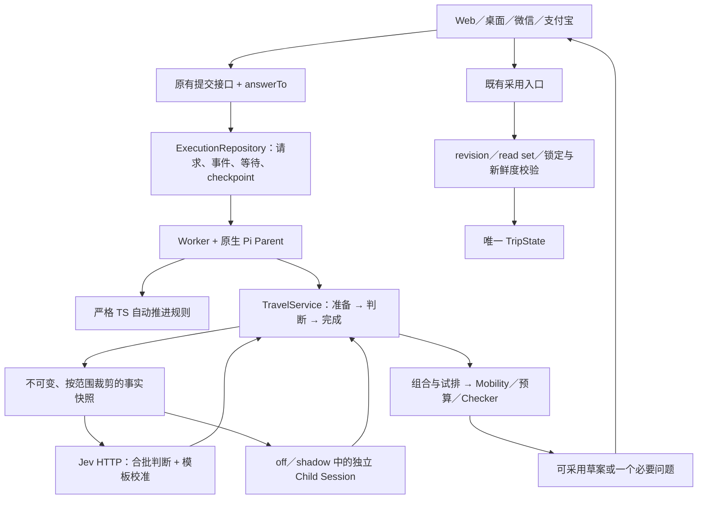

# 自动推进、Jev 与持久恢复：实现和验证记录

日期：2026-09-21。实施依据：[第二版设计](2026-09-20-jev-travel-decision-team-design.md)。

后续旅行者验收发现并修复了业务采用拦截、回答接续、多候选证据提交和 PostgreSQL 路线保持问题。本文保留本阶段证据，当前用户路径结果及尚未通过的内容／真实来源门槛见[验收修复报告](2026-09-21-traveler-acceptance-fixes.md)。

## 结论与交付边界

代码已接入现有工作台、原生 Pi Parent、TravelService、PostgreSQL execution repository 和 Worker。局部候选比较、完整规划、必要问题、回答后接续、试排与用户采用使用同一条业务链。默认 `TRAVEL_AGENT_JEV_MODE=off`；没有独立中文校准证据的模板，不能因为模型返回高置信度就自动修改草案。

真实 Jev API、真实 Parent/Child 模型、隔离 PostgreSQL 和浏览器路径已分别验证。**这些证据尚不足以宣布 500 用户商用容量验收通过**：真实旅行 Provider 的完整链路、生产模型账户容量、中文自动分支校准和平台真机仍未完成。下表和原始产物区分实现、真实调用和容量证据。

## 1. 用户现在能走通的路径

1. 明确按钮、已有确定性预算计算和有效比较缓存直接执行。Jev 不替代计算、权限或确认规则。
2. 对新偏好，取不可变事实快照，批量判断候选的证据支持度、匹配程度和请求范围。通过模板校准且确属软偏好时，可以调整未确认候选的比较顺序；硬条件或不确定意图交还 Parent。
3. 完整规划即使暂时只生成候选，也会接续读取规划上下文、组合行程和调用 `plan_itinerary_trial`。Mobility、预算及 Checker 保留最终核验权，最多一次修复。
4. 只有必要的用户专属事实或重要约束取舍才形成问题。卡片提供稳定选项、问题影响和可选的逐项影响；也接受自由输入。首次生成候选时不会把新问题藏在收起的助手中。
5. 回答包含 `answerTo`，服务端解析真实选项文字，保留原规划目标并自动接续。已有的明确采用操作仍使用原入口，不再要求口头重复确认。
6. 模型额度不足保持 `queued`，显示“当前方案已保留，稍后自动继续”，释放 Worker。等待用户用 `awaiting_input`。可试排后提供“查看这版行程”，用户进入现有采用入口。

不把未知天气、库存、设施或路线当作模型能够证明的事实；这些限制继续显示在业务结果中。

## 2. 架构与责任



| 模块 | 实际责任 |
| --- | --- |
| `host/travel-decision-policy.ts` | 五种推进结果、稳定问题合同、回答校验、候选稳定排序、锁定和点名上下文保护 |
| `host/travel-judgment.ts` | 不可变快照、证据引用、独立批次、语义判断、未知项、接入模式和版本化校准 |
| `host/jev-client.ts` | 固定 `jev-1.13.0` 和官方 HTTP 地址、响应合同、取消、超时、有限重试、调用记账 |
| `host/execution-scheduling.ts` | 用户公平调度，短交互与续算 2:1，空闲互借与等待提升 |
| `src/persistence/execution-repository.mjs` | 沿用现有队列；迁移、原子配额、租约、fence、续执行信息、答案消费幂等 |
| `src/agent/travel-execution-service.mjs` | 领取任务、释放等待任务、恢复、取消、当前依赖重验及跨端可见状态 |
| `src/agent/travel-conversation-agent.mjs` | Parent 工具闭环、必要问题、一次修复、原生自定义结果消息和交付去重 |
| `src/api/travel-service.mjs` | 真实 Provider 准备、研究结果归并、比较草案、试排及现有提交入口 |

新增核心规则使用严格 TypeScript。没有新增独立队列服务、第二份行程状态或允许 Child/Jev 提交业务变更的入口。

### 上下文与交接

- Parent 每次模型调用重新读取当前权威事实。Child 独立会话、受限工具和结构化交接保持不变；“共享上下文”是共享同一事实版本，不是共享可无限追加的聊天窗口。
- 去掉原生分析“每域只取两个候选”的截断。Jev 批次保留所有进入业务候选集的不同候选，携带共同约束、证据和未知项。
- Parent 有普通上下文数量预算；锁定、已选、用户点名和明确 UI 选择优先保留，其他候选兼顾领域覆盖。无法容纳受保护上下文时明确失败，不静默截断 JSON 或遗漏锁定项。
- 判断缓存由用户、Trip、实际批次依赖、模板、固定模型及校准版本隔离。某个候选变更只使读取它的批次失效。精确相同且仍新鲜的比较可以零新调用复用；全局约束变化会保守重算相关批次。
- 当前步骤缓存使用 60 秒上限；过期事实会重新读取。这不是长期偏好记忆，也不承诺跨任意不同请求共享语义结果。

### 持久等待和恢复

首次入队确定 4 分钟总期限，恢复不重置。`notBefore`、原因、版本化 continuation 和原生 checkpoint 位于原 execution repository。研究分成准备、判断、完成三个可重入阶段，继续调用公开业务方法。

延后工具先形成完整回执再保存 checkpoint。恢复使用原生 `travel-operation-result` / `travel-resume` 消息接续，只执行未完成且依赖仍有效的步骤。原始用户要求按队列顺序保存，答案消费、操作与交付均去重。取消后的迟到结果由租约/fence 和提交校验拒绝。

**恢复有明确边界：** 额度等待等已知检查点可以自动恢复；Worker 硬崩溃后，无法判断是否完成的业务写入维持 `interrupted` 保护。图片仍为请求内存数据，不进入 checkpoint；此类中断需重新附图。

## 3. 配额和配置

Jev 固定正常 1,080 RPM、重试至多 60 RPM，保留 60 RPM 余量；所有调用合计任意连续 60 秒不超过 1,200。每批最多重试一次，并遵守账户级冷却。PostgreSQL 原子预留使用数据库时间；同时检查输入 TPS、12,000 UTF-8 字节的请求预算、最多 32 个在途请求、每个 Trip 最多一个 Jev 请求在途及 run 总预算。

这些是本部署共享数据库所管理的账户调用限制；复用同一账号的其他应用也必须纳入同一个预算，否则不能声称控制了整个账号。固定上限依据[官方模型文档](https://docs.typesafe.ai/models)，服务商仍可能动态降低额度；真实 `429` 继续进入持久等待。

- `off`：原 Parent/Child 路径。
- `shadow`：Jev 结果记账和留存，不影响候选顺序，也不进入 Parent 判断摘要；原路径负责结果。
- `auto`：Jev 进入判断链，但未经校准或属于开放规划时仍由 Parent 接手。自动比较不等于自动确认。

服务端配置和校准文件格式见 [09 部署指南](../current/09-account-configuration-guide.md)。密钥只在服务端或授权测试进程读取。本轮沿用用户授权的 TypeSafe 账号，没有将密钥复制进项目或 Wiki。

## 4. 可复现验证结果

### 行为与工程回归

聚焦回归已覆盖：中文否定、必要问题与原目标接续、未知事实、未校准高置信度、锁定/点名保留、陈旧答案、重复点击、跨用户拒绝、跨端条件更新、取消、配额延后、Worker 恢复、已完成步骤复用和未知写入保护。

修复前的受控压力测试曾复现候选 ID 内数字被误判为银行卡号；已改为匹配完整数字 token，正常卡号仍拦截。原生工具摘要也已取消字符串硬截断，防止候选 ID 被截断或 JSON 无法解析。前两轮测试模型还存在恢复后重复工具调用的夹具错误，修正和失败产物均保留，没有把夹具成功算作真实模型成功。

最终 `npm run check` 在启用隔离 PostgreSQL 执行测试的环境中通过，包括严格 TypeScript、桌面 TypeScript、`npm test`、Web 构建与两个小程序合同检查。共 341 项测试，337 通过、0 失败、4 跳过；跳过的是需要独立数据库开关的既有账号／日志测试，不是本次 execution 恢复测试。实际杀死 Worker 后，原生 Pi 在 30,262 ms 内接续，同一用户消息和 Trip 均只持久化一次。见[机器可读汇总与源码哈希](assets/2026-09-20-jev-iteration/final-verification.json)和[完整命令输出](assets/2026-09-20-jev-iteration/final-check.log)。未执行小程序真机验证。

### 浏览器产品路径

真实本地 Web、原生 Pi、HTTP 和 PostgreSQL，旅行资料及模型回复使用明确测试夹具；[逐项观察记录](assets/2026-09-20-jev-iteration/browser-product-path.json)：

- 桌面：输入“上海一天预算6000，做完整行程，日期还没定” → 生成候选并直接显示日期问题 → 点击日期 → 自动核验试排 → 原有“确认加入行程” → 页面显示“4 个安排已确认”。
- 手机 390 × 844：问题、影响、选项和自由输入可见；刷新后恢复同一必要问题。回答后自动生成草案，“查看这版行程”直接进入四项选择的核验与采用页。修复了旧移动样式隐藏关闭按钮及助手试排数量显示为 1 的问题。
- 夹具没有地图坐标，页面如实显示“地图待补”，没有用假底图或坐标生成演示成功。

### 真实 Jev 中文样本

[原始结果](assets/2026-09-20-jev-iteration/chinese-live-evaluation.json)：冻结的 16 个中文场景，范围分类 16/16；10 个带人工预期支持度的场景中 9/10 一致。`low_spoiler` 场景返回 `unknown`，未正确识别已有支持证据。部分回答置信度很低。

这只证明真实接口和这些样本上的表现，**不足以开放自动推进**。未修改测试标签来迎合模型，也未据此生成生产校准文件。

### 三种真实模型接入模式

[原始对照](assets/2026-09-20-jev-iteration/live-product-modes.json)：同一个事先定义要求的旅行场景；Parent/Child/Jev 为真实模型，旅行资料和路线为受控夹具。

| 接入模式 | 首个候选结果 | 本轮用时 | 最终状态 | 模型调用 | 必要问题 |
| --- | ---: | ---: | --- | --- | ---: |
| off | 63.4 秒 | 90.0 秒 | trial_ready / completed | Parent 4、Child 6 | 0 |
| shadow | 52.8 秒 | 117.6 秒 | trial_ready / awaiting_input | Parent 8、Child 6、Jev 2 | 1 |
| auto（未开放校准自动分支） | 12.1 秒 | 33.0 秒 | trial_ready / completed | Parent 5、Jev 2 | 0 |

三组均保留目的地和预算、引用已有节点、没有替用户确认。shadow 询问“当天回杭州还是住一晚”，暴露了输入中的住宿歧义；不单凭少一次提问或更快就认定更优。只执行单场景、各一次、顺序运行，**不是多次随机 A/B，也不是独立旅行质量验收**。产物记录输入/输出 tokens，实际账户账单和总金额尚未核对。

这份接入模式对照不能替代计划中的“原 Parent/Child、Jev 仅判断、Jev 判断加自动推进”严格三组评估：shadow 不使用判断结果，auto 本轮又没有开放校准自动分支。后者仍需独立核对场景、真实旅行资料及通过中文校准的模板，当前标为未验证。

### 两类 500 用户容量

在线与跨端订阅：[首次优化后结果](assets/2026-09-20-jev-iteration/controlled-500-online-after.json)完成 500 个请求、500 份持久化 Trip，观察到 1,000 条 SSE 和 500 个原生 Parent 在途。接入 P95 2.629 秒、P99 3.272 秒，**未达到该脚本既定 2/3 秒目标**。

[最终断线重连验收](assets/2026-09-20-jev-iteration/controlled-500-online-reconnect.json)单独运行：500 用户、1,000 条 SSE、500 个原生 Parent 同时在途；500 个用户均从一个 API 断线后切换至另一个 API，并按持久事件游标恢复，没有重放已消费事件或重复用户消息；最终 500 个 run 完成、500 份 Trip 持久化。接入 P95 3.491 秒、P99 3.918 秒，**容量达到，但接入时延目标仍失败**，脚本据此返回非零状态，未调整阈值冒充通过。真实模型回复被受控门闩替代，所以不是外部模型并发证明。

复杂规划：[30 分钟持续结果](assets/2026-09-20-jev-iteration/controlled-500-planning-30min-r3.json)使用两 API、两 Worker、真实 PostgreSQL 和原生 Pi；每轮同时提交 500 个冷请求，25 个主动取消。包含跨 API 取消和条件更新。共运行 30 分 18 秒、14 轮、7,000 个请求；6,650 个未要求取消的请求全部形成可核验草案。350 次取消请求中 349 个取消成功，1 个在取消前已完成。没有未取消请求失败。

完成时间 P50 76.0 秒、P95 146.0 秒、P99 183.2 秒，首次调度等待 P95 89.4 秒；共记录 13,730 次 Jev 受控请求，滚动一分钟峰值 851 次，没有超过固定上限。这也暴露了拥塞等待，不能把“最终完成”表述为所有用户即时得到答案。

Parent fixture 上限为 64 并发、10,000 RPM、100,000,000 TPM，**该配置不是生产账号已经具备的权益**。持续测试启动时的源码哈希保存在产物中；期间增加的点名/锁定上下文保护、按批次缓存和回答纠正处理由最终代码的独立回归及单轮 500 请求验证，不能宣称这些修改也完整运行了 30 分钟。早期失败产物保留在同一目录。

[最终代码单轮复验](assets/2026-09-20-jev-iteration/controlled-500-planning-final.json)：500 请求，475 个可核验草案、25 个取消、无失败；完成 P95 82.3 秒，首次调度等待 P95 10.3 秒，Jev 滚动一分钟峰值 802。此次单独运行，不能用较快结果替代持续负载结果。

## 5. 复现入口

Node 必须 `>=22.19.0`。依赖沿用 lockfile，没有新增第三方 SDK。

```bash
node --import tsx --test tests/travel-decision-policy.test.mjs tests/travel-jev.test.mjs tests/travel-execution.test.mjs
npm test
npm run typecheck
npm run check
npm run miniapp:weapp
npm run miniapp:alipay
```

真实 Jev：在测试进程设置 `TRAVEL_JEV_LIVE_EVAL=true`、`TRAVEL_JEV_TEST_ENV_FILE`（授权私有文件）和 `TRAVEL_JEV_EVAL_OUTPUT`，运行 `npm run evaluate:jev`。产品三模式对照设置 `TRAVEL_JEV_PRODUCT_EVAL=true`、同一个测试密钥入口、`TRAVEL_JEV_PRODUCT_OUTPUT` 和隔离数据库，再运行 `npm run evaluate:jev-product`。

容量脚本只允许本机独立 `/travel_execution_test` 数据库；`TRAVEL_EXECUTION_TEST_DATABASE_URL` 通过环境注入。每次使用随机 schema 并在结束后删除，禁止指向业务数据库。

```bash
TRAVEL_EXECUTION_TEST_USERS=500 TRAVEL_EXECUTION_TEST_OUTPUT=/tmp/online-500.json npm run smoke:execution-capacity
TRAVEL_EXECUTION_TEST_USERS=500 TRAVEL_EXECUTION_TEST_DURATION_MS=1800000 TRAVEL_EXECUTION_TEST_OUTPUT=/tmp/planning-500.json npm run smoke:jev-capacity
```

复杂规划原始产物保留 `testedAt`、证据范围和运行时源码哈希。测试日期使用 UTC；文档日期使用香港时区。商用验收不能只取一次最优结果，应在目标部署、真实账户限额和真实 Provider 下重复这两条负载。

验收过程中曾同时运行两套独立多进程压测，超过本地 PostgreSQL 默认 100 连接，导致一次浏览器刷新失败和重连预检未达并发目标；连接释放后，同一问题恢复正常。全套并行测试还出现过夹具启动超时。后续数据库验收改为单独运行，既不扩大服务端限额掩盖，也不将这些失败计为通过。生产必须按所有 API/Worker 进程的连接池上限求和，预留迁移、健康检查和运维连接。

## 6. 尚未通过的商用门槛

1. **中文自动推进校准：** 需要独立标注集、错误类型和高置信错误分析，确定模板阈值及自动覆盖率；当前保持自动分支关闭。
2. **真实旅行链路：** 本轮缺少项目 AMap 服务端凭据，受控路线不能替代真实查询、营业时间、天气、库存与用户采用后的验证。
3. **真实 500 容量和等待体验：** 受控在线测试已达到并发数，但接入时延 P95/P99 仍未达到目标；需要在目标部署优化并复验。还需要生产 Parent/Child/Provider 配额、机器规格、连接池与真实时延下的完成比例及分位数。现有 4 分钟 run 期限不因限流重置；实际限额无法在期限内服务 500 个复杂请求时，不能承诺这些请求都完成。
4. **真实账户费用与产品服务条款：** 有调用账本和 token 数据，尚未核对最终账单、商用服务协议、SLA。第三方审计见[登记](third-party-candidate-audits.md)及 [JSON](assets/2026-09-20-jev-iteration/jev-third-party-audit.json)。
5. **平台上线：** 微信/支付宝真机、生产 OAuth、桌面签名及正式 PostgreSQL 部署验收继续独立进行。本轮未发布或部署。

现行规范已同步：01、02、03、04、06、08、09、12，以及 Wiki 首页、研究依据、Agent/Skill 约定和环境配置示例。文档中的“已实现”不替代以上尚未通过项。
