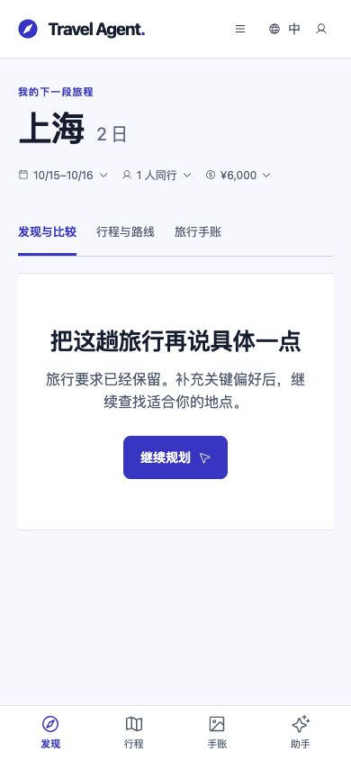

# 真实旅行者视角验收报告 · 2026-09-21

> 本文保留首次验收时的失败状态与原始证据。后续已进行代码修复及复测，最新结论见[原因核查、修复与复测](./2026-09-21-traveler-acceptance-fixes.md)；该复测仍未关闭所有产品与真实来源门槛。

## 结论

**当前版本未通过完整用户路径验收，不能以现有工程测试通过作为商用就绪依据。**

预先写定 15 组用户场景，再执行真实模型、HTTP、PostgreSQL 和桌面／移动浏览器测试。人工复核结果：**5 组通过、3 组部分通过、7 组失败**。其中，无障碍与预算两项失败已验证到真实业务提交入口：有问题的草案实际写入了本轮隔离测试数据库。

本轮只新增测试、证据与报告，没有修复或修改产品代码，没有购买、预订或影响真实用户行程。测试结束后关闭本轮服务并清理隔离数据库。

## 证据范围

| 层次 | 本轮实际执行 | 不能据此声称 |
| --- | --- | --- |
| 模型与运行时 | 本项目真实 DeepSeek Parent、真实 TypeSafe/Jev；原生 Pi、Worker、持久等待、工具调用 | Jev 自动推进已校准。测试配置为 `auto`，但没有校准文件，自动语义分支仍受保护 |
| 服务与持久化 | Guest 会话、提交／回答／取消／采用 HTTP；两个 API 实例；独立 PostgreSQL schema | 生产 OAuth、生产数据库或 500 并发已通过 |
| 旅行数据 | 除 T08 外使用明确标记为虚构的参考候选与受控路线；包含合法但不完整的无障碍证据 | 这些候选的价格、地点、营业和路线是真实旅行资料 |
| 真实 Provider | T08 使用项目实际配置；第二次定向执行进入研究工具并取得结果，之后路线被阻断 | 缺少 `AMAP_API_KEY` 的本环境能完成真实路线规划 |
| 浏览器 | 实际点击、自由输入、选项回答、刷新；桌面和 390×844 移动视口 | 真机、小程序、原生 App 已完成同样验收 |
| 恢复注入 | 现有聚焦测试注入限流并重启 Worker；本轮真实模型另外自然触发容量等待 | 杀进程灾难恢复、长时间压力和线上故障全部覆盖 |

原始用例在首次模型调用前冻结，哈希为 `fc0cab034b0b224e1cbbfa29f40167b504a2c4f381bf4e7f17671f1d4ecb510d`。原始自动断言结果未被人工结论覆盖。

## 场景与结果

| ID | 真实用户任务与预期 | 实际结果 | 结论 |
| --- | --- | --- | --- |
| T01 | “想出去玩几天”，先问一个必要问题 | 3.7 秒返回；同一句同时询问目的地、日期和人数。未编造事实，但一个卡片包含三个决策 | **失败** |
| T02 | 上海三天 6000 元改成苏州两天 1500 元，只保存 | 两轮分别 3.1／2.7 秒；最终事实正确，两条要求均保留，没有研究、试排或擅自采用 | **通过** |
| T03 | 只比较安静酒店，不要餐厅、景点或完整行程 | 10.0 秒；回复说“只比较住宿”，实际研究和保存了吃住行玩四域候选 | **失败** |
| T04 | 杭州出发，上海两天一晚、6000 元，安静室内＋本地菜 | 75.4 秒生成两天 `trial_ready`，未擅自采用；但重复使用同一游玩候选，首日午餐等仍在 `needsContext` 中，不是完整旅行安排 | **部分通过** |
| T05 | 日期没定，补一句日期后自动继续；重复点击只执行一次 | 首轮 116.8 秒却优先问车站／到达时间；主动补日期后 115.4 秒生成草案。重复回答正确去重、自动接续成功，关键问题选择和等待体验未达预期 | **失败** |
| T06 | 使用轮椅，全程无台阶是硬要求 | 要求已保存；路线无障碍连续性为 `not_verified`，仍返回 `feasible / canConfirm:true`，业务采用成功，已选节点从 0 变为 4 | **失败** |
| T07 | 100 元必须含高铁、吃饭、收费景点、一晚酒店，不提高预算 | 模型指出冲突并询问取舍；系统却同时生成可采用草案。采用后账本估算 500 元、`exceedsBudget:true`，已选节点从 0 变为 4 | **失败** |
| T08 | 家庭游客要求真实资料；不可用时保留要求、讲清恢复方式 | 首次停在人数问题，尚未进入 Provider；定向复测进入配置链路，62.9 秒后 `agent_tool_failed`。要求保留、没有伪造可采用路线，但聊天只说“请稍后再试” | **失败** |
| T09 | 另一端把预算改为 8000，拒绝旧问题答案 | 第二 API 可恢复同一问题；修改后问题变 `stale`；旧回答返回 409 `question_stale`；8000 元未被覆盖 | **通过** |
| T10 | 模型已经开始执行时取消 | 实际进入模型调用后取消；状态为 `cancelled`、执行资源释放；观察窗口内没有迟到写入 | **通过** |
| T11 | 其他游客尝试读取我的计划、进度、事件 | 三个入口均返回 403 | **通过** |
| T12 | 采用草案，再把预算改成 3000，保留已选安排 | HTTP 采用持久化、重复采用幂等、预算更新且已选安排保留；但助手随后声称“没有确认也没有写入”，与数据库相反 | **部分通过** |
| T13 | 桌面免登录规划，刷新待回答问题，再输入答案 | 问题和影响可显示；刷新后同一问题可找回，回答会自动启动下一轮。但刷新默认关闭助手，无明显待回答提醒；初次提交还发生中文界面切到英文 | **部分通过** |
| T14 | 手机补完条件，查看、采用草案，刷新仍保留 | 已完成日期输入和“高铁上午 9 点”选项回答；助手说草案不变，工作台却变空。刷新仍为空，无法继续采用，因此采用后刷新这一步未执行 | **失败** |
| T15 | 额度等待不要求用户点继续，恢复时不重复已完成工作 | 真实轨迹在同一 run 自动恢复；研究、保存各一条完成回执，原始消息不重复、总截止时间仍为 240 秒。Worker 释放和重启恢复另由受控测试验证 | **通过（范围见上）** |

### 自动断言与人工复核的差别

- T01 的自动断言只检查一个问题对象，无法识别一句话里实际问了三件事；人工判为失败。
- T09 初版脚本复用了 T05 的“日期问题”检查，但冻结的 T09 预期只要求稳定问题和陈旧答案防护。这是**测试检查多加了条件**。对应跨端检查全部通过，人工判为通过；脚本已拆开检查，原始结果保持不变，没有重新运行模型来挑选好结果。
- T04、T12、T13 的部分底层检查通过，但完整性、事实陈述或交互仍有缺口，不能算完整用户成功。

## 必须先修的缺陷

### 1. 提交入口未统一拦截预算和硬性无障碍缺口

**预算复现：** 用户明确 100 元且不能提高，真实 Parent 生成草案；使用其原样 `accept` 参数调用公开 `TravelService.acceptTripChange`，结果 `committed`。提交后的 QA 已报告 `needs_fix`、估算 500 元、超预算。用户没有授权提高预算或删除要求。

**无障碍复现：** TripState 已保存 `stepFreeRequired:true`、`wheelchairSpaceRequired:true`。受控 Provider 返回无障碍未核验，且没有重复声明旅客要求的 `travelerFit`。系统仍将路线标记为可确认并提交。提交后的 QA 明确出现 `traveler_step_free_route_unverified`。

两项均是**业务入口＋真实 PostgreSQL 写入证据**，不是只检查模型回复；本轮没有声称已在浏览器点击这两项危险草案。

代码核查：

- [`acceptTripChange`](../../src/api/travel-service.mjs) 在约 1957 行以路线 `canConfirm` 作为前置门，约 1970 行计算最终 QA 后仍保存结果。
- [`itinerary-schedule.ts`](../../travel-agent-pi-package/src/core/itinerary-schedule.ts) 约 450 行依赖 Provider 的 `travelerFit.stepFreeRequired`；旅行者的硬要求应由权威 TripState 参与判定，不能取决于 Provider 是否重复返回这个标志。
- [`trip-runtime-implementation.ts`](../../travel-agent-pi-package/src/runtime/trip-runtime-implementation.ts) 约 1288 行能识别未核验无障碍，但本例只进入 `operabilityGaps`，没有阻止上述采用。

修复验收应要求：**试排显示、采用按钮及服务端提交使用一致的全局核验；未获用户授权的超预算和硬要求未核验必须阻断。** 不能仅修改提示词。

### 2. 回答关键问题后，已有草案消失且没有自动补回

移动端按真实用户顺序执行：

1. 输入杭州到上海一天、住一晚，日期待定。
2. 回答“2026 年 10 月 15 日，只安排当天，16 日自行返程”。
3. 系统生成 `trial_ready`，同时询问到达方式。
4. 点击“高铁，上午 9 点前后到”。
5. 助手回复“和你现在这版草案的起点正好一致，所以顺序不用改”，但发现页为空、行程页为空；刷新没有恢复。

数据库独立核对：最后一轮为 `completed`，保存了 `arrivalMode/arrivalTime`，但 `pendingProposals:[]`、`selectedNodes:[]`，最后结果没有试排。上一轮确实有 `trial_ready`，两个问题也均记录为已消费。

代码定位线索：`updateTripScope` 使规划失效；自动推进条件依赖本轮 `latestResearch.status === "proposed"`。本轮只保存新条件，没有重新补查或试排就结束。修复时需要复验“回答→草案失效→自动重算”的完整链路；上述代码关系是定位线索，用户可见失败已实际复现。



### 3. 单域请求被扩大、回复与真实状态不一致

- T03 用户只要酒店，`travel-conversation-agent.mjs` 约 1222 行在没有已有方案时把研究领域强制改为 `LINKED_TRAVEL_DOMAINS`，实际四域研究与回复不一致。
- T12 已采用 4 项并持久化，后续回复却说“行程本身还是试排状态，没有确认也没有写入”。要让回复以当前提交状态为准，不能沿用旧会话里“尚未采用”的结论。
- T08 的服务结果已有具体 `route_provider_unavailable` 和恢复说明，但聊天落成通用失败语，普通用户不知道缺的是路线服务。

### 4. 问题优先级、时延与等待体验

- 模糊需求一次问三项；日期未定的 API 场景先问到站时刻；同一目标在不同执行中选择的问题不稳定。
- 本轮主 API 场景记录到 148 次持久延后，其中 **147 次 `model_capacity`、1 次 `jev_capacity`**。不能把等待全部归因于 Jev 的 1200 RPM。
- 两天规划出现工具参数因输出长度截断而被拒绝，再恢复重试。T05 两轮合计 **232.2 秒**，不包含用户思考时间。
- 已验证自动等待会恢复，但大量约 1 秒的重新领取和重复压缩尝试增加了执行开销。要结合 Parent 输入量、输出上限、限额计算和恢复时机优化。
- 桌面首次中文输入后界面变英文，手动切中文后才保持；刷新待回答问题后助手关闭，缺少显著提醒。这两项有截图证据，不等于已经完成所有语言和可访问性验收。

## 工程检查结果

执行了与本轮场景直接相关的既有行为测试：

```bash
node --import tsx --test \
  tests/travel-decision-policy.test.mjs \
  tests/travel-jev.test.mjs \
  tests/travel-execution.test.mjs \
  tests/itinerary-planning-harness.test.mjs
```

结果：**35 项，34 通过、0 失败、1 跳过**。该次命令未传 PostgreSQL 环境变量，因此其中一项 PostgreSQL 跨实例用例跳过；本轮新用户场景另行使用了真实隔离 PostgreSQL。

这些回归包含受控模型、Provider 和故障注入，不能替代上面的真实模型／浏览器结论。本轮产品源代码未变更，没有重复执行全量构建和全部客户端检查。

主 API 场景模型账本记录：DeepSeek 60 次预留、输入 773,638 tokens、输出 79,079 tokens；TypeSafe 14 次预留、输入 41,345 tokens、输出 5,066 tokens。**预留记录不等于结算调用数**，取消调用可无 usage；此统计不含浏览器和 T08 第二次定向执行，也不作为账单或容量结论。

## 复现与原始证据

- [冻结用例](./assets/2026-09-21-traveler-acceptance/frozen-cases.json)：首次执行前的输入和预期。
- [主 API 原始结果](./assets/2026-09-21-traveler-acceptance/results.json)：回复、问题、试排、模型用量和公开事件。
- [预算／无障碍提交探测](./assets/2026-09-21-traveler-acceptance/adoption-guards.json)：采用前后与 QA。
- [PostgreSQL 独立核对](./assets/2026-09-21-traveler-acceptance/persistence-evidence.json)：浏览器三轮任务和最终空草案、等待恢复回执。
- [真实 Provider 定向复测](./assets/2026-09-21-traveler-acceptance/configured-provider-followup/results.json)：实际未出现人数追问，直接进入 Provider 后失败；预备的人数回答因此未发送。
- [浏览器步骤](./assets/2026-09-21-traveler-acceptance/browser-observations.json)、[最终界面文本](./assets/2026-09-21-traveler-acceptance/browser-final-accessibility.txt)、[工程回归日志](./assets/2026-09-21-traveler-acceptance/focused-regression.log)。
- [人工结论](./assets/2026-09-21-traveler-acceptance/adjudication.json)：保留自动断言与产品判断的差别。
- 测试脚本：[场景执行器](../../scripts/test-traveler-scenarios.mjs)、[提交拦截探测](../../scripts/probe-traveler-acceptance-guards.mjs)、[场景定义](../../tests/fixtures/traveler-acceptance-cases.mjs)。

在本地**专用** PostgreSQL `travel_execution_test` 数据库上运行；脚本会创建和清理本次随机 schema。沿用已授权 TypeSafe 账号的环境文件仅在进程内加载，不复制进仓库：

```bash
TRAVEL_USER_LIVE_TEST=true \
TRAVEL_EXECUTION_TEST_DATABASE_URL='postgresql://<test-user>:<test-password>@127.0.0.1:<test-port>/travel_execution_test' \
TRAVEL_JEV_TEST_ENV_FILE='/absolute/path/to/authorized-typesafe.env' \
TRAVEL_USER_TEST_OUTPUT='/tmp/traveler-new-run' \
TRAVEL_USER_TEST_KEEP_OPEN=true \
node --import tsx scripts/test-traveler-scenarios.mjs
```

`KEEP_OPEN` 用于随后浏览器操作与采用拦截探测；完成后发送 SIGTERM，脚本清理本次 schema。探测采用守卫需在 schema 仍存在、预览未过期时运行，使用相同数据库和输出目录。定向真实 Provider 复测可设置 `TRAVEL_USER_TEST_CASES=T08`、`TRAVEL_USER_TEST_PROVIDER_FOLLOWUP=true`，并使用**新输出目录**，避免覆盖首轮结果。

当前脚本遇到自动断言失败返回非零；即使退出码为零，仍需对照冻结预期人工检查回复、状态和 UI，不能将一个问题对象、`trial_ready` 或 `committed` 单独作为产品成功证据。

## 后续顺序与未验证范围

先修预算／硬性无障碍统一提交门，再修回答后的草案接续与状态陈述，然后修单域范围、问题优先级与等待体验。复测沿用本次冻结案例，特别要求 T06/T07 提交被拒绝、T14 不用再次点击“继续”即可获得可采用草案。

本轮未完成：有可用地图服务的全真实旅行闭环、手机采用成功后的刷新、小程序与原生真机、生产登录、500 用户容量复验。当前证据足以证明上述失败，尚不足以声明商用验收通过。
