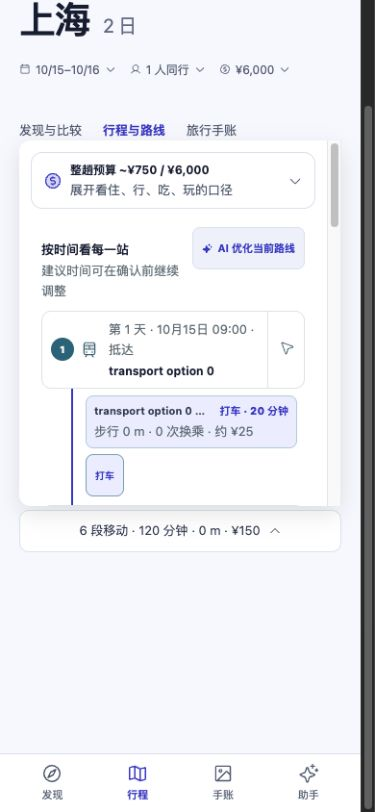

# 旅行者验收：原因核查、修复与复测 · 2026-09-21

> 后续纠正：用户指出本轮存在强制早停、固定回复掩盖业务未完成的问题。以下记录保留为历史证据，不能作为当前完整验收结论。控制链、失败草案、全程覆盖、上下文交接和追加要求后的状态返工，见[最新业务返工报告](./2026-09-21-traveler-business-rework.md)。

## 结论

**预算／硬性无障碍错误采用、回答后草案消失、单域请求扩大、采用状态误报等阻断性缺陷已修复并复验。完整产品验收仍未全部通过。**

本轮完成代码修复、真实 Parent/Jev 与 HTTP/PostgreSQL 复测、桌面和手机视口实际操作，并同步现行 Wiki。没有修改冻结用例去降低验收标准，没有部署或替真实用户预订。

仍未关闭：

1. **完整规划的内容质量。** 两天规划仍可能留下第二天的活动空缺、把可自行决定的候选选择写成待补充项。现已如实标记条件性草案，但这不等于稳定完成用户期待的两天完整安排。
2. **真实旅行路线。** 本轮环境没有 `AMAP_API_KEY`，受控路线只证明控制链、核验与持久化。真实可行路线、无障碍设施、房态和价格仍需相应真实接口证据。
3. 本轮没有重跑 500 用户与 500 复杂规划的持续容量验收，也没有新增真机／生产 OAuth 验收。工程回归成功不能关闭这些门槛。

原始失败报告和证据保留在[首次验收报告](./2026-09-21-real-traveler-acceptance-report.md)。本报告是后续修复结果，不覆盖历史失败。

## 为什么原来工程测试通过，用户验收却失败

旧测试主要检查工具合同、运行状态、候选数量和路线可行性，没有检查完整用户结果：是否真的按预算阻断写入、已确认状态与回复是否一致、数据库往返是否保留路线、用户回答后是否真的继续完成草案。简化候选还没有携带完整证据图，漏掉组合提交中的证据引用错误。

本轮先复现关键失败，再补业务结果断言，检查实际保存状态。另加了完整证据的“研究→组合→采用”回归、PostgreSQL JSONB 往返检查，浏览器验证到采用后的刷新与完整行程入口。

| 问题 | 核查到的原因 | 修复位置与行为 |
| --- | --- | --- |
| 100 元预算、500 元以上草案仍能采用 | 采用入口把路线 `canConfirm` 当作全局可行；最终 QA 报超预算仍保存 | `trip-feasibility.ts` 合并预算、硬要求与路线；TravelService 在预览、试排、提交前及实际变更结果上检查，拒绝时不写入 |
| 全程无台阶未知却能采用 | 依赖 Provider 重复声明旅客要求；TripState 中硬要求的未知证据只记为一般资料缺口 | 从权威旅客状态判定硬要求；连续无台阶未知直接阻断；可调整时间的冲突不能把它降成可修复问题 |
| 回答后草案消失 | 条件变化使旧草案失效，接续只在本轮刚做研究时触发；仅保存答案就结束 | 持久原目标和工具回执；回答后从当前事实补查、重排，不依赖本轮必须已调用研究 |
| 只查酒店变成四域研究 | 首次研究时硬编码扩成四域 | 尊重工具调用中与用户目标对应的 `domains`；完整规划继续联动，局部比较保持局部 |
| 已采用又说没有确认 | Parent 事实摘要缺少已采用节点；预算回复使用一段固定否认确认的文案 | 当前摘要携带已采用节点和锁；预算回执按当前选择数量说明保留状态 |
| 预算调整后路线与餐次消失 | 对同行人用 `JSON.stringify` 比较；JSONB 重排键顺序被误判为人员条件改变 | Runtime 用深度值比较；真实 PostgreSQL 验证仅改预算保留站序、路线、餐次与估算 |
| 不能同时采用多家餐厅／多处景点 | 完整行程复用了单域一个候选的比较字典；新候选的规划提案未包含实际新增操作 | 完整行程按其全部 nodeId 建立一个组合提案；只在用户采用时统一提交 |
| 组合草案能生成但按钮采用失败 | 组合只选部分候选，却携带未选候选的 claims，触发 `claim_decision_node_not_found` | 提案只携带所选节点及其来源、实体和声明；保留原提案未选替代项 |
| 一家餐厅吃两顿被当成重复／费用重复乘天数 | 地点 ID 被当成到访 ID；每家餐厅都按整趟天数估计 | 每次到访独立 stopId；预算按实际排入的餐次／体验计价，加入市内交通估算；不同到访的交通偏好分别匹配 |
| 完整规划漏餐 | 核验没有覆盖用餐机会 | 对跨过午／晚餐时段的完整行程增加检查，允许一次局部修复；未核验内容不冒充完整 |
| 一次问多个问题、先问非关键事实 | 单问题只限制卡片数量，未对缺失事实设优先级 | 根据已有结构化事实优先补目的地、日期、明确人数；未知家庭人数不会丢弃已知目的地和预算 |
| 等待过长 | 完成调用未及时释放未使用的 token 预留；限流反复约 1 秒领取；较小上下文和输出上限导致压缩／截断 | 已知 usage 按实际量核算；持久等到配额窗口释放；结果不明仍保留预留；有界调整 Pi 输入／输出上限，不提高账号配额 |
| 刷新问题不展开、语言变化、完整行程跳错页 | 问题恢复与新问题展开不同；Guest 分支语言上下文不同；完整行程按钮指向候选页 | 问题恢复可见；共享语言上下文；完整行程打开已采用路线与站序；条件性草案摘要显示剩余未知项 |

## 复测结果与边界

冻结输入哈希保持为 `fc0cab034b0b224e1cbbfa29f40167b504a2c4f381bf4e7f17671f1d4ecb510d`。模型有随机性，修复按发现推进，保留了各轮失败和部分结果；下表不是同一个模型快照上的成功率统计。

| 场景 | 当前验证结果 | 证据 |
| --- | --- | --- |
| T01 模糊愿望 | 单独询问目的地，不再同句问目的地、日期、人数 | `live-round-1/results.json`，4.7 秒 |
| T02 中文纠正 | 苏州、两天、1500 元正确保存，未研究或擅自采用 | `live-round-1` |
| T03 只比较酒店 | 实际研究和候选仅 `stay`，没有完整试排 | `live-round-1`，9.8 秒 |
| T04 两天完整规划 | **部分通过**：午晚餐检查与多候选机制可用；真实模型的最后一次仍留第二天活动及返程时间缺口，回复与界面按条件性草案处理 | `live-final/results.json`，31.0 秒生成条件性草案；不能作为完整规划时间 |
| T05 缺日期→回答→自动续算 | 日期优先；另一实例恢复同一问题，重复点击同一任务；回答一次后形成草案 | `live-budget-final`，8.9 秒提问＋30.2 秒续算＝39.1 秒，不含用户思考 |
| T06 硬性无障碍未知 | 真实模型明确阻断，未追问无效的到达偏好；强行调用采用也不能写入 | `live-budget-final`、`live-round-3/adoption-guards.json` |
| T07 100 元预算冲突 | 预算保持 100；不能得到可采用草案；直接采用拒绝，状态不变 | `live-round-3` 及 `adoption-guards.json` |
| T08 真实 Provider 不可用 | 保存已有要求；补人数后明确说明路线资料不可用，保留候选与恢复方向 | `live-round-1`；**真实路线闭环未验证** |
| T09 跨端旧答案 | 原问题失效；陈旧回答被拒绝，新预算不被覆盖 | `live-round-1` |
| T10 取消 | 活跃规划取消后终态正确，迟到结果不新增行程变更 | `live-round-1` |
| T11 用户隔离 | 其他游客读取计划、运行与事件均被拒绝 | `live-final` |
| T12 采用后只改预算 | 6 项已采用保留，路线／站序完全相同；预算从 6000 改为 3000，已排估算保持 775；回复确认采用状态 | `live-budget-final`，真实 HTTP／PostgreSQL／Parent |
| T13 刷新恢复问题 | 页面刷新后问题、影响与输入可见；中文选择保持；回答自动接续 | 浏览器截图与 `browser-persistence.json`；语言验证含显式中文设置 |
| T14 手机采用与刷新 | 实际点击成功，6 个节点、6 条证据声明、6 段路线入库；刷新后仍在，完整行程入口打开站序 | `browser-persistence.json`、手机／桌面最终截图 |
| T15 持久恢复 | 限额等待及取消回归通过；真实 Worker 进程被结束后约 30.3 秒恢复，只保留一次用户消息及旅行 | `all-final-check.log`，受控依赖的恢复检查 |

### 直接写入拦截

[采用拦截探测](./assets/2026-09-21-traveler-acceptance-fixes/live-round-3/adoption-guards.json)对 T06/T07 调用同一个公开 `TravelService.acceptTripChange`，并比较实际 PostgreSQL 状态：

- 两项均为 `blocked_by_business_guard`；采用返回 `rejected`。
- 已选节点均为 **0→0**；`stateUnchanged:true`。
- 没有通过改预算、删硬要求或伪造无障碍证据使测试变绿。

### 浏览器闭环

手机视口输入“杭州到上海一天、住一晚、日期未定、不要确认” → 刷新仍有日期问题 → 回答 10 月 15 日 → 自动生成草案 → 查看 → 点击采用 → 刷新 → 查看已确认完整行程。

中途确实发现组合证据提交失败，随后补回归并修复。最终数据库含 6 个已选节点，含两家餐厅及两处游玩候选；可查看完整站序。纯 UI 观察以外另核对数据库，未用脚本代替最后的浏览器采用动作。



候选名称和路线为受控数据，页面明确显示缺坐标，截图不能证明真实地图／导航可用。测试期间重建静态资源曾使已打开旧页面的动态模块失效，构建完成后刷新复验通过；没有把该次空页面当成通过。

### 时延

- 原 T05 两轮约 **232.2 秒**；修复后最后一次 **39.1 秒**，此前修复轮次为 26.6～48.6 秒。
- T04 最后一次 31.0 秒是**条件性草案**，不与旧“完整规划”时长直接比较，也不声称达成完整规划时延指标。
- 这些是小样本开发环境观测，不是 p95／p99、生产 SLA 或 500 并发结果。没有增加 Jev 官方 1,200 RPM 上限。

## 工程验证

在 Node **26.7.0**、本轮专用 PostgreSQL 上执行：

```bash
TRAVEL_EXECUTION_TEST_DATABASE_URL='<本地专用 travel_execution_test 数据库>' npm run check
```

该命令实际包含 `npm run typecheck`、桌面类型检查、`npm test`、Web 构建、微信／支付宝合同检查。

- **357 项：353 通过、4 跳过、0 失败**。
- 4 项跳过为另需专用环境变量的持久账号／日志 PostgreSQL 套件，不是本次执行与行程测试；没有把跳过计为通过。
- 行程 PostgreSQL 聚焦检查 **16／16 通过**，包含预算调整保留路线、跨实例读取及采用复用证据。
- 最后一处条件性草案 UI 文案另执行 Web 构建，通过；完整行程入口在重建后实际点击验证。
- 构建仍有现存大 chunk 提示；无新依赖、未发布、未执行原生打包或真机验收。

## 证据与复现

目录：[修复证据](./assets/2026-09-21-traveler-acceptance-fixes/)

- `guards-before.log`：预算／无障碍修复前失败。
- `conversation-before.log`、`family-before.log`：范围、问题与已知事实保存失败。
- `admission-before.log`：额度等待核算失败。
- `meal-before.log`、`repeated-visit-before.log`、`multiple-candidates-before.log`、`route-budget-before.log`：餐次、组合和费用失败。
- `evidence-adoption-before.log`、`browser-adoption-before.json`：带完整证据的组合采用被拒绝。
- `jsonb-and-evidence-before.log`：真实 JSONB 预算修改丢失路线、无障碍错误进入修复的复现。
- `live-round-1`：全部原 API 场景与真实 Provider 故障路径；存在后续修复的内容问题。
- `live-round-2`、`live-round-3`：中间轮；第三轮 T12 失败保留，没有隐藏。
- `live-final`：组合证据修复后真实采用；其后发现的预算 JSONB 问题在下一轮关闭。
- `live-budget-final`：最后的日期接续、硬性无障碍与预算保持路线复测。
- `browser-observations.json`、`browser-persistence.json`、`browser-final-accessibility.txt`：真实界面步骤和持久化核对。
- `all-final-check.log`、`postgres-final.log`、`web-final-build.log`、`source-manifest.json`：最终命令证据和文件版本。

真实模型复现沿用已授权账号；只在进程内加载配置文件，不将密钥复制进仓库：

```bash
TRAVEL_USER_LIVE_TEST=true \
TRAVEL_USER_TEST_CASES=T05,T06 \
TRAVEL_EXECUTION_TEST_DATABASE_URL='<本地专用 travel_execution_test 数据库>' \
TRAVEL_JEV_TEST_ENV_FILE='<已授权的服务端配置文件路径>' \
TRAVEL_USER_TEST_OUTPUT=/tmp/traveler-retest \
node --import tsx scripts/test-traveler-scenarios.mjs
```

脚本按随机 schema 隔离并清理，禁止指向生产库。完整场景去掉 `TRAVEL_USER_TEST_CASES`。旅行 Provider 默认是明确标记的测试候选，仅 T08 使用项目真实配置。

## 尚未通过的门槛

**下一步优先是规划内容质量与真实来源，不能继续用增加工程测试数量代替它们。**

- T04 要以完整两天安排或一个真正必要、可回答并能续算的问题闭环；当前仍有条件性草案，未完全通过。部分模型还会把“最终选择酒店”放入未知项，尽管已有可采用草案，这属于不必要交互提示，尚未充分消除。
- 缺少高德服务端配置的环境不能验收真实路线。已询问现有配置位置，不能把历史高德 smoke 或本轮 fixture 当成当前接线证据。
- 多个同域候选的金额计算已按到访计价；分域文字中的相同计价依据会去重，可能不够直观，仍应按候选或总餐次进一步说明。
- Jev 未校准模板保持不能自动语义推进；需真实中文质量评估和实际账号全链路容量测试。500 在线、500 复杂规划与至少 30 分钟持续负载的商业承诺仍独立待验收。

本轮解决的是已复现的数据与流程阻断，并交付可复现修复证据；没有宣称系统已稳定达到完整商业上线条件。

测试收尾：已关闭本轮临时浏览器标签页、恢复默认视口、结束测试服务；各随机 schema 已清理，专用 PostgreSQL 容器已停止。其他项目服务未作更改。
