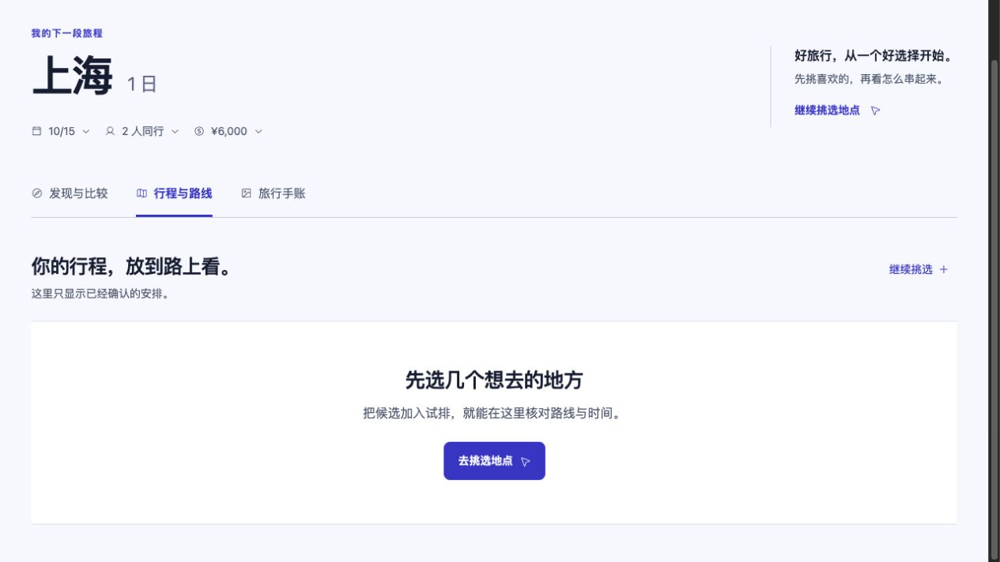

# 电脑操作用户 QA 复测（2026-09-22）

## 结论

**当前工作树仍未通过实际用户验收。** 本次使用 Computer Use 操作真实页面，并对照 HTTP 执行记录与隔离 PostgreSQL；聊天中的“已完成”不作为成功依据。

普通的“补日期 → 生成草案 → 采用 → 刷新”能够完成，但仅改预算出现明确的假成功；真实来源下仍有“数据库存了草案、工作台却显示空白”的问题；硬约束和预算冲突的接续仍存在长等待、超时与错误的选项影响说明。另在真实 PostgreSQL 回归中发现，多站行程更新预算后会写入不可再次读取的状态。

本报告记录正在改造中的工作树，不表示持续规划与模型上下文的 14/15 规范已完成实现。本 PR 只归档复测报告和引用证据；文中的启动修复、失败回归及复现命令对应当时尚未合入的开发工作树，不能在此文档分支单独复跑，也不表示这些代码变更已随本 PR 提交。

## 环境与证据边界

- 使用项目真实 Web、Pi Parent、Kimi K3、Jev、HTTP 和隔离 PostgreSQL；桌面与手机视口均实际输入、点击、采用、刷新。手机视口不等于真机验收。
- 普通案例的旅行候选与市内路线来自明确标记的 reference fixture。实际模型会看见并说明这项限制；这些案例验证业务链，不能证明真实商家、票价、库存或无障碍设施可用。
- 默认 DeepSeek 的真实探针返回 `402 Insufficient Balance`。页面没有可用的模型切换入口。为继续 QA，在浏览器创建的**空白测试对话**中，通过现有 repository 预设已配置的 Kimi；没有预置旅行状态或模型回答。这不算用户成功切换模型。
- 真实 Provider 案例与 reference 案例采用独立 schema；顺序操作，避免同一浏览器不同端口共享 Cookie 干扰身份。
- 12 组案例在执行前登记于 [manifest](./assets/2026-09-22-computer-user-retest/manifest.json)。初始版本和两个启动修复后的版本分别有源码哈希。证据时间使用 UTC；本文日期为香港时区。
- 本轮没有进行 500 在线、500 同时规划、30 分钟持续负载或原生小程序真机验收。

## 案例结果

| 案例 | 实际操作与结果 | 判定 |
| --- | --- | --- |
| R01 默认模型故障 | 真实 DeepSeek 余额不足；刷新保留原话，但点击继续仍失败，只给通用提示 | 恢复失败 |
| R02 切换可用模型 | 页面没有切换入口；隔离测试预设 Kimi 后，复现并修复工具合同 400，再跑通 R03/R04 | 用户切换路径受阻；后端合同已复测 |
| R03 缺日期再补充 | 约 29.9 秒问日期；回答后约 82.9 秒自动形成 6 次到访草案，无需点击继续 | 核心链路通过；等待较长 |
| R04 采用、刷新 | 页面实际采用，刷新后 6 次到访、两次用餐、酒店入住与返回及 625 元参考估算保留 | 本次单日链路通过 |
| R05 仅改预算 | 回复称 8000，页面/数据库仍 6000，另生成多余草案 | 失败 |
| R06 仅换酒店、晚餐 | 约 42.8 秒；保留其他到访和时间，酒店两次到访一致；是否另一家餐厅未能证实 | 部分通过 |
| R07 新增轮椅、全程无台阶 | 首次和一次恢复各约 210 秒超时；恢复后硬约束、原完整时间线和不可采用保护有效 | 业务接续失败；保留与拦截通过 |
| R08 硬预算冲突与回答 | 210 秒超时，继续 62.4 秒才问问题；按其 500 元选项回答，再等 210 秒超时；预算和不合格草案保留 | 失败 |
| R09 模型执行中取消 | 通过页面停止；服务端从收到取消到 cancelled 约 34 ms；最终无业务写入，之后可以提出新需求 | 本次取消路径通过 |
| R10 真实来源与缺域补查 | 首次约 177.5 秒返回 partial，持久草案在页面不可见；只补餐饮约 70.6 秒，数据库仍有 15 个候选，页面却只剩 4 个；刷新未恢复 | 展示与业务交付失败；底层候选保留通过 |
| R11 中文纠正、只查酒店 | 取消原两人请求后改一人、仅住宿；约 35.9 秒完成，只有住宿候选、未采用；进度文案范围错误 | 业务范围通过，展示有问题 |
| R12 跨页问题回答 | 两页同时看到问题；先答 500，立即从旧页选放弃高铁，服务端拒绝旧回答且未新建冲突 run | 旧答案保护通过；主动同步延迟未测 |

R12 的证明过期/时钟推进没有通过浏览器另测，本轮不能把已有合同测试等同于这部分用户验收。表中时延是单次真实请求记录，不是容量或时延分位数；最终状态核对见 [business-verification-final](./assets/2026-09-22-computer-user-retest/business-verification-final.json)。

## 已复现的问题

### 1. 只改预算，回复成功，实际没有保存

**操作：** 已采用完整方案后，输入“把总预算从 6000 元提高到 8000 元……只保存预算，不要重新查资料或重排行程”。

**实际：** 等待约 78.7 秒，助手明确说预算已改成 8000 元；页面和 PostgreSQL 仍为 6000 元，revision 没变，反而多出一版用户未要求的新草案。后续局部调整回复继续引用错误的 8000 元预算。

**已定位原因：** `itineraryPlanningIntent()` 将否定句中的“重排行程”识别为专门的重排操作，`activeTools` 被缩成只有 `plan_itinerary_trial`，移除了保存理解的工具。最终答复又没有核对业务写入回执。问题横跨输入路由、工具可用范围与结果交付，不能靠替换一句回复或新增否定关键词修完。

证据：[回复](./assets/2026-09-22-computer-user-retest/R05-budget-reply.png)、[实际页面](./assets/2026-09-22-computer-user-retest/R05-budget-still-6000.png)、[数据库对照](./assets/2026-09-22-computer-user-retest/business-verification-initial.json)、[新增失败回归](./assets/2026-09-22-computer-user-retest/budget-business-regression-red.log)。

### 2. 多站行程的持久化存在合同冲突

已有 PostgreSQL 跨实例测试在采用 13 个到访后，只更新预算。写入成功，但随后读取报 `invalid_trip_state`。

**已定位原因：** `stalePlanFeasibility()` 将全局待核验事项关联到全部 13 个到访，写入 `environment.mobility.feasibility.issues[0].stopIds`；该合同最多允许 8 个。内存测试没有覆盖相同 JSONB 回读过程。已保留诊断断言；没有把到访截成 8 个或放松验证来制造通过。

这不等于数据已经删除，但会让有数据的行程无法通过正常服务读取。问题属于实际持久化可用性，不是页面文案。

证据：[真实 PostgreSQL 失败日志](./assets/2026-09-22-computer-user-retest/multiday-postgres-regression-red.log)。

### 3. 冲突处理仍会把用户带入超时与重复等待

100 元预算要求同时保留高铁、两餐、收费景点、一晚酒店，服务正确阻止了超支采用，留下了未通过的 6 次到访草案。但两次试排后运行在约 210 秒超时，只给出通用失败提示，没有交付具体取舍问题。

点击一次“继续规划”后，又等约 62.4 秒才出现问题。推荐选项写“提高到 500 元左右……草案基本可直接采用”，而已有核验回执的总估算为 **625 元，其中市内交通 125 元**。选项影响说明没有使用完整成本账本，也没有说明“最低价”仅限本批来源范围。

选择系统给出的 500 元选项后，预算实际保存为 500 元，6 次到访草案保留，但又进行两次试排并在约 210 秒超时；界面仍显示 625 元超支，确认按钮禁用。从首次请求到回答后的执行合计约 **482.6 秒**（不含用户阅读、点击间隔），没有交付可用结果。受控路线固定返回 taxi，不能据此断言真实公交替换能力不可用；但系统明知完整估算仍推荐不足的预算，以及失败后没有交付可接续结果，是本次直接观察到的问题。证据：[回答后超时](./assets/2026-09-22-computer-user-retest/R08-answer-timeout.png)、[预算保存与草案](./assets/2026-09-22-computer-user-retest/R08-answer-draft-preserved.png)、[最终运行](./assets/2026-09-22-computer-user-retest/reference-final.json)。

**交付问题的具体失效点：** 回答后的第 131 秒，`ask_travel_question` 已返回经过账本修正的 625 元问题和稳定 optionId；随后立即触发对话压缩，约 79 秒后超时，run 最终为 failed，页面没有拿到该问题。`pendingQuestion` 的交付仍排在 `session.prompt()` 完整结束和全局期限检查之后。`terminate: true` 并没有隔离后续压缩的失败。预算问题在新的恢复 turn 中也仅依据该 turn 的 `itineraryTrialResult` 进行账本纠偏，未从持久草案恢复，所以第一次恢复露出了错误的 500 元选项。这两点是上下文、恢复状态与业务交付没有贯通的证据。

该失效点的精简原始轨迹见 [question-lost-during-compaction](./assets/2026-09-22-computer-user-retest/question-lost-during-compaction.json)。

无障碍补充的首次执行同样约 210 秒超时，之前约 93 秒花在对话压缩，期间没有实际工具调用；首次失败时轮椅、全程无台阶和火车抵达尚未写入 TripState。原行程保留，但这不能算完成了新要求。

点击继续后，轮椅与全程无台阶写入了 traveler care，原 6 次到访和时间保持完整，旧路线标成待核验，新的未核验草案不能采用；放弃新草案后也能展开查看原完整行程。这些保留与保护行为通过。**但恢复再次在约 210 秒超时**，未交付具体证据缺口与可行调整，`brief.arrivalMode` 仍未保存本次火车补充。证据：[恢复失败](./assets/2026-09-22-computer-user-retest/R07-recovery-failed.png)、[草案被阻止采用](./assets/2026-09-22-computer-user-retest/R07-blocked-draft.png)、[原到访仍在](./assets/2026-09-22-computer-user-retest/R07-original-full-timeline.dom.txt)、[数据库](./assets/2026-09-22-computer-user-retest/R07-recovery-and-R08-answer.json)。

证据：[预算超时](./assets/2026-09-22-computer-user-retest/R08-timeout.png)、[错误的预算选项](./assets/2026-09-22-computer-user-retest/R08-budget-question.png)、[无障碍失败](./assets/2026-09-22-computer-user-retest/R07-failed.png)、[两条执行记录](./assets/2026-09-22-computer-user-retest/R07-R08-terminal.json)。恢复后的最终结果见下方案例表。

### 4. 真实来源下，未通过的草案仍然无法在工作台查看

真实飞猪/途牛返回交通 3、住宿 6、游玩 6 个候选，餐饮为 0。Parent 自动补查一次餐饮，其他 15 个候选保留。约 177.5 秒后返回 `partial`，明确说明餐饮、市内路线、部分价格等缺口。

但助手同时说“草案已保留在方案区”，实际点击“行程与路线”只见“先选几个想去的地方”。数据库有 `planning.draft.plan`（7 个规划到访），`planning.draft.itinerary` 为 null；当前计划未通过，包含两餐缺失、路线 Provider 不可用和第二天超出一日范围等问题。

**已定位原因：** `getTripPlanView()` 对草案投影仍直接输出 nullable `draft.itinerary`；`useTripMobilityPreview()` 以 `agentTrial?.itinerary` 作为展示前提。持久计划与可用核验结果尚未在展示层真正分开。这条失败使用真实 Provider；不能把修复限制在 reference 草案有路线的情况。

回复还声称“都是资料侧缺口而不是行程逻辑问题”，但 Checker 实际报告 `plan_day_mismatch`；结尾又说“可以……采用”，与不可采用状态不一致。

证据：[真实候选](./assets/2026-09-22-computer-user-retest/R10-real-candidates.png)、[助手完整回复](./assets/2026-09-22-computer-user-retest/R10-real-full-reply.txt)、[草案空白页面](./assets/2026-09-22-computer-user-retest/R10-draft-missing-from-workbench.png)、[真实调用及持久草案](./assets/2026-09-22-computer-user-retest/R10-before-followup.json)。候选来源真实性指确实调用已配置 Provider，不代表已独立核实商家当天价格、库存或设施。

随后通过页面输入“只补午餐和晚餐，其他候选和时间不要删”。约 70.6 秒后正确返回餐饮仍不可用，数据库里原 15 个候选的 ID 和草案到访均未改变。但页面候选数量从 **交通 3 / 住宿 6 / 游玩 6** 变成 **1 / 1 / 2**，刷新仍如此。

**另一处展示根因：** `PlanCanvas` 使用 `plan.pendingProposals[0]` 作为候选来源。补查前第一项是完整候选，补查后第一项变成了仅包含试排行程所用四个地点的提案；完整研究提案仍在第二项。页面没有按业务类型取得候选。修复底层保留后，没有复核展示层的真实调用方，用户仍看到候选消失。

证据：[补查后刷新页面](./assets/2026-09-22-computer-user-retest/R10-candidates-reduced-after-refresh.png)、[刷新后草案仍不可见](./assets/2026-09-22-computer-user-retest/R10-draft-missing-after-refresh.png)、[候选和计划逐项对照](./assets/2026-09-22-computer-user-retest/real-provider-business-verification.json)、[完整最终状态](./assets/2026-09-22-computer-user-retest/real-provider-final.json)。



### 5. 局部调整的业务完成度仍不足

仅换酒店和晚餐时，原午餐、活动、抵达、各次到访时间和采用版都保留；酒店入住与晚间返回也都指向同一家新酒店。

但晚餐新旧候选同名，系统无法确认是否真正换了商家。助手披露了这一点，因此这不是隐瞒数据来源；不过“生成了新 nodeId”不能作为“换成另一家餐厅”的验收依据。新的酒店候选还带有与安静偏好相冲突的描述，需要明确呈现取舍。

这是受控资料下未完成业务目标，真实商家去重与替换能力仍需真实来源验证。证据：[完整回复与页面](./assets/2026-09-22-computer-user-retest/R06-local-adjustment-reply.txt)、[到访差异](./assets/2026-09-22-computer-user-retest/business-verification-initial.json)。

### 6. 页面隐藏了用户最需要的信息

- 完整草案和局部调整的关键列表、限制说明默认折叠，只留下开头、标题与结尾；用户需额外展开才能判断究竟改了什么。
- 只查酒店时，实际没有扩域，但进度文案仍显示“已核验吃住行玩候选”，快捷建议仍包括出发地、城际交通。
- 关闭助手再打开，进行中的用时重新显示为 0 秒，不能反映真实等待。
- 跨页立即点击旧选项时，服务端正确拒绝并提示已在另一端回答，冲突选项文字仍留在输入框中。本轮测试的是竞态拦截，没有测量另一页主动撤题的延迟，不能据此认定永远不会同步。
- 默认模型的余额故障只显示通用“稍后再试”；实际点击继续仍立即失败，没有可用的用户恢复路径。

证据：[酒店单域](./assets/2026-09-22-computer-user-retest/R11-hotels-only.png)、[旧答案被拒绝](./assets/2026-09-22-computer-user-retest/R12-stale-answer-rejected.png)、[默认模型失败](./assets/2026-09-22-computer-user-retest/R01-default-model-failed.png)、[真实账号探针](./assets/2026-09-22-computer-user-retest/parent-health.json)。

## 本轮为使 QA 可以运行而修复的两项问题

1. **Kimi 工具合同 400：** 注册给模型的 itinerary union schema 没有根级 `type: "object"`。真实相同接口对照探针确认原合同失败、补充根类型后成功；保留原 union 和业务验证，增加注册工具层回归，重启后由真实页面完成草案与采用路径。证据：[真实探针](./assets/2026-09-22-computer-user-retest/kimi-tool-contract-probe.json)、[修正探针](./assets/2026-09-22-computer-user-retest/kimi-object-union-probe.json)。
2. **TypeScript 启动检查：** 修正持续规划上下文中 journal 的类型访问及 `findLast` 的编译目标不兼容，`npm run typecheck` 通过。没有改变规划业务规则。

这两项修复不表示上述业务问题已经解决。

## 工程检查与复现

- 启动修复后的聚焦测试：59 通过、1 跳过；之后新写的“不要重排行程、只改预算”回归为红，符合本轮浏览器复现。
- `npm run check` 在 `npm test` 阶段失败：该次执行 378 通过、1 失败、13 跳过。失败为 Pi 完整工具合同 48,635 bytes 超过项目 48,000 bytes 上限；这是合同预算回归，不单独证明生产运行崩溃。后续 Web build 与小程序检查未执行。
- 显式启用 PostgreSQL 的 13 到访预算更新回归失败。上述默认检查有数据库跳过项，不能拿默认绿灯替代数据库验收。
- 新增失败用例晚于整套检查，不能把 378 通过的旧快照当成最终工作树全绿。

```bash
# 无真实模型费用的业务回归
node --import tsx --test --test-name-pattern='a traveler saying not to replan' tests/travel-conversation-agent.test.mjs

# 需要独立测试 PostgreSQL，测试负责创建/清理自己的 schema
TRAVEL_EXECUTION_TEST_DATABASE_URL='<isolated PostgreSQL URL>' \
  node --import tsx --test --test-name-pattern='a checked itinerary survives' tests/itinerary-planning-harness.test.mjs

npm run typecheck
npm run check
```

完整日志：[类型检查](./assets/2026-09-22-computer-user-retest/typecheck-after.log)、[聚焦回归](./assets/2026-09-22-computer-user-retest/focused-after.log)、[check](./assets/2026-09-22-computer-user-retest/check-after-transport-fix.log)、[工具大小](./assets/2026-09-22-computer-user-retest/pi-tool-sizes.json)。

## 修复优先顺序

1. **先修事实变更与交付的一致性。** 普通自然语言不能因为否定句命中关键词就失去保存事实的工具；“已保存/已采用”必须对应当前操作的真实回执与版本。
2. **修好全局核验的持久化合同。** 全局待核验和局部到访问题使用明确语义；保留完整时间线，预算变化只重新计算相关检查。回归必须经过 PostgreSQL 写入、重启/跨实例读取和真实页面。
3. **让草案成为独立可见的工作成果。** 有计划、无有效路线的情况也展示已排到访、缺餐与缺证据；不能等待全局核验成功才允许用户查看。未知内容不补成假事实。
4. **让冲突形成可接续的用户决定。** 用同一份完整费用与来源范围生成问题；回答后自动核验、形成草案。已形成的问题必须可靠保存并交付，后续上下文整理不能把它覆盖成通用失败。
5. **页面首先展示变化、冲突和下一步。** 已采用版、待核验版和未知证据必须清楚，不能把关键限制藏在默认折叠中。

本轮临时页面、两个 QA schema 与服务均已清理；测试 PostgreSQL 容器恢复为启动测试前的停止状态。原有开发服务未作变更。[清理记录](./assets/2026-09-22-computer-user-retest/cleanup.json)

验收应复跑本文失败输入及相同数据库读取路径，以用户能完成决定、保存并继续旅行规划为准；不以新增测试数量或拒绝更多操作作为完成证据。
